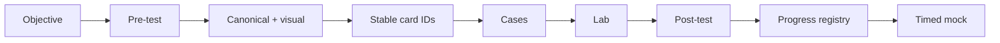

# Certification MOC

# Entry points

- [[00_HOME/Certification 99 Percent Readiness Dashboard]]
- [[00_HOME/Java 11 17 21 Complete Knowledge Program]]
- [[00_HOME/Card Review Dashboard]]
- [[00_HOME/Knowledge Route Registry]]
- [[00_HOME/Review Dashboard]]
- [[01_MAPS/Certification 99 Percent Map.canvas]]

# Corrected learning system



Machine controls:

```text
70_PROGRESS/card-progress.json
.github/scripts/card_progress.py
.github/objectives/*.json
.github/objective-overrides/*.json
.github/scripts/audit_objective_traceability.py
.github/scripts/audit_certification_readiness.py
.github/java-version-coverage.json
.github/scripts/audit_java_version_coverage.py
```

# Master tracks

| Track | Roadmap | Target |
|---|---|---:|
| Spring 2V0-72.22 | [[30_CERTIFICATIONS/Spring/2V0-72.22/Spring 99 Percent Master Roadmap]] | 99% |
| Java 11/17/21 platform | [[00_HOME/Java 11 17 21 Complete Knowledge Program]] | 99% |
| Java 1Z0-829 | [[30_CERTIFICATIONS/Java/1Z0-829/Java SE 17 99 Percent Master Roadmap]] | 99% |
| Java Concurrency | [[30_CERTIFICATIONS/Java/Concurrency/Java Concurrency 99 Percent Roadmap]] | 99% |

# Java 11, 17 and 21

## JAVA-LTS-B01 — Evolution and Migration

- [[30_CERTIFICATIONS/Java/JAVA-LTS-B01/JAVA-LTS-B01 Roadmap]]
- [[10_CONCEPTS/Java/Versions/Java 11 17 21 LTS Evolution]]
- [[30_CERTIFICATIONS/Java/JAVA-LTS-B01/JAVA-LTS-B01 Cards|30 cards]]
- [[40_PRODUCTION_CASES/Java/Java 11 17 21 Migration Cases|10 cases]]
- [[50_LABS/Java/JAVA-LTS-B01/README|JDK 11/17/21 lab]]
- [[98_SOURCES/Java 11 17 21 Official Sources]]

```text
Java 11  compatibility baseline
Java 17  exact 1Z0-829 exam baseline
Java 21  modern production baseline
```

The route is cumulative, but exam answers remain version-bound.

# Java 1Z0-829

- [[30_CERTIFICATIONS/Java/1Z0-829/Java SE 17 99 Percent Master Roadmap]]
- [[98_SOURCES/Java SE 17 1Z0-829 Sources]]

```text
JAVA-B01 Data/Text/Date-Time
JAVA-B02 Control Flow and Pattern Matching
JAVA-B03 Object Model
JAVA-B04 Exceptions and Resources
JAVA-B05 Collections and Generics
JAVA-B06 Lambdas and Streams
JAVA-B07 Modules and Deployment
JAVA-B08 Concurrency
JAVA-B09 I/O and NIO.2
JAVA-B10 JDBC
JAVA-B11 Localization
```

Every route must include Java 11 baseline, Java 17 exam semantics and Java 21 production delta.

# Java Concurrency

- [[30_CERTIFICATIONS/Java/Concurrency/Java Concurrency 99 Percent Roadmap]]
- [[10_CONCEPTS/Java/Concurrency/Concurrency Learning Path]]
- [[10_CONCEPTS/Java/Concurrency/Java Concurrency Visual Deep Dive]]
- [[20_QUESTIONS/Interview/Java/Concurrency/Advanced Concurrency Recall]]
- [[50_LABS/Java/Concurrency/README]]

# Spring published batches

| Batch | Cards | Status |
|---|---:|---|
| [[30_CERTIFICATIONS/Spring/2V0-72.22/CORE-B01/CORE-B01 Cards|CORE-B01]] | 20 | normalized |
| [[30_CERTIFICATIONS/Spring/2V0-72.22/CORE-B02/CORE-B02 Cards|CORE-B02]] | 24 | published |
| [[30_CERTIFICATIONS/Spring/2V0-72.22/CORE-B03/CORE-B03 Cards|CORE-B03]] | 24 | published |
| [[30_CERTIFICATIONS/Spring/2V0-72.22/CORE-B04/CORE-B04 Cards|CORE-B04]] | 24 | normalized |
| [[30_CERTIFICATIONS/Spring/2V0-72.22/CORE-B05/CORE-B05 Cards|CORE-B05]] | 24 | published |
| [[30_CERTIFICATIONS/Spring/2V0-72.22/CORE-B06/CORE-B06 Cards|CORE-B06]] | 24 | published |
| [[30_CERTIFICATIONS/Spring/2V0-72.22/AOP-B01/AOP-B01 Cards|AOP-B01]] | 24 | normalized |
| [[30_CERTIFICATIONS/Spring/2V0-72.22/CACHE-B01/CACHE-B01 Cards|CACHE-B01]] | 20 | normalized |
| [[30_CERTIFICATIONS/Spring/2V0-72.22/TX-B01/TX-B01 Cards|TX-B01]] | 32 | normalized |
| [[30_CERTIFICATIONS/Spring/2V0-72.22/DATA-B01/DATA-B01 Cards|DATA-B01]] | 36 | normalized |
| [[30_CERTIFICATIONS/Spring/2V0-72.22/TEST-B01/TEST-B01 Cards|TEST-B01]] | 36 | normalized |
| [[30_CERTIFICATIONS/Spring/2V0-72.22/SPRING-BOOT-B01/SPRING-BOOT-B01 Cards|SPRING-BOOT-B01]] | 30 | published |
| [[30_CERTIFICATIONS/Spring/2V0-72.22/SPRING-BOOT-B02/SPRING-BOOT-B02 Cards|SPRING-BOOT-B02]] | 35 | published |
| [[30_CERTIFICATIONS/Spring/2V0-72.22/SPRING-MVC-B01/SPRING-MVC-B01 Cards|SPRING-MVC-B01]] | 35 | published |
| [[30_CERTIFICATIONS/Spring/2V0-72.22/SPRING-MVC-B02/SPRING-MVC-B02 Cards|SPRING-MVC-B02]] | 25 | published |
| **Total** | **413** | |

# Spring route hubs

- [[30_CERTIFICATIONS/Spring/2V0-72.22/Spring Core Card Roadmap]]
- [[30_CERTIFICATIONS/Spring/2V0-72.22/Spring AOP and Cache Roadmap]]
- [[30_CERTIFICATIONS/Spring/2V0-72.22/Spring Transaction Management Roadmap]]
- [[30_CERTIFICATIONS/Spring/2V0-72.22/Spring Data JPA Roadmap]]
- [[30_CERTIFICATIONS/Spring/2V0-72.22/Spring Testing Roadmap]]
- [[30_CERTIFICATIONS/Spring/2V0-72.22/SPRING-BOOT-B01/SPRING-BOOT-B01 Roadmap]]
- [[30_CERTIFICATIONS/Spring/2V0-72.22/SPRING-BOOT-B02/SPRING-BOOT-B02 Roadmap]]
- [[30_CERTIFICATIONS/Spring/2V0-72.22/SPRING-MVC-B01/SPRING-MVC-B01 Roadmap]]
- [[30_CERTIFICATIONS/Spring/2V0-72.22/SPRING-MVC-B02/SPRING-MVC-B02 Roadmap]]

# Database route

- [[30_CERTIFICATIONS/Databases/DB-B01/DB-B01 Roadmap]]
- [[30_CERTIFICATIONS/Databases/DB-B01/DB-B01 Cards]]
- [[50_LABS/Databases/DB-B01/README]]

# Card contract

Every published card contains:

```text
Question
Russian Translation
Answer
Explanation
Exam Trap
```

Additional sections strengthen the card but do not replace the mandatory contract.

# Assessment process

1. Identify the target Java/framework version.
2. Complete pre-test without confidence updates.
3. Study canonical and visual mechanism.
4. Answer stable card IDs.
5. Record outcome and confidence per card.
6. Apply the mechanism to production cases.
7. Predict and execute lab evidence.
8. Complete post-test.
9. Enter mixed timed mock only after delayed review.

# Next implementation routes

```text
Spring: SPRING-SEC-B01 — Authentication, Authorization and Method Security
Java:   JAVA-B01 — Data, Text and Date-Time across Java 11/17/21
```
