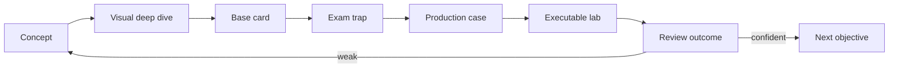

# Certification MOC

## Learning model

Canonical theory lives in `10_CONCEPTS`. Cards train recall and discrimination; production cases train transfer; labs provide observable evidence.



Review entry: [[00_HOME/Review Dashboard]].

# Java route

## Java Concurrency

- [[10_CONCEPTS/Java/Concurrency/Java Concurrency Visual Deep Dive]];
- [[01_MAPS/Java Concurrency Visual Atlas.canvas]];
- [[10_CONCEPTS/Java/Concurrency/Java Memory Model]];
- [[10_CONCEPTS/Java/Concurrency/Happens-Before]];
- [[10_CONCEPTS/Java/Concurrency/volatile]];
- [[10_CONCEPTS/Java/Concurrency/synchronized]];
- [[10_CONCEPTS/Java/Concurrency/ExecutorService]];
- [[10_CONCEPTS/Java/Concurrency/CompletableFuture]];
- [[10_CONCEPTS/Java/Concurrency/Virtual Threads]];
- [[10_CONCEPTS/Java/Concurrency/Atomic CAS and Counters]];
- [[10_CONCEPTS/Java/Concurrency/Deadlock Livelock and Lock Ordering]];
- [[10_CONCEPTS/Java/Concurrency/Concurrent Collections and Backpressure]].

# Spring certification route

- [[30_CERTIFICATIONS/Spring/2V0-72.22/Spring Certification Card System|Card System]]
- [[30_CERTIFICATIONS/Spring/2V0-72.22/Spring Core Card Roadmap|Spring Core Roadmap]]
- [[30_CERTIFICATIONS/Spring/2V0-72.22/Spring AOP and Cache Roadmap|AOP and Cache Roadmap]]
- [[30_CERTIFICATIONS/Spring/2V0-72.22/Spring Transaction Management Roadmap|Transaction Management Roadmap]]
- [[30_CERTIFICATIONS/Spring/2V0-72.22/Spring Data JPA Roadmap|Spring Data JPA Roadmap]]
- [[30_CERTIFICATIONS/Spring/2V0-72.22/Spring Testing Roadmap|Spring Testing Roadmap]]

## Published Spring batches

| Batch | Cards | Concept route | Status |
|---|---:|---|---|
| [[30_CERTIFICATIONS/Spring/2V0-72.22/CORE-B01/CORE-B01 Cards|CORE-B01]] | 20 | [[10_CONCEPTS/Spring/Core/Spring Core Foundations]] | published |
| [[30_CERTIFICATIONS/Spring/2V0-72.22/CORE-B02/CORE-B02 Cards|CORE-B02]] | 24 | [[10_CONCEPTS/Spring/Core/Dependency Resolution and Optional Injection]] | published |
| [[30_CERTIFICATIONS/Spring/2V0-72.22/CORE-B03/CORE-B03 Cards|CORE-B03]] | 24 | [[10_CONCEPTS/Spring/Core/Bean Lifecycle from Definition to Destruction]] | published |
| [[30_CERTIFICATIONS/Spring/2V0-72.22/CORE-B04/CORE-B04 Cards|CORE-B04]] | 24 | [[10_CONCEPTS/Spring/Core/Container Extension Points]] | published |
| [[30_CERTIFICATIONS/Spring/2V0-72.22/CORE-B05/CORE-B05 Cards|CORE-B05]] | 24 | [[10_CONCEPTS/Spring/Core/Configuration Profiles and Externalized Properties]] | published |
| [[30_CERTIFICATIONS/Spring/2V0-72.22/CORE-B06/CORE-B06 Cards|CORE-B06]] | 24 | [[10_CONCEPTS/Spring/Core/Advanced Core Scopes FactoryBean and Context Hierarchy]] | published |
| [[30_CERTIFICATIONS/Spring/2V0-72.22/AOP-B01/AOP-B01 Cards|AOP-B01]] | 24 | [[10_CONCEPTS/Spring/AOP/Spring AOP Proxy Mechanics]] | normalized |
| [[30_CERTIFICATIONS/Spring/2V0-72.22/CACHE-B01/CACHE-B01 Cards|CACHE-B01]] | 20 | [[10_CONCEPTS/Spring/Cache/Spring Cache with Caffeine and Redis]] | normalized |
| [[30_CERTIFICATIONS/Spring/2V0-72.22/TX-B01/TX-B01 Cards|TX-B01]] | 32 | [[10_CONCEPTS/Spring/Transactions/Spring Transaction Management Deep Dive]] | published |
| [[30_CERTIFICATIONS/Spring/2V0-72.22/DATA-B01/DATA-B01 Cards|DATA-B01]] | 36 | [[10_CONCEPTS/Spring/Data/Spring Data JPA Persistence Context and Entity Lifecycle]] | published |
| [[30_CERTIFICATIONS/Spring/2V0-72.22/TEST-B01/TEST-B01 Cards|TEST-B01]] | 36 | [[10_CONCEPTS/Spring/Testing/Spring TestContext and Test Slices]] | published |

```text
Spring Core               140
AOP and Cache               44
Transaction Management      32
Spring Data and JPA          36
Spring Testing               36
-------------------------------
Published Spring total     288
```

## Spring visual routes

- [[10_CONCEPTS/Spring/Core/Spring Core Visual Deep Dive]];
- [[01_MAPS/Spring Core Visual Atlas.canvas]];
- [[01_MAPS/Spring Visual Learning Atlas.canvas]];
- [[01_MAPS/Spring AOP and Cache Visual Atlas.canvas]].

# Database route

## DB-B01 — Indexes and Query Plans

| Batch | Cards | Concepts | Status |
|---|---:|---|---|
| [[30_CERTIFICATIONS/Databases/DB-B01/DB-B01 Cards|DB-B01]] | 30 | [[10_CONCEPTS/Databases/PostgreSQL Index Mechanics]] + [[10_CONCEPTS/Databases/PostgreSQL EXPLAIN and Query Plan Analysis]] | published |

Complete route:

- [[30_CERTIFICATIONS/Databases/DB-B01/DB-B01 Roadmap]];
- [[01_MAPS/Database Indexes and Query Plans Map.canvas]];
- [[40_PRODUCTION_CASES/Databases/Indexes and Query Plans Production Cases]];
- [[50_LABS/Databases/DB-B01/README]];
- [[98_SOURCES/PostgreSQL Indexes and Query Plans Sources]].

```text
DB-B01 cards             30
DB-B01 diagrams          62
Production cases         14
PostgreSQL experiments   10
```

# Card format

1. `Question` in English.
2. `Russian Translation`.
3. `Answer`.
4. `Explanation`.
5. `Exam Trap`.
6. `Mini Example` where path-dependent.
7. `Memory Hook` where easily confused.
8. `Production Transfer` for mechanism-heavy topics.

# Testing process

1. Answer without opening explanation.
2. Mark confident or guessed.
3. Reconstruct the relevant diagram or runtime path.
4. Explain why a plausible wrong answer fails.
5. Apply the rule to a new incident.
6. Predict lab evidence before execution.
7. Increase confidence only after repeated successful recall.

Outcome taxonomy:

- `correct-confident`;
- `correct-guessed`;
- `wrong-concept`;
- `wrong-attention`;
- `wrong-confusion`.

# Next routes

```text
DB-B02 — Transactions, MVCC and Locks
Spring Boot Internals and Auto-configuration
Java language / collections / JVM
Messaging delivery semantics
Distributed systems resilience
```
