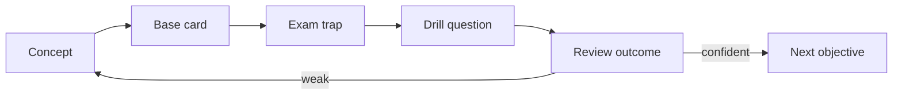

# Certification MOC

## Общая модель

Каноническая теория хранится в `10_CONCEPTS`. Сертификационные карточки используют её для active recall, discrimination и exam drills.



## Маршрут Java certification

Материал организуется по official exam objectives, но каждая objective ссылается на канонические заметки из `10_CONCEPTS`.

Основные типы вопросов:

- результат компиляции;
- вывод программы;
- scope и accessibility;
- overload и override resolution;
- generics;
- exceptions;
- streams;
- concurrency;
- modules;
- version-specific language features.

### Java concurrency foundation

- [[10_CONCEPTS/Java/Concurrency/Java Memory Model]]
- [[10_CONCEPTS/Java/Concurrency/Happens-Before]]
- [[10_CONCEPTS/Java/Concurrency/volatile]]
- [[10_CONCEPTS/Java/Concurrency/synchronized]]
- [[10_CONCEPTS/Java/Concurrency/ExecutorService]]
- [[10_CONCEPTS/Java/Concurrency/CompletableFuture]]
- [[10_CONCEPTS/Java/Concurrency/Virtual Threads]]

## Маршрут Spring certification

- [[30_CERTIFICATIONS/Spring/2V0-72.22/Spring Certification Card System|Card System]]
- [[30_CERTIFICATIONS/Spring/2V0-72.22/Spring Core Card Roadmap|CORE-B01–CORE-B06 Roadmap]]

Зафиксированный формат карточки:

1. `Question` на английском;
2. `Russian Translation`;
3. `Answer`;
4. `Explanation`;
5. `Exam Trap`;
6. `Mini Example` для сложной темы;
7. `Memory Hook` для легко путаемой темы.

Целевая модель:

```text
750 base cards + 150 exam drill questions = 900 items
```

Карточки производятся партиями по 20–30.

Основные области:

- Spring container и dependency injection;
- configuration и profiles;
- bean lifecycle;
- AOP и proxies;
- data access;
- transaction management;
- Spring Boot;
- testing;
- security и actuator, если они входят в выбранный учебный маршрут.

## Процесс тестирования

1. Ответить, не открывая explanation.
2. Зафиксировать, был ли ответ уверенным или угаданным.
3. Связать вопрос с канонической концепцией.
4. Разобрать все неправильные варианты.
5. Повышать confidence только после последующего успешного повторения.

## Outcome taxonomy

- `correct-confident`;
- `correct-guessed`;
- `wrong-concept`;
- `wrong-attention`;
- `wrong-confusion`.

## Планируемые dashboards

- questions never attempted;
- repeatedly failed questions;
- objectives with low coverage;
- weak concepts с `confidence < 3`;
- questions due for review;
- correct-but-guessed questions;
- recurring confusion pairs.
