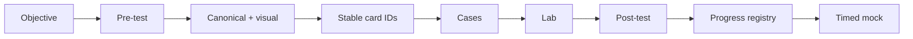

# Certification MOC

# Entry points

- [[00_HOME/Certification 99 Percent Readiness Dashboard]]
- [[00_HOME/Card Review Dashboard]]
- [[00_HOME/Knowledge Route Registry]]
- [[00_HOME/Review Dashboard]]
- [[01_MAPS/Certification 99 Percent Map.canvas]]

# Corrected learning system



Machine controls:

```text
70_PROGRESS/card-progress.json
.github/scripts/card_progress.py
.github/objectives/*.json
.github/objective-overrides/*.json
.github/scripts/audit_objective_traceability.py
.github/scripts/audit_certification_readiness.py
```

# Master tracks

| Track | Roadmap | Target |
|---|---|---:|
| Spring 2V0-72.22 | [[30_CERTIFICATIONS/Spring/2V0-72.22/Spring 99 Percent Master Roadmap]] | 99% |
| Java 1Z0-829 | [[30_CERTIFICATIONS/Java/1Z0-829/Java SE 17 99 Percent Master Roadmap]] | 99% |
| Java Concurrency | [[30_CERTIFICATIONS/Java/Concurrency/Java Concurrency 99 Percent Roadmap]] | 99% |

# Spring published batches

| Batch | Cards | Status |
|---|---:|---|
| [[30_CERTIFICATIONS/Spring/2V0-72.22/CORE-B01/CORE-B01 Cards|CORE-B01]] | 20 | normalized |
| [[30_CERTIFICATIONS/Spring/2V0-72.22/CORE-B02/CORE-B02 Cards|CORE-B02]] | 24 | published |
| [[30_CERTIFICATIONS/Spring/2V0-72.22/CORE-B03/CORE-B03 Cards|CORE-B03]] | 24 | published |
| [[30_CERTIFICATIONS/Spring/2V0-72.22/CORE-B04/CORE-B04 Cards|CORE-B04]] | 24 | normalized |
| [[30_CERTIFICATIONS/Spring/2V0-72.22/CORE-B05/CORE-B05 Cards|CORE-B05]] | 24 | published |
| [[30_CERTIFICATIONS/Spring/2V0-72.22/CORE-B06/CORE-B06 Cards|CORE-B06]] | 24 | published |
| [[30_CERTIFICATIONS/Spring/2V0-72.22/AOP-B01/AOP-B01 Cards|AOP-B01]] | 24 | normalized |
| [[30_CERTIFICATIONS/Spring/2V0-72.22/CACHE-B01/CACHE-B01 Cards|CACHE-B01]] | 20 | normalized |
| [[30_CERTIFICATIONS/Spring/2V0-72.22/TX-B01/TX-B01 Cards|TX-B01]] | 32 | normalized |
| [[30_CERTIFICATIONS/Spring/2V0-72.22/DATA-B01/DATA-B01 Cards|DATA-B01]] | 36 | normalized |
| [[30_CERTIFICATIONS/Spring/2V0-72.22/TEST-B01/TEST-B01 Cards|TEST-B01]] | 36 | normalized |
| [[30_CERTIFICATIONS/Spring/2V0-72.22/SPRING-BOOT-B01/SPRING-BOOT-B01 Cards|SPRING-BOOT-B01]] | 30 | published |
| [[30_CERTIFICATIONS/Spring/2V0-72.22/SPRING-BOOT-B02/SPRING-BOOT-B02 Cards|SPRING-BOOT-B02]] | 35 | published |
| **Total** | **353** | |

# Spring route hubs

- [[30_CERTIFICATIONS/Spring/2V0-72.22/Spring Core Card Roadmap]]
- [[30_CERTIFICATIONS/Spring/2V0-72.22/Spring AOP and Cache Roadmap]]
- [[30_CERTIFICATIONS/Spring/2V0-72.22/Spring Transaction Management Roadmap]]
- [[30_CERTIFICATIONS/Spring/2V0-72.22/Spring Data JPA Roadmap]]
- [[30_CERTIFICATIONS/Spring/2V0-72.22/Spring Testing Roadmap]]
- [[30_CERTIFICATIONS/Spring/2V0-72.22/SPRING-BOOT-B01/SPRING-BOOT-B01 Roadmap]]
- [[30_CERTIFICATIONS/Spring/2V0-72.22/SPRING-BOOT-B02/SPRING-BOOT-B02 Roadmap]]

## SPRING-BOOT-B02 evidence

- [[10_CONCEPTS/Spring/Boot/Spring Boot Externalized Configuration and Type-safe Binding]]
- [[10_CONCEPTS/Spring/Boot/Spring Boot Configuration Visual Deep Dive]]
- [[30_CERTIFICATIONS/Spring/2V0-72.22/SPRING-BOOT-B02/SPRING-BOOT-B02 Assessment]]
- [[40_PRODUCTION_CASES/Spring/Spring Boot Configuration Production Cases]]
- [[50_LABS/Spring/SPRING-BOOT-B02/README]]
- [[98_SOURCES/Spring Boot Externalized Configuration Sources]]

# Java 1Z0-829

- [[30_CERTIFICATIONS/Java/1Z0-829/Java SE 17 99 Percent Master Roadmap]]
- [[98_SOURCES/Java SE 17 1Z0-829 Sources]]

```text
JAVA-B01 Data/Text/Date-Time
JAVA-B02 Control Flow
JAVA-B03 Object Model
JAVA-B04 Exceptions
JAVA-B05 Collections/Generics
JAVA-B06 Lambdas/Streams
JAVA-B07 Modules
JAVA-B08 Concurrency
JAVA-B09 I/O and NIO.2
JAVA-B10 JDBC
JAVA-B11 Localization
```

# Java Concurrency

- [[30_CERTIFICATIONS/Java/Concurrency/Java Concurrency 99 Percent Roadmap]]
- [[10_CONCEPTS/Java/Concurrency/Concurrency Learning Path]]
- [[10_CONCEPTS/Java/Concurrency/Java Concurrency Visual Deep Dive]]
- [[20_QUESTIONS/Interview/Java/Concurrency/Advanced Concurrency Recall]]
- [[50_LABS/Java/Concurrency/README]]

# Database route

- [[30_CERTIFICATIONS/Databases/DB-B01/DB-B01 Roadmap]]
- [[30_CERTIFICATIONS/Databases/DB-B01/DB-B01 Cards]]
- [[50_LABS/Databases/DB-B01/README]]

# Card contract

Every published card contains:

```text
Question
Russian Translation
Answer
Explanation
Exam Trap
```

Additional sections such as Mini Example, Memory Hook and Production Transfer strengthen the card but do not replace the mandatory contract.

# Assessment process

1. Pre-test without confidence updates.
2. Study canonical and visual mechanism.
3. Answer stable card IDs.
4. Record outcome and confidence per card.
5. Apply the mechanism to production cases.
6. Predict and execute lab evidence.
7. Complete post-test.
8. Enter mixed timed mock only after delayed review.

# Next implementation route

```text
SPRING-MVC-B01 — DispatcherServlet and Controller Pipeline
```
