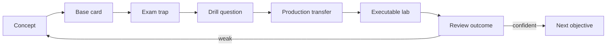

# Certification MOC

## Общая модель

Каноническая теория хранится в `10_CONCEPTS`. Карточки используют её для active recall, discrimination, mechanism explanation и production transfer.



## Review entry point

- [[00_HOME/Review Dashboard]]

# Java certification route

## Java concurrency foundation

- [[10_CONCEPTS/Java/Concurrency/Java Memory Model]]
- [[10_CONCEPTS/Java/Concurrency/Happens-Before]]
- [[10_CONCEPTS/Java/Concurrency/volatile]]
- [[10_CONCEPTS/Java/Concurrency/synchronized]]
- [[10_CONCEPTS/Java/Concurrency/ExecutorService]]
- [[10_CONCEPTS/Java/Concurrency/CompletableFuture]]
- [[10_CONCEPTS/Java/Concurrency/Virtual Threads]]
- [[10_CONCEPTS/Java/Concurrency/Atomic CAS and Counters]]
- [[10_CONCEPTS/Java/Concurrency/Deadlock Livelock and Lock Ordering]]
- [[10_CONCEPTS/Java/Concurrency/Concurrent Collections and Backpressure]]

# Spring certification route

- [[30_CERTIFICATIONS/Spring/2V0-72.22/Spring Certification Card System|Card System]]
- [[30_CERTIFICATIONS/Spring/2V0-72.22/Spring Core Card Roadmap|Spring Core Roadmap]]
- [[30_CERTIFICATIONS/Spring/2V0-72.22/Spring AOP and Cache Roadmap|AOP and Cache Roadmap]]
- [[30_CERTIFICATIONS/Spring/2V0-72.22/Spring Transaction Management Roadmap|Transaction Management Roadmap]]
- [[30_CERTIFICATIONS/Spring/2V0-72.22/Spring Data JPA Roadmap|Spring Data JPA Roadmap]]
- [[30_CERTIFICATIONS/Spring/2V0-72.22/Spring Testing Roadmap|Spring Testing Roadmap]]

## Published Spring Core batches

| Batch | Cards | Concept | Status |
|---|---:|---|---|
| [[30_CERTIFICATIONS/Spring/2V0-72.22/CORE-B01/CORE-B01 Cards|CORE-B01]] | 20 | [[10_CONCEPTS/Spring/Core/Spring Core Foundations]] | published |
| [[30_CERTIFICATIONS/Spring/2V0-72.22/CORE-B02/CORE-B02 Cards|CORE-B02]] | 24 | [[10_CONCEPTS/Spring/Core/Dependency Resolution and Optional Injection]] | published |
| [[30_CERTIFICATIONS/Spring/2V0-72.22/CORE-B03/CORE-B03 Cards|CORE-B03]] | 24 | [[10_CONCEPTS/Spring/Core/Bean Lifecycle from Definition to Destruction]] | published |
| [[30_CERTIFICATIONS/Spring/2V0-72.22/CORE-B04/CORE-B04 Cards|CORE-B04]] | 24 | [[10_CONCEPTS/Spring/Core/Container Extension Points]] | published |
| [[30_CERTIFICATIONS/Spring/2V0-72.22/CORE-B05/CORE-B05 Cards|CORE-B05]] | 24 | [[10_CONCEPTS/Spring/Core/Configuration Profiles and Externalized Properties]] | published |
| [[30_CERTIFICATIONS/Spring/2V0-72.22/CORE-B06/CORE-B06 Cards|CORE-B06]] | 24 | [[10_CONCEPTS/Spring/Core/Advanced Core Scopes FactoryBean and Context Hierarchy]] | published |

## Published AOP and Cache batches

| Batch | Cards | Concept | Status |
|---|---:|---|---|
| [[30_CERTIFICATIONS/Spring/2V0-72.22/AOP-B01/AOP-B01 Cards|AOP-B01]] | 24 | [[10_CONCEPTS/Spring/AOP/Spring AOP Proxy Mechanics]] | published |
| [[30_CERTIFICATIONS/Spring/2V0-72.22/CACHE-B01/CACHE-B01 Cards|CACHE-B01]] | 20 | [[10_CONCEPTS/Spring/Cache/Spring Cache with Caffeine and Redis]] | published |

## Published Transaction Management batch

| Batch | Cards | Concepts | Status |
|---|---:|---|---|
| [[30_CERTIFICATIONS/Spring/2V0-72.22/TX-B01/TX-B01 Cards|TX-B01]] | 32 | [[10_CONCEPTS/Spring/Transactions/Spring Transaction Management Deep Dive]] + [[10_CONCEPTS/Spring/Transactions/Transactional Outbox and Commit Boundaries]] | published |

## Published Spring Data JPA batch

| Batch | Cards | Concepts | Status |
|---|---:|---|---|
| [[30_CERTIFICATIONS/Spring/2V0-72.22/DATA-B01/DATA-B01 Cards|DATA-B01]] | 36 | [[10_CONCEPTS/Spring/Data/Spring Data JPA Persistence Context and Entity Lifecycle]] + [[10_CONCEPTS/Spring/Data/Spring Data Repositories Queries and Fetching]] | published |

## Published Spring Testing batch

| Batch | Cards | Concepts | Status |
|---|---:|---|---|
| [[30_CERTIFICATIONS/Spring/2V0-72.22/TEST-B01/TEST-B01 Cards|TEST-B01]] | 36 | [[10_CONCEPTS/Spring/Testing/Spring TestContext and Test Slices]] + [[10_CONCEPTS/Spring/Testing/Spring Data JPA Testing with Testcontainers]] | published |

```text
Spring Core               140
AOP and Cache               44
Transaction Management      32
Spring Data and JPA          36
Spring Testing               36
-------------------------------
Published Spring total     288
```

# Supporting maps, cases and labs

## Spring Core

- [[01_MAPS/Spring Core Foundation Map.canvas]]
- [[01_MAPS/Spring Dependency Resolution Map.canvas]]
- [[01_MAPS/Spring Bean Lifecycle Map.canvas]]
- [[01_MAPS/Spring Container Extension Points Map.canvas]]
- [[01_MAPS/Spring Configuration and Profiles Map.canvas]]
- [[01_MAPS/Spring Advanced Core Map.canvas]]

## AOP and Cache

- [[01_MAPS/Spring AOP and Caching Map.canvas]]
- [[40_PRODUCTION_CASES/Spring/AOP and Cache Production Cases]]
- [[50_LABS/Spring/AOP-B01/README]]
- [[50_LABS/Spring/CACHE-B01/README]]
- [[98_SOURCES/Spring AOP and Cache Sources]]

## Transaction Management

- [[01_MAPS/Spring Transaction Management Map.canvas]]
- [[40_PRODUCTION_CASES/Spring/Transaction Management Production Cases]]
- [[50_LABS/Spring/TX-B01/README]]
- [[98_SOURCES/Spring Transaction Management Sources]]

## Spring Data and JPA

- [[01_MAPS/Spring Data JPA Map.canvas]]
- [[40_PRODUCTION_CASES/Spring/Spring Data JPA Production Cases]]
- [[50_LABS/Spring/DATA-B01/README]]
- [[98_SOURCES/Spring Data JPA Sources]]

## Spring Testing

- [[01_MAPS/Spring Testing Map.canvas]]
- [[40_PRODUCTION_CASES/Spring/Spring Testing Production Cases]]
- [[50_LABS/Spring/TEST-B01/README]]
- [[98_SOURCES/Spring Testing Sources]]

# Card format

1. `Question` на английском.
2. `Russian Translation`.
3. `Answer`.
4. `Explanation`.
5. `Exam Trap`.
6. `Mini Example` для сложной темы.
7. `Memory Hook` для легко путаемой темы.
8. Production transfer для mechanism-heavy темы.

Целевая модель всей Spring certification base:

```text
750 base cards + 150 exam drill questions = 900 items
```

# Testing process

1. Ответить, не открывая explanation.
2. Зафиксировать confident или guessed.
3. Связать вопрос с canonical concept note.
4. Разобрать неправильные варианты.
5. Применить правило к новому production scenario.
6. Предсказать lab trace до запуска.
7. Повышать confidence только после повторного успешного recall.

## Outcome taxonomy

- `correct-confident`;
- `correct-guessed`;
- `wrong-concept`;
- `wrong-attention`;
- `wrong-confusion`.

# Next Spring certification route

`Spring Boot Internals and Auto-configuration`:

- application bootstrap;
- auto-configuration import pipeline;
- conditions;
- condition report;
- starters;
- custom auto-configuration;
- `ApplicationContextRunner`;
- Actuator and startup diagnostics.
