# DB-B01 — Indexes and Query Plans Roadmap

> [!summary]
> Route model: query shape → planner estimates → chosen access path → physical page work → measured evidence. Цель — доказать, почему plan дорог и какой change уменьшает required work.

# Route navigation

- **Registry:** [[00_HOME/Knowledge Route Registry]]
- **Domain map:** [[01_MAPS/Databases Map]]
- **Previous bridge:** [[10_CONCEPTS/Spring/Data/Spring Data JPA Visual Deep Dive]]
- **Next:** DB-B02 — Transactions, MVCC and Locks — planned.
- **Canvas:** [[01_MAPS/Database Indexes and Query Plans Map.canvas]]
- **Sources:** [[98_SOURCES/PostgreSQL Indexes and Query Plans Sources]]

# Progress

```text
Canonical notes        2  PUBLISHED
Visual diagrams       62  PUBLISHED
Cards                 30  PUBLISHED
Production cases      14  PUBLISHED
PostgreSQL lab        10  experiments
Canvas atlas           1
Source index           1
```

```mermaid
flowchart LR
    SHAPE["Query shape"] --> BTREE["B-tree and heap mechanics"]
    BTREE --> SELECT["Selectivity and composite order"]
    SELECT --> ACCESS["Seq / Index / Bitmap / Index Only"]
    ACCESS --> PLAN["EXPLAIN ANALYZE BUFFERS"]
    PLAN --> EST["Statistics and estimate errors"]
    EST --> JOIN["Join, sort and aggregation"]
    JOIN --> CASES["Production incidents"]
    CASES --> LAB["PostgreSQL 18 lab"]
```



# DB-B01 artifacts

| Role | Artifact |
|---|---|
| Index mechanics | [[10_CONCEPTS/Databases/PostgreSQL Index Mechanics]] |
| Plan analysis | [[10_CONCEPTS/Databases/PostgreSQL EXPLAIN and Query Plan Analysis]] |
| Cards | [[30_CERTIFICATIONS/Databases/DB-B01/DB-B01 Cards]] |
| Cases | [[40_PRODUCTION_CASES/Databases/Indexes and Query Plans Production Cases]] |
| Lab | [[50_LABS/Databases/DB-B01/README]] |
| Compose | [[50_LABS/Databases/DB-B01/compose.yaml]] |
| Schema | [[50_LABS/Databases/DB-B01/sql/01_schema.sql]] |
| Seed | [[50_LABS/Databases/DB-B01/sql/02_seed.sql]] |
| Experiments | [[50_LABS/Databases/DB-B01/sql/03_experiments.sql]] |
| Canvas | [[01_MAPS/Database Indexes and Query Plans Map.canvas]] |
| Sources | [[98_SOURCES/PostgreSQL Indexes and Query Plans Sources]] |

# Coverage

## Index mechanics

- heap and secondary-index separation;
- B-tree hierarchy and leaf traversal;
- equality and range scans;
- selectivity, cardinality and skew;
- composite indexes and leading-prefix reasoning;
- PostgreSQL 18 skip-scan boundary;
- ordering and early stop;
- `INCLUDE` payload;
- visibility map and index-only scans;
- partial and expression indexes;
- bitmap combination;
- unique indexes;
- write amplification and HOT;
- correlation and BRIN boundary.

## Query-plan analysis

- planner pipeline and plan tree reading;
- startup/total cost;
- actual time, rows and loops;
- `EXPLAIN` versus `EXPLAIN ANALYZE`;
- `BUFFERS`;
- Seq, Index, Index Only and Bitmap scans;
- `Index Cond`, `Filter`, `Rows Removed`;
- single-column and extended statistics;
- nested loop, hash join and merge join;
- sort/hash spills;
- parallel plans;
- LIMIT early stop;
- cache-state comparison;
- safe DML analysis;
- planner toggles as diagnostics only.

# Production transfer

Use [[40_PRODUCTION_CASES/Databases/Indexes and Query Plans Production Cases]] for:

- index exists but Seq Scan is rational;
- composite index column order mismatch;
- three single-column indexes versus one workload-aligned composite index;
- Index Only Scan with many heap fetches;
- wide `INCLUDE` write amplification;
- ignored partial index;
- expression mismatch leaving a Filter;
- stale statistics and catastrophic Nested Loop;
- correlated predicates and extended statistics;
- sort spill, lossy bitmap and high OFFSET;
- cases where another B-tree cannot reduce required aggregation work.

# Quality status

- [x] Central registry and domain MOC links.
- [x] Two canonical notes.
- [x] 62 diagrams and Canvas.
- [x] 30 normalized cards.
- [x] 14 incidents.
- [x] PostgreSQL 18 Docker lab structure.
- [x] Skewed/correlated fixtures.
- [x] Source index.
- [x] Route manifest and graph audit.
- [ ] Docker lab executed and output reviewed.
- [ ] Query plans captured on a second machine/cache profile.
- [ ] Write-amplification experiment completed.

# Review questions

1. What physical path does ordinary Index Scan use?
2. Why can a common value lead to Seq Scan?
3. Which columns limit a multicolumn B-tree range?
4. Why can Index Only Scan still read heap?
5. How does `INCLUDE` differ from a key column?
6. When is Bitmap Heap Scan rational?
7. How should rows × loops be interpreted?
8. Where is the first material estimate error?
9. How do extended statistics differ from a composite index?
10. Why can an index not solve aggregation over most of the dataset?
