# DB-B01 — Indexes and Query Plans Roadmap

> [!summary]
> Маршрут строит единую модель: query shape → planner estimates → chosen access path → physical page work → measured evidence. Он не учит механически добавлять indexes; он учит доказывать, почему конкретный plan дорог и какой change уменьшает required work.

# Progress

```text
Canonical notes       2  PUBLISHED
Visual diagrams      62  PUBLISHED
Cards                30  PUBLISHED
Production cases     14  PUBLISHED
PostgreSQL lab        10 experiments
Canvas atlas           1
Source index           1
```

# Learning sequence

```mermaid
flowchart LR
    SHAPE["Query shape"] --> BTREE["B-tree and heap mechanics"]
    BTREE --> SELECT["Selectivity and composite order"]
    SELECT --> ACCESS["Seq / Index / Bitmap / Index Only"]
    ACCESS --> PLAN["EXPLAIN ANALYZE BUFFERS"]
    PLAN --> EST["Statistics and estimate errors"]
    EST --> JOIN["Join, sort and aggregation nodes"]
    JOIN --> CASES["Production incidents"]
    CASES --> LAB["PostgreSQL 18 lab"]
```



# Materials

## Canonical concepts

- [[10_CONCEPTS/Databases/PostgreSQL Index Mechanics]]
- [[10_CONCEPTS/Databases/PostgreSQL EXPLAIN and Query Plan Analysis]]

## Active recall

- [[30_CERTIFICATIONS/Databases/DB-B01/DB-B01 Cards]]

## Production transfer

- [[40_PRODUCTION_CASES/Databases/Indexes and Query Plans Production Cases]]

## Lab

- [[50_LABS/Databases/DB-B01/README]]
- [[50_LABS/Databases/DB-B01/compose.yaml]]
- [[50_LABS/Databases/DB-B01/sql/01_schema.sql]]
- [[50_LABS/Databases/DB-B01/sql/02_seed.sql]]
- [[50_LABS/Databases/DB-B01/sql/03_experiments.sql]]

## Visual map and sources

- [[01_MAPS/Database Indexes and Query Plans Map.canvas]]
- [[98_SOURCES/PostgreSQL Indexes and Query Plans Sources]]

# Coverage

## Index mechanics

- heap and secondary-index separation;
- B-tree hierarchy and leaf traversal;
- equality and range scans;
- selectivity and cardinality;
- composite indexes and leading-prefix reasoning;
- PostgreSQL 18 B-tree skip-scan boundary;
- ordering and early stop;
- `INCLUDE` payload;
- visibility map and index-only scans;
- partial and expression indexes;
- bitmap combination;
- unique indexes;
- write amplification and HOT;
- correlation and BRIN boundary.

## Query-plan analysis

- planner pipeline;
- plan tree reading;
- startup/total cost;
- actual time, rows and loops;
- `EXPLAIN` versus `EXPLAIN ANALYZE`;
- `BUFFERS`;
- Seq, Index, Index Only and Bitmap scans;
- `Index Cond`, `Filter`, `Rows Removed`;
- single-column and extended statistics;
- nested loop, hash join and merge join;
- sort/hash spills;
- parallel plans;
- LIMIT early stop;
- cache-state comparison;
- safe DML analysis;
- planner toggles as diagnostics only.

# Quality gate

- [x] Mechanism-oriented canonical explanations.
- [x] Architecture/topology diagrams.
- [x] Runtime sequence diagrams.
- [x] State/data-flow diagrams.
- [x] Diagnostic decision trees.
- [x] Worked production examples.
- [x] 30 cards with full mandatory sections.
- [x] 14 incidents with evidence and repair.
- [x] PostgreSQL 18 Docker lab structure.
- [x] Skewed and correlated data fixtures.
- [x] Primary official source index.
- [x] Canvas route.
- [ ] Docker lab executed and output reviewed.
- [ ] Query plans captured on a second machine/cache profile.
- [ ] Write-amplification experiment completed.

# Review questions

1. Какой physical path использует обычный Index Scan?
2. Почему common value может привести к Seq Scan?
3. Какие columns реально ограничивают multicolumn B-tree range?
4. Почему `Index Only Scan` может читать heap?
5. Чем `INCLUDE` отличается от key column?
6. Когда Bitmap Heap Scan рациональнее plain Index Scan?
7. Как читать rows × loops?
8. Где искать первый estimate error?
9. Чем extended statistics отличаются от composite index?
10. Почему index не решает aggregation по большей части dataset?

# Next route

```text
DB-B02 — Transactions, MVCC and Locks
```

Planned scope:

- snapshots and tuple visibility;
- READ COMMITTED and REPEATABLE READ;
- row/table locks;
- lock queues and deadlocks;
- optimistic/pessimistic application patterns;
- vacuum and long transactions;
- transaction ID and bloat boundaries;
- production lock diagnostics.
