# Java SE 17 1Z0-829 — 99 Percent Master Roadmap

> [!summary]
> Target: 720 base cards + 180 exam-drill cards + six full timed mocks. Existing Java Concurrency material is reused, but OCP readiness requires ten additional complete exam domains and exact compile/output practice.

# Official capability baseline

Oracle's Java SE 17 learning path identifies these broad capabilities:

```text
object-oriented programming
Java syntax and constructs
Collections and Streams
I/O and Concurrency
deployment
JDK 17 features
```

The repository decomposes them into 11 exam-oriented domains.

# Card target

```text
Base cards   720
Drill cards  180
----------------
Total        900
```

## Base-card allocation

| Domain | Batch | Target |
|---|---|---:|
| Data types, operators, text and date/time | JAVA-B01 | 70 |
| Control flow and switch | JAVA-B02 | 45 |
| Object model, inheritance, records and sealed classes | JAVA-B03 | 90 |
| Exceptions and resource management | JAVA-B04 | 50 |
| Arrays, collections and generics | JAVA-B05 | 90 |
| Lambdas, functional interfaces and streams | JAVA-B06 | 100 |
| Modules, services and deployment | JAVA-B07 | 60 |
| Concurrency exam objectives | JAVA-B08 | 75 |
| I/O, NIO.2 and serialization | JAVA-B09 | 65 |
| JDBC | JAVA-B10 | 40 |
| Localization | JAVA-B11 | 35 |
| **Total** |  | **720** |

## Drill-card allocation

| Drill type | Cards |
|---|---:|
| Compile / does-not-compile | 55 |
| Exact output and initialization order | 35 |
| Multiple-select API semantics | 25 |
| Streams/collectors pipelines | 20 |
| Generics and overload resolution | 15 |
| Modules/I/O/JDBC/localization API traps | 20 |
| Concurrency/JMM execution traps | 10 |
| **Total** | **180** |

# Required answer order

Every code-result drill follows:

```text
1. Does it compile?
2. If not, which line/rule fails?
3. If yes, what is the exact output?
4. Does execution throw an exception?
5. Which options are selected?
```

# JAVA-B01 — Data Types, Operators, Text and Date/Time

Target:

```text
2 canonical notes
25+ diagrams/tables
70 base cards
15 drills
12 cases
2 labs
1 Canvas
1 source index
```

Coverage:

- primitive types and literals;
- numeric promotion and casts;
- wrapper classes and boxing;
- operators and precedence;
- `String`, text blocks and `StringBuilder`;
- equality and immutability;
- `Math` and common utility APIs;
- `LocalDate`, `LocalTime`, `LocalDateTime`;
- `ZonedDateTime`, `Instant`;
- `Period` versus `Duration`;
- `DateTimeFormatter`;
- DST and unsupported operations.

# JAVA-B02 — Control Flow and Switch

Target: 45 base cards + 10 drills.

Coverage:

- `if/else`;
- classic and enhanced switch;
- switch expressions and `yield`;
- loops;
- labels;
- `break` and `continue`;
- unreachable code;
- pattern matching for `instanceof`;
- scope of pattern variables.

# JAVA-B03 — Object Model

Target: 90 base cards + 25 drills.

Coverage:

- declarations, access and encapsulation;
- constructor rules;
- initialization order;
- overloading and overriding;
- static hiding;
- covariant returns;
- abstract classes and interfaces;
- default/private/static interface methods;
- polymorphism and casts;
- enums;
- nested classes;
- records;
- sealed classes;
- annotations relevant to language semantics.

# JAVA-B04 — Exceptions and Resources

Target: 50 base cards + 15 drills.

Coverage:

- checked versus unchecked;
- catch ordering and multi-catch;
- finally behavior;
- try-with-resources;
- `AutoCloseable`;
- close order;
- suppressed exceptions;
- exception propagation;
- overriding `throws` rules;
- assertions and custom exceptions.

# JAVA-B05 — Arrays, Collections and Generics

Target: 90 base cards + 25 drills.

Coverage:

- arrays and multidimensional initialization;
- `List`, `Set`, `Map`, `Queue`, `Deque`;
- immutable collection factories;
- `Comparable` and `Comparator`;
- `equals`/`hashCode` contracts;
- generic classes and methods;
- invariance;
- bounded wildcards;
- PECS;
- type erasure;
- raw types;
- overload resolution with generics;
- concurrent collection exam boundary.

# JAVA-B06 — Lambdas, Functional Interfaces and Streams

Target: 100 base cards + 30 drills.

Coverage:

- lambda syntax and effectively-final capture;
- built-in functional interfaces;
- method references;
- `Optional`;
- lazy stream execution;
- intermediate and terminal operations;
- map/flatMap;
- reduce;
- primitive streams;
- collectors;
- grouping/partitioning/mapping/flatMapping/teeing;
- parallel streams;
- ordering, associativity and side effects.

# JAVA-B07 — Modules, Services and Deployment

Target: 60 base cards + 15 drills.

Coverage:

- `module-info.java`;
- `requires`, transitive and static;
- `exports` and `opens`;
- qualified exports/opens;
- `uses` and `provides`;
- service loading;
- classpath versus module path;
- named, automatic and unnamed modules;
- modular JARs;
- `jar`, `jdeps`, `jlink`;
- migration and split-package traps.

# JAVA-B08 — Concurrency Exam Objectives

Target: 75 base cards + 20 drills.

Uses the independent Concurrency route but adds certification-shaped questions:

- `Runnable` versus `Callable`;
- `execute` versus `submit`;
- `Future` outcomes;
- executor lifecycle;
- synchronization and locks;
- atomics;
- concurrent collections;
- parallel streams;
- thread-safety;
- happens-before questions with exact code paths.

Parent route: [[30_CERTIFICATIONS/Java/Concurrency/Java Concurrency 99 Percent Roadmap]].

# JAVA-B09 — I/O, NIO.2 and Serialization

Target: 65 base cards + 15 drills.

Coverage:

- byte versus character streams;
- buffering;
- `Reader`/`Writer`;
- object serialization;
- `transient` and `serialVersionUID`;
- `Path` operations;
- `Files` operations;
- attributes;
- directory traversal;
- `resolve`, `relativize`, `normalize`;
- file watch/service boundary;
- try-with-resources.

# JAVA-B10 — JDBC

Target: 40 base cards + 10 drills.

Coverage:

- `Connection`;
- `Statement`, `PreparedStatement`, `CallableStatement`;
- parameter indexing;
- `execute`, `executeQuery`, `executeUpdate`;
- `ResultSet` navigation;
- transactions;
- commit/rollback/savepoint;
- batching;
- resource lifecycle;
- SQL exception semantics.

# JAVA-B11 — Localization

Target: 35 base cards + 10 drills.

Coverage:

- `Locale`;
- `ResourceBundle` lookup and fallback;
- properties versus class bundles;
- `NumberFormat`;
- currency and percentages;
- localized date/time;
- `MessageFormat`;
- missing-resource behavior.

# Vertical-slice contract

Every JAVA-Bxx route includes:

```text
canonical explanation
visual deep dive
base cards
exam drills
production/API cases
executable Java 17 lab
Canvas
official JLS/API/tool sources
```

# Mock system

## Domain mini-mocks

```text
22 mini-mocks
25 questions each
2 per domain
```

## Full timed mocks

```text
6 full mixed mocks
format/time verified against current Oracle registration page before publication
```

Each question stores:

```text
objective ID
question kind
correct answer count
compile status
runtime outcome
source note
confidence
elapsed time
error taxonomy
```

Error taxonomy:

```text
syntax-rule
scope-rule
overload-resolution
initialization-order
generics-invariance
stream-laziness
collector-contract
module-readability
resource-lifecycle
concurrency-ordering
API-recall
wrong-attention
correct-guessed
```

# Current baseline

```text
Java Concurrency concepts and visuals    strong
General Java exam cards                  not yet published
Language vertical slices                 missing
Collections/generics vertical slice      missing
Streams vertical slice                   missing
Modules/I/O/JDBC/localization            missing
Full Java mocks                          missing
```

Conservative material readiness: **20–25%**.

# 99% material gate

```text
[ ] 11/11 domains complete
[ ] 720 base cards
[ ] 180 drill cards
[ ] compile/output validation for code drills
[ ] Java 17 labs compile and run in CI
[ ] six full mocks
[ ] official objectives mapped
[ ] JLS/API/tool references version-pinned
[ ] no domain below its artifact target
[ ] structural/cross-link/Mermaid/card/readiness CI passes
```

# Delivery sequence

```mermaid
flowchart LR
    B1["JAVA-B01 data/date"] --> B2["JAVA-B02 control flow"]
    B2 --> B3["JAVA-B03 object model"]
    B3 --> B4["JAVA-B04 exceptions"]
    B4 --> B5["JAVA-B05 collections/generics"]
    B5 --> B6["JAVA-B06 lambdas/streams"]
    B6 --> B7["JAVA-B07 modules"]
    B7 --> B8["JAVA-B08 concurrency exam"]
    B8 --> B9["JAVA-B09 I/O"]
    B9 --> B10["JAVA-B10 JDBC"]
    B10 --> B11["JAVA-B11 localization"]
    B11 --> DRILL["180 drills"]
    DRILL --> MOCK["6 full mocks"]
```



# Related dashboards

- [[00_HOME/Certification 99 Percent Readiness Dashboard]]
- [[30_CERTIFICATIONS/Java/Concurrency/Java Concurrency 99 Percent Roadmap]]
- [[01_MAPS/Java Map]]
- [[30_CERTIFICATIONS/Certification MOC]]
