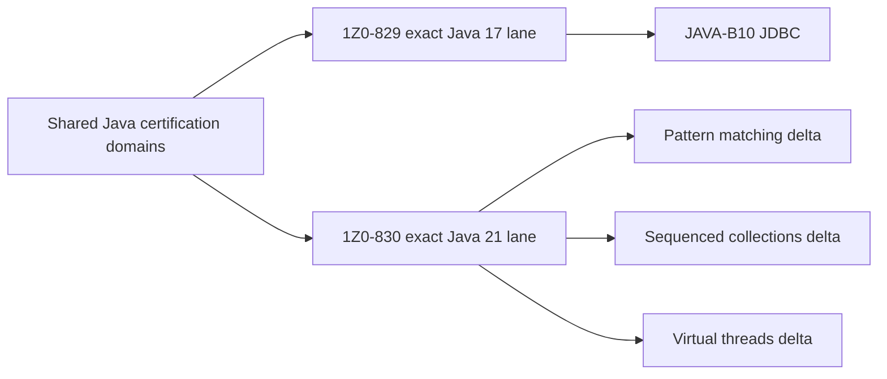

# Java SE 21 1Z0-830 — 99 Percent Master Roadmap

> [!summary]
> Java 21 is the exact exam baseline. The track reuses stable Java 17 material where the language/API contract is unchanged, then adds explicit Java 21 coverage for record patterns, pattern matching for `switch`, sequenced collections and virtual threads. Java 17 JDBC material remains valuable backend knowledge but is not part of the main 1Z0-830 objective list.

# Navigation

- [[00_HOME/Oracle Java 17 and 21 Certification Program]]
- [[30_CERTIFICATIONS/Java/Java 17 and 21 Exam Delta Matrix]]
- [[30_CERTIFICATIONS/Java/1Z0-829/Java SE 17 99 Percent Master Roadmap]]
- [[00_HOME/Java 11 17 21 Complete Knowledge Program]]
- [[30_CERTIFICATIONS/Java/JAVA-LTS-B01/JAVA-LTS-B01 Roadmap]]
- [[98_SOURCES/Java SE 21 1Z0-830 Sources]]
- [[01_MAPS/Java Map]]

# Exam baseline

```text
Exam          Java SE 21 Developer Professional
Code          1Z0-830
Questions     50
Duration      120 minutes
Passing score 68%
Format        multiple choice
Baseline      Java SE 21
```

Re-verify logistics in Oracle's exam portal before purchase.

# Version contract

```text
Java 17  shared foundation and comparison baseline
Java 21  exact compile/API/execution baseline for 1Z0-830
```

Rules:

1. Compile/no-compile answers use JLS 21.
2. API questions use Java SE 21 documentation.
3. Java 21 preview features are invalid unless preview is explicitly enabled.
4. Java 17 answers are reused only when behavior is unchanged.
5. Every Java 21-specific feature has an exact JEP and final/preview status.
6. JDBC is kept in the wider program but excluded from the 1Z0-830 exam-card quota.

# Objective manifest

```text
.github/objectives/java-1Z0-830.json
```

The manifest contains 24 direct sub-objectives and 3 supplementary objectives.

# Card target

```text
Base cards     800
Drill cards    200
------------------
Total         1000
Full mocks       6
```

## Base-card allocation

| Domain | Shared route | Target | Java 21 emphasis |
|---|---|---:|---|
| Values, text and date/time | JAVA-B01 | 75 | exact Java 21 APIs and DST traps |
| Program flow | JAVA-B02 | 60 | pattern switch, dominance, exhaustiveness, null |
| Object-oriented concepts | JAVA-B03 | 115 | record patterns, sealed exhaustiveness, nested patterns |
| Exceptions and resources | JAVA-B04 | 50 | unchanged core contract, exact close/suppression rules |
| Arrays, collections and generics | JAVA-B05 | 100 | sequenced collection interfaces and reversed views |
| Streams and lambdas | JAVA-B06 | 110 | shared pipelines plus collection-order interactions |
| Modules and deployment | JAVA-B07 | 70 | Java 21 tool/runtime-image baseline |
| Concurrency | JAVA-B08 | 90 | platform versus virtual threads |
| I/O, NIO.2 and serialization | JAVA-B09 | 70 | exact Path/Files/serialization contracts |
| Localization | JAVA-B11 | 40 | bundles, formatting and parsing |
| Supplementary topics | JAVA-SUP-B01 | 20 | logging, standard annotations, generic wildcards |
| **Total** |  | **800** |  |

# Shared and exclusive route model



# Domain requirements

## JAVA-B01 — Values, Text and Date-Time

```text
primitives and wrappers
numeric promotion, casting and operators
Math API
String and StringBuilder
text blocks
LocalDate, LocalTime, LocalDateTime
Instant, Period and Duration
ZoneId and ZonedDateTime
DST gaps and overlaps
DateTimeFormatter
```

Target: 75 base cards + 15 drills.

## JAVA-B02 — Program Flow and Pattern Switch

```text
if/else
loops and labels
break and continue
classic switch
switch expressions and yield
pattern matching for switch
case dominance
exhaustiveness
null case handling
qualified enum constants
```

Target: 60 base cards + 20 drills.

Java 21 mandatory delta:

```text
JEP 441 pattern matching for switch
```

## JAVA-B03 — Object-Oriented Concepts

```text
object lifecycle and reachability
nested, local and anonymous classes
constructors and initialization order
static and instance members
overloading and varargs
scope, encapsulation and immutability
inheritance and polymorphism
abstract and sealed types
records and enums
interfaces and functional interfaces
pattern instanceof
record patterns
nested patterns
```

Target: 115 base cards + 35 drills.

Java 21 mandatory delta:

```text
JEP 440 record patterns
pattern switch interaction with sealed hierarchies
```

## JAVA-B04 — Exceptions and Resources

```text
checked and unchecked exceptions
try/catch/finally
multi-catch
custom exceptions
try-with-resources
AutoCloseable
reverse close order
suppressed exceptions
rethrow and overriding rules
```

Target: 50 base cards + 15 drills.

## JAVA-B05 — Arrays, Collections and Generics

```text
arrays and multidimensional initialization
List, Set, Map and Deque
Comparable and Comparator
mutation and iteration
immutable factory collections
generic classes and methods
bounds and wildcards
PECS and capture
type erasure and raw types
sequenced collection interfaces
first/last/reversed contracts
```

Target: 100 base cards + 30 drills.

Java 21 mandatory delta:

```text
JEP 431 SequencedCollection
JEP 431 SequencedSet
JEP 431 SequencedMap
live reversed views and encounter order
```

## JAVA-B06 — Streams and Lambda Expressions

```text
functional interfaces
lambda syntax and capture
method references
object and primitive streams
stream creation and laziness
filter/map/flatMap/sort
reduce and collect
Optional
grouping and partitioning
parallel streams
associativity, ordering and side effects
```

Target: 110 base cards + 30 drills.

## JAVA-B07 — Packaging and Deployment

```text
module-info.java
requires, exports and opens
qualified directives
uses and provides
reflection boundaries
classpath versus module path
named, automatic and unnamed modules
modular/non-modular JARs
jar, jdeps and jlink
custom runtime images
migration to modules
```

Target: 70 base cards + 15 drills.

## JAVA-B08 — Concurrent Code Execution

```text
Thread lifecycle
platform threads
virtual threads
Runnable and Callable
Future and executor services
synchronization and intrinsic locks
Lock and concurrent utilities
atomics
concurrent collections
parallel streams
thread safety and happens-before
```

Target: 90 base cards + 30 drills.

Java 21 mandatory delta:

```text
JEP 444 virtual threads
Thread.ofVirtual
Thread.startVirtualThread
Executors.newVirtualThreadPerTaskExecutor
thread-local and pinning awareness
virtual threads are not pooled worker threads
```

Preview boundary:

```text
Structured Concurrency and Scoped Values are not normal final Java 21 exam assumptions.
```

## JAVA-B09 — I/O, NIO.2 and Serialization

```text
byte and character streams
buffering
Console
serialization and object graphs
transient and serialVersionUID
Path operations
Files operations
attributes
walking and searching directories
resource ownership
```

Target: 70 base cards + 15 drills.

## JAVA-B11 — Localization

```text
Locale
ResourceBundle lookup and fallback
properties and class bundles
NumberFormat
currency and percentages
date/time formatting and parsing
MessageFormat
missing-resource behavior
```

Target: 40 base cards + 10 drills.

## JAVA-SUP-B01 — Supplementary Topics

```text
java.util.logging basics
@Override
@FunctionalInterface
@Deprecated
@SuppressWarnings
@SafeVarargs
generics and wildcards reinforcement
```

Target: 20 base cards + 5 drills.

# Explicit 1Z0-829 versus 1Z0-830 boundary

| Topic | 1Z0-829 | 1Z0-830 |
|---|---:|---:|
| Java 17 language/API baseline | exact | inherited where unchanged |
| JDBC | direct objective | not in main objective list |
| Pattern switch | not final Java 17 baseline | direct Java 21 requirement |
| Record patterns | unavailable as final Java 17 feature | direct Java 21 requirement |
| Sequenced collections | unavailable | direct collection delta |
| Virtual threads | production delta only | direct concurrency requirement |
| Localization | direct objective | direct objective |
| Modules | direct objective | direct objective |
| I/O/NIO/serialization | direct objective | direct objective |

# Drill allocation

| Drill type | Cards |
|---|---:|
| Compile / does-not-compile | 60 |
| Exact output and initialization | 30 |
| Pattern switch and record-pattern dominance | 25 |
| Collections/generics/sequenced views | 25 |
| Streams and collectors | 20 |
| Virtual threads and concurrency | 20 |
| Modules/I/O/localization/supplementary | 20 |
| **Total** | **200** |

# Executable evidence

Each shared domain must include:

```text
JDK 17 lane for shared-baseline comparison
JDK 21 lane for exact 1Z0-830 behavior
compile-pass cases
compile-fail cases with javac diagnostics
runtime-output assertions
version-specific source sets when syntax differs
```

Recommended matrix:

```yaml
java: [17, 21]
```

Java 21-only source files must never be compiled in the Java 17 lane.

# Mock system

```text
20 domain mini-mocks × 25 questions
6 full mixed mocks × 50 questions / 120 minutes
```

Each question records:

```text
objective ID
target Java version
question kind
correct-answer count
compile status
runtime outcome
source evidence
confidence
elapsed time
error taxonomy
```

# Current gap

```text
1Z0-830 objective manifest         created
1Z0-830 source index               created
shared Java LTS route              published
shared exam-domain content         mostly absent
Java 21 pattern route              absent
Java 21 sequenced collections      absent
Java 21 virtual-thread exam bank   absent
1Z0-830 full mocks                 absent
```

# 99 percent gate

```text
[ ] 27/27 direct and supplementary objectives mapped
[ ] 800 base cards
[ ] 200 drills
[ ] all Java 21-only syntax compile-proven on JDK 21
[ ] Java 17 and Java 21 version traps explicitly separated
[ ] 20 domain mini-mocks
[ ] 6 timed full mocks
[ ] no JDBC questions counted toward the 1Z0-830 quota
[ ] all source links version-pinned
[ ] all structural, graph, card and objective audits pass
```

# Delivery sequence


# First implementation slice

```text
JAVA-B01 — values, text and date/time
JAVA-B02 — control flow and Java 21 pattern switch
JAVA-B03 — object model, records and record patterns
```

These three routes carry the highest dependency value because later collections, streams and concurrency questions reuse their language rules.
