# Java Concurrency — 99 Percent Roadmap

> [!summary]
> Existing Concurrency route is conceptually strong. To reach 99% material readiness it needs a dedicated certification/interview card bank, production-case collection, stress/diagnostic labs, version-boundary matrix and timed mini-mocks.

# Current assets

- [[10_CONCEPTS/Java/Concurrency/Concurrency Learning Path]]
- [[10_CONCEPTS/Java/Concurrency/Java Concurrency Visual Deep Dive]] — 35 diagrams.
- [[01_MAPS/Java Concurrency Visual Atlas.canvas]]
- [[01_MAPS/Java Concurrency Map.canvas]]
- [[01_MAPS/Java Advanced Concurrency Map.canvas]]
- [[20_QUESTIONS/Interview/Java/Concurrency/Advanced Concurrency Recall]]
- [[50_LABS/Java/Concurrency/README]]
- [[98_SOURCES/Java Concurrency Sources]]
- [[98_SOURCES/Advanced Concurrency Sources]]

# Target artifact model

```text
Canonical/supporting notes   18+
Visual diagrams              50+
Base cards                  140
Drill cards                  40
Production cases             20
Runnable experiments         25
Timed mini-mocks              6
Canvas maps                   3+
Source indexes                2+
```

# Card allocation

## Base cards — 140

| Domain | Cards |
|---|---:|
| Threads, lifecycle and interruption | 12 |
| Java Memory Model | 18 |
| Happens-before and safe publication | 16 |
| `volatile`, monitors and locks | 18 |
| Atomics, CAS and counters | 14 |
| Executors and queues | 18 |
| Future and CompletableFuture | 16 |
| Concurrent collections and backpressure | 12 |
| ThreadLocal and context propagation | 8 |
| Virtual threads | 8 |
| **Total** | **140** |

## Drill cards — 40

| Drill type | Cards |
|---|---:|
| Exact interleaving/visibility reasoning | 10 |
| Compile/runtime API behavior | 8 |
| Executor saturation and lifecycle | 8 |
| CompletableFuture execution/failure path | 6 |
| Deadlock/livelock diagnosis | 4 |
| Virtual-thread resource traps | 4 |
| **Total** | **40** |

# Missing canonical consolidation

## CONC-B01 — Thread Lifecycle and Interruption

- thread states;
- `start` versus `run`;
- interruption flag semantics;
- interruptible blocking;
- cooperative cancellation;
- shutdown protocols;
- uncaught exceptions.

## CONC-B02 — JMM and Safe Publication

- actions and synchronization order;
- program order;
- happens-before;
- final-field semantics;
- volatile publication;
- monitor publication;
- thread start/join;
- future completion;
- unsafe publication;
- double-checked locking.

## CONC-B03 — Locks, Conditions and Liveness

- intrinsic monitors;
- `wait/notify/notifyAll`;
- `ReentrantLock`;
- `Condition`;
- read/write locks;
- stamped-lock boundary;
- deadlock;
- livelock;
- starvation;
- lock ordering;
- timeout/interruptible acquisition.

## CONC-B04 — Atomics and Non-blocking State

- CAS;
- retry loops;
- ABA;
- atomic field/reference updates;
- immutable aggregate state;
- `LongAdder`/`LongAccumulator`;
- contention and consistency trade-offs.

## CONC-B05 — Executors, Futures and Backpressure

- execution policy;
- fixed/cached/scheduled executors;
- bounded/unbounded queues;
- rejection policies;
- `execute` versus `submit`;
- `Future` outcome model;
- cancellation;
- shutdown and termination;
- ForkJoin work stealing;
- blocking in common pool.

## CONC-B06 — CompletableFuture

- completion stages;
- sync versus async continuation;
- executor selection;
- `thenApply`/`thenCompose`/`thenCombine`;
- `allOf`/`anyOf`;
- exception paths;
- timeout;
- cancellation limitations;
- context propagation.

## CONC-B07 — Concurrent Collections

- `ConcurrentHashMap`;
- atomic compound methods;
- weakly consistent iterators;
- copy-on-write collections;
- blocking queues;
- producer/consumer design;
- semaphores and limiters;
- immutable/message-passing alternatives.

## CONC-B08 — ThreadLocal and Virtual Threads

- ThreadLocalMap ownership;
- pool reuse leaks;
- cleanup;
- inheritance boundaries;
- context propagation;
- virtual thread scheduler/carrier model;
- pinning/version boundaries;
- structured thread-per-task model;
- downstream resource limits.

# Production cases — target 20

Minimum case set:

```text
lost update on volatile counter
unsafe publication
broken double-checked locking variant
wait without condition loop
forgotten unlock
inconsistent lock ordering deadlock
read/write-lock misuse
CAS retry storm
LongAdder used for exact invariant
unbounded executor queue latency collapse
CallerRuns on request thread
submit failure never observed
shutdownNow task ignores interruption
CompletableFuture common-pool starvation
ThreadLocal tenant leak
ThreadLocal object-graph retention
ConcurrentHashMap check-then-act race
parallel stream side effects
virtual threads overwhelm DB pool
carrier pinning/blocked-thread diagnosis
```

# Lab target — 25 experiments

## Correctness labs

- lost update stress loop;
- volatile publication;
- monitor publication;
- start/join happens-before;
- Future.get visibility;
- atomic transition;
- concurrent-map compute;
- interruption protocol.

## Liveness labs

- reproducible deadlock;
- lock-order fix;
- starvation/fairness comparison;
- executor saturation;
- bounded queue/rejection;
- blocking queue backpressure.

## Pipeline labs

- CompletableFuture executor tracing;
- exception recovery;
- timeout;
- allOf aggregation;
- ForkJoin work stealing;
- common-pool blocking contrast.

## Context and virtual-thread labs

- ThreadLocal leak on one-thread executor;
- cleanup proof;
- 10,000 virtual-thread blocking tasks;
- semaphore-limited database simulation;
- JFR/thread-dump evidence instructions.

# Version matrix

```text
Java 8  — executors, futures, CompletableFuture, atomics, collections
Java 11 — stable production baseline delta
Java 17 — 1Z0-829 exam baseline
Java 21 — virtual threads and modern concurrency delta
```

Every Java 21-only mechanism must be marked as not part of Java 17 language/API exam baseline unless the question explicitly compares versions.

# Mini-mocks

```text
6 mini-mocks
30 questions each
45 minutes each
```

Distribution per mock:

```text
JMM/happens-before             8
locks/atomics                  6
executors/futures              7
collections/backpressure       4
ThreadLocal/virtual threads    3
liveness/diagnostics           2
```

# Material 99% gate

```text
[ ] 140 base cards complete
[ ] 40 drill cards complete
[ ] 20 production cases complete
[ ] 25 runnable/diagnostic experiments complete
[ ] 50+ rendered visual models
[ ] Java 8/17/21 version matrix complete
[ ] six timed mini-mocks complete
[ ] every mechanism linked to evidence and primary source
[ ] Java 17 exam subset mapped to JAVA-B08
[ ] CI compiles/runs supported lab suites
[ ] no incomplete published card
```

# Candidate 99% gate

```text
[ ] last 4 mini-mocks >= 92%
[ ] JMM/happens-before >= 90%
[ ] executors/futures >= 90%
[ ] liveness diagnosis >= 90%
[ ] every guessed-correct answer reviewed
[ ] lab outcomes predicted before execution
[ ] can explain mechanism without framework vocabulary
```

# Delivery order

```mermaid
flowchart LR
    C1["CONC-B01 lifecycle"] --> C2["CONC-B02 JMM"]
    C2 --> C3["CONC-B03 locks/liveness"]
    C3 --> C4["CONC-B04 atomics"]
    C4 --> C5["CONC-B05 executors"]
    C5 --> C6["CONC-B06 CompletableFuture"]
    C6 --> C7["CONC-B07 collections"]
    C7 --> C8["CONC-B08 ThreadLocal/virtual"]
    C8 --> CASES["20 cases"]
    CASES --> LABS["25 labs"]
    LABS --> DRILLS["40 drills"]
    DRILLS --> MOCKS["6 mini-mocks"]
```



# Related roadmaps

- [[00_HOME/Certification 99 Percent Readiness Dashboard]]
- [[30_CERTIFICATIONS/Java/1Z0-829/Java SE 17 99 Percent Master Roadmap]]
- [[10_CONCEPTS/Java/Concurrency/Concurrency Learning Path]]
