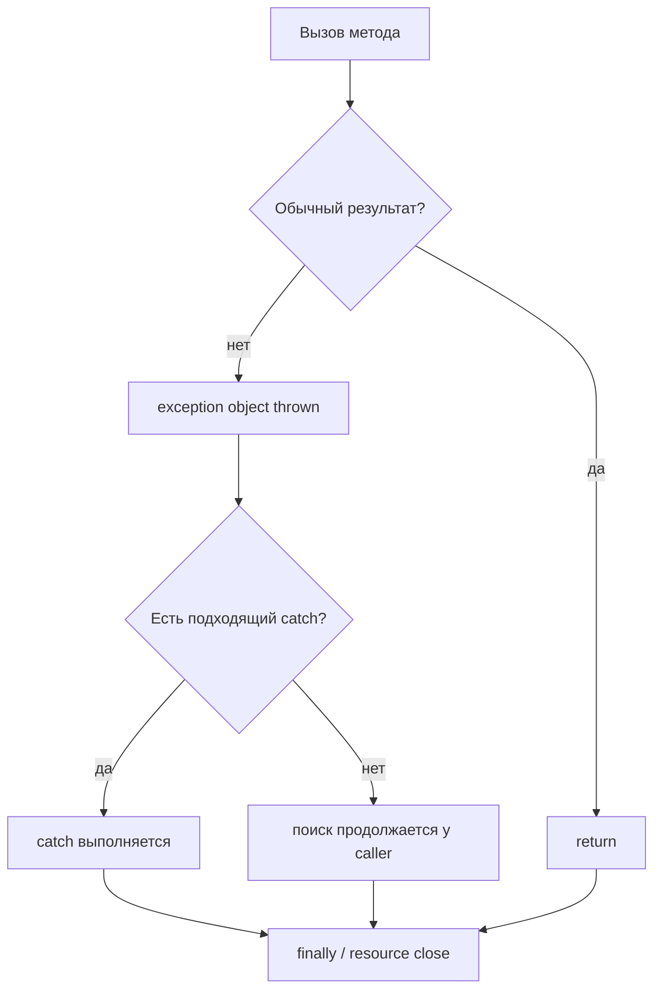

# JAVA-B04 — Exceptions and Resource Safety

> [!summary]
> Route goal: понять, как Java сообщает о невозможности продолжить обычный путь, как программа ищет обработчик и как гарантированно освобождает файлы, соединения и другие ресурсы.

## Для кого этот маршрут

### Начинающий

Научится отличать:

```text
ошибку компиляции
exception во время выполнения
обычный результат метода
```

### Студент

Научится проектировать exception flow, custom exceptions и cleanup.

### Certification candidate

Научится точно предсказывать:

- matching catch;
- порядок catch/finally;
- multi-catch legality;
- checked-exception compile rules;
- try-with-resources close order;
- primary и suppressed exceptions.

## Главная модель



## Последовательность изучения

1. [[10_CONCEPTS/Java/Exceptions/Java Why Programs Fail and Exception Flow]]
2. [[10_CONCEPTS/Java/Exceptions/Java Checked Unchecked Exceptions and Errors]]
3. [[10_CONCEPTS/Java/Exceptions/Java Try Catch Finally]]
4. [[10_CONCEPTS/Java/Exceptions/Java Throw Throws and Custom Exceptions]]
5. [[10_CONCEPTS/Java/Exceptions/Java Multi-catch and Precise Rethrow]]
6. [[10_CONCEPTS/Java/Exceptions/Java Try-with-resources and Suppressed Exceptions]]

Canonical hub:

- [[10_CONCEPTS/Java/Exceptions/Java Exceptions and Resource Safety]]

## Учебный цикл

```text
простая ситуация
→ нарисовать normal и failure paths
→ предсказать catch
→ предсказать finally/close
→ запустить proof
→ прочитать stack trace
→ исправить design
```

## Практика

- [[30_CERTIFICATIONS/Java/JAVA-B04/JAVA-B04 Cards]] — 36 карточек трёх уровней.
- [[30_CERTIFICATIONS/Java/JAVA-B04/JAVA-B04 Drills]] — 20 compile/output задач.
- [[40_PRODUCTION_CASES/Java/Java Exceptions Production Cases]] — 8 практических случаев.
- [[50_LABS/Java/JAVA-B04/README]] — executable proof Java 17/21.

## Ученик завершил маршрут, если может

1. Объяснить stack unwinding без фразы «Java прыгает в catch».
2. Отличить checked от unchecked по compiler contract, а не по «серьёзности».
3. Расположить catch от более конкретного к более общему.
4. Объяснить, когда выполняется `finally` и когда JVM может завершиться без него.
5. Создать custom exception с полезным сообщением и cause.
6. Объяснить automatic close order.
7. Найти primary и suppressed exception.
8. Не использовать exception как обычный branch там, где подходит validation/result.

## Version boundary

Основные правила route одинаковы в Java 17 и Java 21. Маршрут использует syntax, совместимый с обеими версиями.

## Navigation

- [[00_HOME/Java Beginner Learning Path]]
- [[00_HOME/Java Learning Dashboard]]
- [[00_HOME/Knowledge Route Registry]]
- **Previous:** [[30_CERTIFICATIONS/Java/JAVA-B03/JAVA-B03 Roadmap]]
- **Next:** `JAVA-B05 — Collections, Generics and Sequenced Collections`
- [[98_SOURCES/Java SE 17 1Z0-829 Sources]]
- [[98_SOURCES/Java SE 21 1Z0-830 Sources]]
