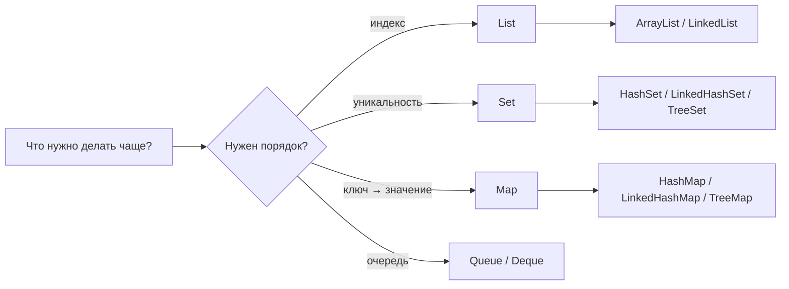

# JAVA-B05 — Collections, Generics and Sequenced Collections

> [!summary]
> Route goal: научиться выбирать структуру данных по операции, понимать её внутренний механизм и безопасно использовать generics от Java 17 до Java 21.

## Evidence status

```text
JDK 17 collections/generics proof       PASS
JDK 17 Java 21 API negative boundary    PASS
JDK 21 collections/generics proof       PASS
JDK 21 sequenced collections proof      PASS
GitHub Actions run 30164422955
```

## Beginner bridge

```text
массив  → фиксированное число ячеек
List    → последовательность с индексами
Set     → уникальные элементы
Map     → ключ находит значение
Queue   → обработка в порядке поступления
Deque   → добавление и удаление с обоих концов
```

## Главная модель



## Последовательность изучения

1. [[10_CONCEPTS/Java/Collections/Java Array to Collection Beginner Bridge]]
2. [[10_CONCEPTS/Java/Collections/Java List Set Map Queue and Deque]]
3. [[10_CONCEPTS/Java/Collections/Java Collection Implementations and Internals]]
4. [[10_CONCEPTS/Java/Collections/Java Equality Hashing and Mutable Keys]]
5. [[10_CONCEPTS/Java/Collections/Java Comparable Comparator and Ordering]]
6. [[10_CONCEPTS/Java/Generics/Java Generics Invariance Wildcards and PECS]]
7. [[10_CONCEPTS/Java/Generics/Java Generic Methods Erasure and Heap Pollution]]
8. [[10_CONCEPTS/Java/Collections/Java Immutable Unmodifiable and Sequenced Collections]]

Canonical hub:

- [[10_CONCEPTS/Java/Collections/Java Collections Generics and Sequenced Collections]]

## Учебный цикл

```text
простая ситуация
→ mental model
→ минимальный код
→ пошаговая трассировка
→ точный механизм
→ контраст
→ самостоятельный прогноз
→ executable proof
```

## Практика

- [[30_CERTIFICATIONS/Java/JAVA-B05/JAVA-B05 Cards]] — 48 карточек.
- [[30_CERTIFICATIONS/Java/JAVA-B05/JAVA-B05 Drills]] — 24 compile/output задачи.
- [[40_PRODUCTION_CASES/Java/Java Collections and Generics Production Cases]] — 10 production cases.
- [[50_LABS/Java/JAVA-B05/README]] — positive и expected-failure proofs для JDK 17/21.

## Критерии завершения

Ученик может:

1. Выбрать `ArrayList`, `HashSet`, `HashMap`, `ArrayDeque` или sorted implementation под конкретную операцию.
2. Объяснить resize массива, bucket lookup, collision и tree ordering.
3. Предсказать последствия нарушения контракта `equals()` / `hashCode()`.
4. Не использовать mutable key в hash-based map.
5. Написать natural order и отдельные comparators.
6. Объяснить invariance и использовать `? extends` / `? super` по PECS.
7. Распознать raw type, unchecked warning, erasure и heap pollution.
8. Отличить immutable snapshot от unmodifiable view.
9. Использовать Java 21 `SequencedCollection`, `SequencedSet`, `SequencedMap` и reversed views.
10. Обосновать выбор структуры через Big-O и фактический workload.

## Version boundary

Java 17 покрывает базовые Collections Framework и generics. Java 21 добавляет sequenced interfaces и единый first/last/reversed API. Negative bank доказывает, что Java 21 API недоступен при `--release 17`.

## Navigation

- [[00_HOME/Java Beginner Learning Path]]
- [[00_HOME/Java Learning Dashboard]]
- [[00_HOME/Knowledge Route Registry]]
- **Previous:** [[30_CERTIFICATIONS/Java/JAVA-B04/JAVA-B04 Roadmap]]
- **Next planned route:** `JAVA-B06 — Lambdas and Streams`
