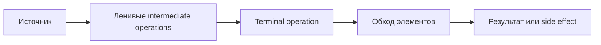

# JAVA-B06 — Lambdas and Streams

> [!summary]
> Route goal: понять функцию как значение, научиться читать stream pipeline слева направо и выбирать между loop, sequential stream и parallel stream по семантике и стоимости.

## Beginner bridge

```text
обычный метод
→ поведение передаётся как объект функции
→ lambda описывает это поведение
→ Stream строит ленивый pipeline
→ terminal operation запускает обработку
```

## Главная модель



## План атомарных уроков

1. Function as value and functional interfaces.
2. Lambda syntax, target typing and overload resolution.
3. Effectively final capture and variable scope.
4. Method references and constructor references.
5. Stream lifecycle, laziness and encounter order.
6. `map`, `filter`, `flatMap`, `distinct`, `sorted`, `limit`, `skip`.
7. Reductions, collectors and grouping.
8. Primitive streams and Optional results.
9. Parallel streams, associativity, interference and side effects.

## Учебный цикл

```text
простая ситуация
→ mental model
→ минимальный код
→ пошаговая трассировка
→ точный механизм
→ контраст с loop
→ самостоятельный прогноз
→ executable proof
```

## Planned evidence

- stable cards and compile/output drills;
- production cases for service-side transformations;
- positive JDK 17/21 runtime proof;
- expected compile failures for capture, target typing and invalid stream reuse;
- route and objective manifests;
- dashboard and audit integration.

## Navigation

- [[00_HOME/Java Beginner Learning Path]]
- [[00_HOME/Knowledge Route Registry]]
- **Previous:** [[30_CERTIFICATIONS/Java/JAVA-B05/JAVA-B05 Roadmap]]
- **Next planned route:** `JAVA-B07 — Modules and Deployment`
