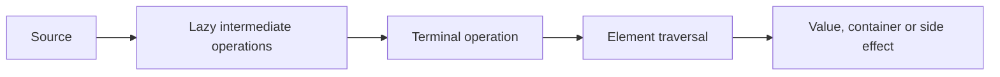

# JAVA-B06 — Lambdas and Streams

> [!summary]
> Route goal: понять функцию как значение, читать stream pipeline по механизму выполнения и выбирать loop, sequential stream или controlled concurrency по семантике и измерениям.

## Beginner bridge

```text
обычный метод
→ поведение передаётся через functional interface
→ lambda реализует SAM
→ Stream описывает ленивый pipeline
→ terminal operation запускает traversal
→ collector/reduction создаёт результат
```

## Главная модель



## Последовательность изучения

1. [[10_CONCEPTS/Java/Functional/Java Functional Interfaces and Lambda Target Typing]]
2. [[10_CONCEPTS/Java/Functional/Java Lambda Capture and Method References]]
3. [[10_CONCEPTS/Java/Streams/Java Stream Pipeline Laziness and Single Use]]
4. [[10_CONCEPTS/Java/Streams/Java Stream Mapping Filtering and Flattening]]
5. [[10_CONCEPTS/Java/Streams/Java Stream Reduction and Collectors]]
6. [[10_CONCEPTS/Java/Streams/Java Primitive Streams Optional and Statistics]]
7. [[10_CONCEPTS/Java/Streams/Java Parallel Streams Safety and Performance]]

Canonical hub:

- [[10_CONCEPTS/Java/Functional/Java Lambdas and Streams]]

## Учебный цикл

```text
простая ситуация
→ mental model
→ минимальный код
→ пошаговая трассировка
→ точный механизм
→ контраст
→ самостоятельный прогноз
→ executable proof
```

## Практика и evidence

- [[30_CERTIFICATIONS/Java/JAVA-B06/JAVA-B06 Cards|48 stable cards]]
- [[30_CERTIFICATIONS/Java/JAVA-B06/JAVA-B06 Drills|24 compile/output drills]]
- [[40_PRODUCTION_CASES/Java/Java Lambdas and Streams Production Cases|10 production cases]]
- [[50_LABS/Java/JAVA-B06/README|JDK 17/21 executable proof]]
- 2 positive proof classes and 6 expected compile failures.

## Критерии завершения

Ученик может:

1. Определить SAM и target type lambda.
2. Объяснить effectively-final capture и scope.
3. Читать четыре формы method reference.
4. Предсказать lazy traversal и short-circuit.
5. Выбирать `map`, `filter` и `flatMap` по cardinality.
6. Строить associative reduction и корректный collector.
7. Безопасно работать с Optional primitive results.
8. Объяснить duplicate-key policy в `toMap`.
9. Найти interference и shared mutable state.
10. Не выбирать parallel stream без workload model и измерения.

## Navigation

- [[00_HOME/Java Beginner Learning Path]]
- [[00_HOME/Java Learning Dashboard]]
- [[00_HOME/Knowledge Route Registry]]
- **Previous:** [[30_CERTIFICATIONS/Java/JAVA-B05/JAVA-B05 Roadmap]]
- **Next planned route:** `JAVA-B07 — Modules and Deployment`
