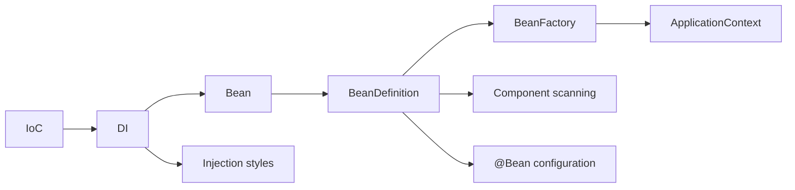

# CORE-B01 — IoC and Bean Registration Foundations

> [!summary]
> Первая фактическая партия из 20 карточек. Сначала ответь на английский вопрос, затем проверь смысл по русскому переводу и только после этого раскрывай ответ.

## Learning map



---

## CORE-B01-C001

### Question

> [!question]
> What does Inversion of Control mean in Spring?

### Russian Translation

> Что означает Inversion of Control в Spring?

> [!answer]- Answer
> The container, rather than application objects, controls object creation, configuration, wiring, and lifecycle.

### Explanation

Business objects перестают самостоятельно собирать object graph. Configuration metadata передаётся container, который создаёт и связывает objects.

### Exam Trap

> IoC не сводится к поиску dependency через container. Dependency Injection — основной способ реализации IoC.

### Memory Hook

> **IoC transfers control.**

---

## CORE-B01-C002

### Question

> [!question]
> What is Dependency Injection?

### Russian Translation

> Что такое Dependency Injection?

> [!answer]- Answer
> Dependencies are supplied to an object from the outside instead of being created or located by that object.

### Explanation

Constructor, method/setter или field получают collaborator, выбранный container.

### Mini Example

```java
class OrderService {
    OrderService(PaymentClient client) { }
}
```

### Exam Trap

> DI — механизм. IoC — более широкий принцип.

### Memory Hook

> **DI transfers dependencies.**

---

## CORE-B01-C003

### Question

> [!question]
> What is a Spring bean?

### Russian Translation

> Что такое Spring bean?

> [!answer]- Answer
> An object instantiated, configured, and managed by the Spring IoC container.

### Explanation

Bean является обычным Java object, но container управляет его metadata, dependencies, lifecycle и post-processing.

### Exam Trap

> Не каждый object, созданный через `new` внутри Spring application, является bean.

### Memory Hook

> **Bean = container-managed object.**

---

## CORE-B01-C004

### Question

> [!question]
> What is a BeanDefinition?

### Russian Translation

> Что такое BeanDefinition?

> [!answer]- Answer
> Metadata describing how the container should create and manage a bean.

### Explanation

BeanDefinition может содержать class/factory method, scope, dependencies, constructor arguments, lifecycle callbacks и flags.

### Exam Trap

> BeanDefinition — recipe, а не сам bean instance.

### Memory Hook

> **Definition is the recipe; bean is the result.**

---

## CORE-B01-C005

### Question

> [!question]
> What is the main responsibility of BeanFactory?

### Russian Translation

> Какова основная ответственность BeanFactory?

> [!answer]- Answer
> It provides the fundamental container contract for bean creation, configuration, dependency resolution, and lookup.

### Explanation

BeanFactory является базовым API Spring bean container.

### Exam Trap

> Не приписывай минимальному BeanFactory все дополнительные ApplicationContext services.

### Memory Hook

> **BeanFactory is the engine.**

---

## CORE-B01-C006

### Question

> [!question]
> How is ApplicationContext related to BeanFactory?

### Russian Translation

> Как ApplicationContext связан с BeanFactory?

> [!answer]- Answer
> ApplicationContext extends the BeanFactory contract and adds application-level services.

### Explanation

Он добавляет events, message resolution, resource loading, Environment и удобную infrastructure integration.

### Exam Trap

> Это не два несвязанных конкурирующих container API.

### Memory Hook

> **ApplicationContext = BeanFactory plus application services.**

---

## CORE-B01-C007

### Question

> [!question]
> Which container is normally preferred in Spring applications?

### Russian Translation

> Какой container обычно предпочитают в Spring-приложениях?

> [!answer]- Answer
> ApplicationContext.

### Explanation

Он включает BeanFactory capabilities и services, обычно необходимые приложению.

### Exam Trap

> BeanFactory остаётся фундаментальным contract, хотя напрямую используется реже.

### Memory Hook

> **Use the vehicle; understand the engine.**

---

## CORE-B01-C008

### Question

> [!question]
> Which configuration metadata styles can define Spring beans?

### Russian Translation

> Какие стили configuration metadata могут определять Spring beans?

> [!answer]- Answer
> Annotated components, Java @Bean methods, XML, and programmatic registration.

### Explanation

Разные источники переводятся в BeanDefinition metadata.

### Exam Trap

> Annotation configuration не устранила XML и programmatic registration.

### Memory Hook

> **Different sources, one BeanDefinition model.**

---

## CORE-B01-C009

### Question

> [!question]
> What does @Component indicate?

### Russian Translation

> Что обозначает @Component?

> [!answer]- Answer
> The class is a candidate for component scanning and registration as a Spring bean.

### Mini Example

```java
@Component
class PaymentService { }
```

### Exam Trap

> `@Component` не запускает scanning сама. Scan boundary должен быть configured.

### Memory Hook

> **Component marks a discoverable class.**

---

## CORE-B01-C010

### Question

> [!question]
> Which annotations are common specializations of @Component?

### Russian Translation

> Какие аннотации являются распространёнными специализациями @Component?

> [!answer]- Answer
> @Service, @Repository, and @Controller.

### Explanation

Они сохраняют component-detection semantics и добавляют architectural intent; некоторые участвуют в дополнительной infrastructure semantics.

### Exam Trap

> Они не являются полностью отдельными registration mechanisms.

### Memory Hook

> **Stereotypes add meaning to Component.**

---

## CORE-B01-C011

### Question

> [!question]
> What does component scanning do?

### Russian Translation

> Что делает component scanning?

> [!answer]- Answer
> It searches configured packages for candidate component classes and registers BeanDefinitions for them.

### Explanation

Именно configured base packages определяют discoverability.

### Exam Trap

> Аннотированный class вне scan tree не будет автоматически найден.

### Memory Hook

> **No scan path, no component.**

---

## CORE-B01-C012

### Question

> [!question]
> What is the typical default bean name for an unnamed component class PaymentService?

### Russian Translation

> Каково типичное default bean name для unnamed component class PaymentService?

> [!answer]- Answer
> paymentService.

### Explanation

Spring обычно выводит name из short class name и применяет decapitalization rules.

### Exam Trap

> Default обычно не является fully qualified class name.

### Memory Hook

> **PaymentService becomes paymentService.**

---

## CORE-B01-C013

### Question

> [!question]
> What does @Bean indicate?

### Russian Translation

> Что обозначает @Bean?

> [!answer]- Answer
> The annotated method creates an object to be registered and managed as a Spring bean.

### Mini Example

```java
@Bean
PaymentClient paymentClient() {
    return new HttpPaymentClient();
}
```

### Exam Trap

> `@Bean` — method-level factory annotation, а не class stereotype.

### Memory Hook

> **Bean marks the factory method.**

---

## CORE-B01-C014

### Question

> [!question]
> When is @Bean especially useful?

### Russian Translation

> Когда @Bean особенно полезен?

> [!answer]- Answer
> When registering third-party classes or when construction requires explicit factory logic.

### Explanation

Application owns factory method даже если library class нельзя изменить.

### Exam Trap

> `@Bean` не ограничен third-party classes; это общий Java configuration mechanism.

### Memory Hook

> **Cannot annotate the class? Own the factory.**

---

## CORE-B01-C015

### Question

> [!question]
> What is the key difference between @Component and @Bean?

### Russian Translation

> Каково ключевое различие между @Component и @Bean?

> [!answer]- Answer
> @Component marks a class for scanning; @Bean marks a factory method whose return value becomes a bean.

### Explanation

Оба пути создают managed bean, но registration metadata и control over construction различаются.

### Exam Trap

> Различие не в том, является ли результат bean: оба результата managed.

### Memory Hook

> **Component = product class; Bean = factory method.**

---

## CORE-B01-C016

### Question

> [!question]
> What does @Configuration indicate?

### Russian Translation

> Что обозначает @Configuration?

> [!answer]- Answer
> The class is a source of bean definitions, typically through @Bean methods, with full configuration semantics when processed accordingly.

### Explanation

В full mode Spring enhances configuration class для container-aware inter-bean method calls.

### Exam Trap

> Не каждый class с `@Bean` methods автоматически имеет идентичную full-mode interception semantics.

### Memory Hook

> **Configuration coordinates bean factories.**

---

## CORE-B01-C017

### Question

> [!question]
> Which injection style is normally preferred for required dependencies?

### Russian Translation

> Какой стиль injection обычно предпочитают для required dependencies?

> [!answer]- Answer
> Constructor injection.

### Explanation

Required dependencies explicit, fields могут быть final, object нельзя создать incomplete, testing проще.

### Mini Example

```java
@Service
class OrderService {
    private final PaymentClient client;

    OrderService(PaymentClient client) {
        this.client = client;
    }
}
```

### Exam Trap

> Вопрос «что поддерживается?» отличается от «что рекомендуется?».

### Memory Hook

> **Required by constructor.**

---

## CORE-B01-C018

### Question

> [!question]
> Is @Autowired required on the only constructor of a Spring bean?

### Russian Translation

> Нужен ли @Autowired на единственном constructor Spring bean?

> [!answer]- Answer
> Usually no.

### Explanation

Если class имеет один constructor, Spring может использовать его без explicit `@Autowired`.

### Exam Trap

> При нескольких constructors правила candidate selection становятся важны.

### Memory Hook

> **One constructor speaks for itself.**

---

## CORE-B01-C019

### Question

> [!question]
> When is setter injection appropriate?

### Russian Translation

> Когда setter injection уместен?

> [!answer]- Answer
> For optional or reconfigurable dependencies when the object remains valid without them.

### Explanation

Setter injection допускает post-construction configuration, поэтому required invariant должен быть защищён отдельно.

### Exam Trap

> Не используй optionality как оправдание invalid partially configured object.

### Memory Hook

> **Optional by setter.**

---

## CORE-B01-C020

### Question

> [!question]
> What is a major drawback of field injection?

### Russian Translation

> Каков основной недостаток field injection?

> [!answer]- Answer
> It hides required dependencies, complicates plain unit testing, and prevents final dependency fields.

### Explanation

Container может установить field, но class contract становится менее явным и object трудно создать без reflection/container.

### Exam Trap

> Field injection поддерживается. Вопрос касается design trade-off, а не basic capability.

### Memory Hook

> **Field injection hides the contract.**

---

## Batch review protocol

После прохождения каждой карточки записать outcome:

- `correct-confident`;
- `correct-guessed`;
- `wrong-concept`;
- `wrong-attention`;
- `wrong-confusion`.

> [!important]
> Угаданный ответ не считается усвоенным, пока ты не можешь объяснить механизм и отклонить похожий вариант.

## Related concept

- [[10_CONCEPTS/Spring/Core/Spring Core Foundations]]
- [[30_CERTIFICATIONS/Spring/2V0-72.22/Spring Certification Card System]]
- [[30_CERTIFICATIONS/Spring/2V0-72.22/Spring Core Card Roadmap]]
