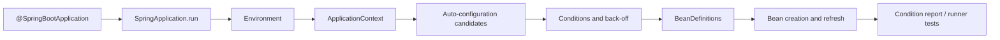

# SPRING-BOOT-B01 — Bootstrap and Auto-configuration Roadmap

> [!summary]
> Route goal: explain how `SpringApplication`, configuration parsing and `@EnableAutoConfiguration` turn classpath, properties and user definitions into a ready `ApplicationContext`. Exam-baseline Boot 2.5 behavior is separated from current Boot registration APIs.

# Route navigation

- **Registry:** [[00_HOME/Knowledge Route Registry]]
- **Master roadmap:** [[30_CERTIFICATIONS/Spring/2V0-72.22/Spring 99 Percent Master Roadmap]]
- **Domain map:** [[01_MAPS/Spring Map]]
- **Previous:** [[30_CERTIFICATIONS/Spring/2V0-72.22/Spring Testing Roadmap]]
- **Next:** `SPRING-BOOT-B02 — Configuration Properties and Externalized Configuration`
- **Canvas:** [[01_MAPS/Spring Boot Auto-configuration Map.canvas]]

# Progress

```text
Canonical note       1  PUBLISHED
Visual deep dive     1  PUBLISHED
Mermaid diagrams    31  PUBLISHED
Base cards          30  PUBLISHED
Production cases    15  PUBLISHED
Boot 2.5 lab         1  SOURCE COMPLETE
Canvas               1  PUBLISHED
Source index         1  VERIFIED 2026-07-21
```

# Learning sequence



# Artifacts

| Role | Artifact |
|---|---|
| Canonical | [[10_CONCEPTS/Spring/Boot/Spring Boot Bootstrap and Auto-configuration]] |
| Visual deep dive | [[10_CONCEPTS/Spring/Boot/Spring Boot Auto-configuration Visual Deep Dive]] |
| Cards | [[30_CERTIFICATIONS/Spring/2V0-72.22/SPRING-BOOT-B01/SPRING-BOOT-B01 Cards]] |
| Cases | [[40_PRODUCTION_CASES/Spring/Spring Boot Auto-configuration Production Cases]] |
| Lab | [[50_LABS/Spring/SPRING-BOOT-B01/README]] |
| Canvas | [[01_MAPS/Spring Boot Auto-configuration Map.canvas]] |
| Sources | [[98_SOURCES/Spring Boot Auto-configuration Sources]] |

# Coverage

## Bootstrap

- `@SpringBootApplication` composition;
- primary configuration source;
- application-class package placement;
- `SpringApplication` stable phases;
- environment preparation;
- web application type;
- context creation and refresh;
- application events and runners;
- lazy initialization;
- embedded-server boundary.

## Auto-configuration

- `@EnableAutoConfiguration`;
- `AutoConfigurationImportSelector` mental model;
- candidate loading, deduplication, exclusions and filters;
- deferred import;
- classpath, bean, property, web and resource conditions;
- back-off behavior;
- condition phases and hierarchy search;
- ordering versus bean creation order;
- condition evaluation report;
- failure analyzers.

## Starter and library development

- starter versus auto-configuration;
- dependency management versus dependency declaration;
- Boot 2.x `spring.factories`;
- current `AutoConfiguration.imports`;
- custom conditional default bean;
- package isolation;
- `ApplicationContextRunner`;
- filtered classloader;
- user-bean override tests.

# Exam baseline versus current delta

| Concern | Boot 2.5 exam baseline | Current Boot delta |
|---|---|---|
| Auto-config class | `@Configuration(proxyBeanMethods=false)` | `@AutoConfiguration` |
| Candidate registration | `META-INF/spring.factories` | `AutoConfiguration.imports` |
| Core conditional model | supported | still supported, APIs evolved |
| Runner testing | `ApplicationContextRunner` | `ApplicationContextRunner` |
| Namespace | Spring 5 / `javax` ecosystem | Spring 6 / `jakarta` ecosystem |

# Quality gate

- [x] Canonical mechanism explanation.
- [x] Topology, sequence, decision and failure diagrams.
- [x] 30 cards with full mandatory sections.
- [x] 15 production incidents.
- [x] Boot 2.5/current version boundary.
- [x] ApplicationContextRunner source lab.
- [x] Canvas and source index.
- [ ] Maven test executed in connected environment.
- [ ] 30 additional Boot base cards delivered in `SPRING-BOOT-B02` and follow-up Boot batch.
- [ ] 20 Boot exam-drill cards delivered.
- [ ] Timed mock results collected.

# Review questions

1. Which three responsibilities are combined by `@SpringBootApplication`?
2. How is component scanning different from auto-configuration discovery?
3. What stable phases occur around `SpringApplication.run`?
4. Why is auto-configuration imported as a deferred selector?
5. Which condition checks classpath, beans, properties and application type?
6. What exactly does missing-bean back-off do?
7. Why can a positive condition match still produce startup failure?
8. How do Boot 2.x and current candidate-registration files differ?
9. What does a starter contribute versus dependency management?
10. Which `ApplicationContextRunner` cases prove a custom auto-configuration?

# Next route

```text
SPRING-BOOT-B02 — Configuration Properties and Externalized Configuration
```

Target:

```text
35 base cards
10 drill cards
property precedence and relaxed binding
@ConfigurationProperties and validation
profiles/config imports/test overrides
version-sensitive constructor binding
```
