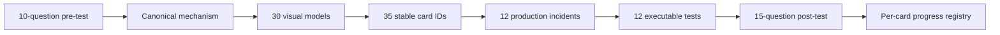

# SPRING-MVC-B01 — DispatcherServlet and Controller Pipeline

> [!summary]
> Route goal: reconstruct the Servlet MVC request lifecycle from container entry through `DispatcherServlet`, handler mapping, adapter invocation, argument resolution, controller execution, return-value handling, error resolution, and final body or view rendering.

# Route navigation

- **Registry:** [[00_HOME/Knowledge Route Registry]]
- **Master:** [[30_CERTIFICATIONS/Spring/2V0-72.22/Spring 99 Percent Master Roadmap]]
- **Domain map:** [[01_MAPS/Spring Map]]
- **Previous:** [[30_CERTIFICATIONS/Spring/2V0-72.22/SPRING-BOOT-B02/SPRING-BOOT-B02 Roadmap]]
- **Next:** [[30_CERTIFICATIONS/Spring/2V0-72.22/SPRING-MVC-B02/SPRING-MVC-B02 Roadmap]]
- **Canvas:** [[01_MAPS/Spring MVC DispatcherServlet Map.canvas]]

# Objective traceability

| Objective | Interpretation | Route evidence |
|---|---|---|
| `SPRING-3.1.1` | create a Boot MVC application | Boot 2.5 application, DispatcherServlet registration, MockMvc lab |
| `SPRING-3.1.2` | describe REST request-processing lifecycle | canonical pipeline, 30 visuals, cards, cases, full MockMvc evidence |
| `SPRING-3.1.3` | create a simple GET REST controller | catalog GET endpoint with path/query/custom arguments and JSON response |
| `SPRING-3.1.4` | configure MVC application deployment | embedded JAR versus WAR baseline and Boot ownership boundary |

Machine manifest:

```text
.github/objectives/spring-2V0-72.22.json
.github/objective-overrides/spring-mvc-b01.json
```

# Learning outcomes

After completion the learner can:

1. Draw the full Servlet MVC request topology without notes.
2. Distinguish container, filter, servlet, interceptor, and controller boundaries.
3. Explain why `HandlerMapping` selects while `HandlerAdapter` invokes.
4. Reconstruct `RequestMappingHandlerMapping` registration and best-match selection.
5. Explain `HandlerExecutionChain` and interceptor callback ordering.
6. Trace each controller parameter through the argument-resolver chain.
7. Distinguish request-parameter binding from request-body conversion.
8. Distinguish conversion failures from validation failures.
9. Trace a return value through response-body or view rendering.
10. Explain the default MVC exception-resolver chain.
11. Diagnose 404, 400, 415, and 406 at the correct stage.
12. Explain Boot MVC auto-configuration and `@EnableWebMvc` ownership transfer.
13. Compare executable JAR and WAR deployment boundaries.
14. Predict all lab outcomes before Maven execution.

# Corrected learning cycle



# Artifacts

| Role | Artifact |
|---|---|
| Canonical | [[10_CONCEPTS/Spring/MVC/DispatcherServlet and Annotated Controller Pipeline]] |
| Visual | [[10_CONCEPTS/Spring/MVC/Spring MVC DispatcherServlet Visual Deep Dive]] |
| Cards | [[30_CERTIFICATIONS/Spring/2V0-72.22/SPRING-MVC-B01/SPRING-MVC-B01 Cards]] |
| Assessment | [[30_CERTIFICATIONS/Spring/2V0-72.22/SPRING-MVC-B01/SPRING-MVC-B01 Assessment]] |
| Cases | [[40_PRODUCTION_CASES/Spring/Spring MVC DispatcherServlet Production Cases]] |
| Lab | [[50_LABS/Spring/SPRING-MVC-B01/README]] |
| Canvas | [[01_MAPS/Spring MVC DispatcherServlet Map.canvas]] |
| Sources | [[98_SOURCES/Spring MVC DispatcherServlet Sources]] |
| Progress | [[70_PROGRESS/README]] |

# Coverage

## Servlet and context boundaries

- Servlet container and filter chain;
- `DispatcherServlet` registration;
- `WebApplicationContext` and traditional root/child contexts;
- Boot embedded-container path;
- executable JAR versus WAR;
- `javax.servlet` baseline versus `jakarta.servlet` current delta.

## Mapping

- `HandlerMapping`;
- `RequestMappingHandlerMapping`;
- `RequestMappingInfo`;
- `HandlerMethod`;
- path, method, params, headers, consumes, and produces conditions;
- specificity and ambiguous mappings;
- `HandlerExecutionChain`.

## Invocation

- `HandlerAdapter`;
- `RequestMappingHandlerAdapter`;
- model initialization;
- `@InitBinder`;
- `HandlerMethodArgumentResolver`;
- `@PathVariable`, `@RequestParam`, `@ModelAttribute`, and minimal `@RequestBody` evidence;
- `WebDataBinder`, conversion, validation, and `BindingResult`.

## Return and rendering

- `HandlerMethodReturnValueHandler`;
- `@Controller` versus `@RestController` string semantics;
- `ResponseEntity` processing;
- `HttpMessageConverter`;
- logical view names, `ModelAndView`, and `ViewResolver`;
- content negotiation.

## Failure handling

- `ExceptionHandlerExceptionResolver`;
- `ResponseStatusExceptionResolver`;
- `DefaultHandlerExceptionResolver`;
- `@ControllerAdvice` applicability;
- no-handler and mapping-condition boundaries;
- conversion, validation, 415, and 406 diagnostics.

# Progress compatibility

Every card has a stable ID:

```text
SPRING-MVC-B01-C001 ... SPRING-MVC-B01-C035
```

Example record:

```bash
python .github/scripts/card_progress.py record \
  --card-id SPRING-MVC-B01-C014 \
  --outcome correct-confident \
  --confidence 4
```

# Route boundary

This route contains only enough non-GET/body behavior to prove converter and validation stages. Full REST API design belongs to the next route:

```text
SPRING-MVC-B02
  multiple HTTP verbs
  request and response contracts
  ResponseEntity in depth
  controller advice error schema
  RestTemplate exam baseline
  RestClient and WebClient current comparison
```

# Quality gate

- [x] Official objective IDs assigned.
- [x] Learning outcomes defined.
- [x] Pre-test and post-test created.
- [x] Canonical mechanism note created.
- [x] Thirty visual models created.
- [x] Thirty-five normalized cards created.
- [x] Twelve production incidents created.
- [x] Java 8 / Boot 2.5 source lab created.
- [x] Canvas and primary-source index created.
- [x] Exam baseline and current delta separated.
- [ ] Twelve Maven tests passed in GitHub Actions.
- [ ] Delayed learner review data collected.
- [ ] Mixed Spring timed mock coverage added.

# Next route

[[30_CERTIFICATIONS/Spring/2V0-72.22/SPRING-MVC-B02/SPRING-MVC-B02 Roadmap]]
