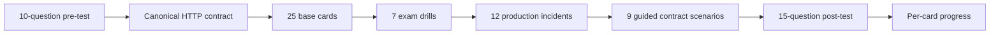

# SPRING-MVC-B02 — REST Verbs, ResponseEntity Contracts and RestTemplate

> [!summary]
> Route goal: design and diagnose REST endpoints as explicit HTTP contracts, then consume those contracts through `RestTemplate` under the Spring Framework 5.3 / Boot 2.5 exam baseline. The route separates exam-required APIs from the current `RestClient` and `WebClient` production delta.

# Route navigation

- **Registry:** [[00_HOME/Knowledge Route Registry]]
- **Master:** [[30_CERTIFICATIONS/Spring/2V0-72.22/Spring 99 Percent Master Roadmap]]
- **Previous:** [[30_CERTIFICATIONS/Spring/2V0-72.22/SPRING-MVC-B01/SPRING-MVC-B01 Roadmap]]
- **Next:** `SPRING-SEC-B01 — Authentication and Authorization`
- **Canonical:** [[10_CONCEPTS/Spring/MVC/REST Endpoints ResponseEntity and RestTemplate]]
- **Cards:** [[30_CERTIFICATIONS/Spring/2V0-72.22/SPRING-MVC-B02/SPRING-MVC-B02 Cards]]
- **Drills:** [[30_CERTIFICATIONS/Spring/2V0-72.22/SPRING-MVC-B02/SPRING-MVC-B02 Drills]]
- **Assessment:** [[30_CERTIFICATIONS/Spring/2V0-72.22/SPRING-MVC-B02/SPRING-MVC-B02 Assessment]]
- **Cases:** [[40_PRODUCTION_CASES/Spring/Spring MVC REST Contract Production Cases]]
- **Lab:** [[50_LABS/Spring/SPRING-MVC-B02/README]]
- **Sources:** [[98_SOURCES/Spring MVC REST and RestTemplate Sources]]

# Objective traceability

| Objective | Interpretation | Route evidence |
|---|---|---|
| `SPRING-3.2.1` | Create REST endpoints for multiple HTTP verbs | canonical contract model, server-side cards/drills, 12 incidents, guided MockMvc scenarios |
| `SPRING-3.2.2` | Use `RestTemplate` to invoke REST services | client pipeline, shortcut/exchange matrix, generic response handling, guided MockRestServiceServer scenarios |

Machine manifest:

```text
.github/objectives/spring-2V0-72.22.json
.github/objective-overrides/spring-mvc-b02.json
```

# Learning outcomes

After completion the learner can:

1. Explain the semantic contract of GET, POST, PUT, PATCH, DELETE, HEAD and OPTIONS.
2. Distinguish safe, idempotent and cacheable operations.
3. Choose path, query, header and body inputs deliberately.
4. Distinguish request `Content-Type` from response `Accept`.
5. Trace `@RequestBody` through message conversion and validation.
6. Build exact `ResponseEntity` status/header/body contracts.
7. Use `201 Created` with `Location`, `204 No Content`, conditional requests and ETags correctly.
8. Design a stable JSON error schema with `@RestControllerAdvice`.
9. Distinguish `HttpEntity`, `RequestEntity` and `ResponseEntity`.
10. Select the appropriate `RestTemplate` convenience method or `exchange`.
11. Preserve generic response types with `ParameterizedTypeReference`.
12. Configure timeouts, interceptors and error handling through `RestTemplateBuilder`.
13. Test clients without a real server through `MockRestServiceServer`.
14. Explain why `RestTemplate` remains an exam baseline while current code may prefer `RestClient` or `WebClient`.
15. Diagnose 400, 404, 405, 406, 409, 412, 415 and downstream 4xx/5xx failures.

# Corrected learning cycle



# Coverage

## Server-side REST contracts

- `@RestController` and composed mapping annotations;
- class-level and method-level mappings;
- GET, POST, PUT, PATCH, DELETE, HEAD and OPTIONS;
- safe versus idempotent semantics;
- `@PathVariable`, `@RequestParam`, `@RequestHeader`, `@RequestBody`;
- `Content-Type`, `Accept`, `consumes`, `produces`;
- conversion, validation and status ownership;
- body-only returns versus `ResponseEntity`;
- `Location`, ETag, `Cache-Control`, `Vary` and `Allow`;
- `@ExceptionHandler`, `@ControllerAdvice`, `@RestControllerAdvice`;
- custom error DTO baseline and `ProblemDetail` current delta.

## Client-side REST contracts

- `RestTemplate` execution pipeline;
- URI template expansion and encoding;
- `getForObject`, `getForEntity`;
- `postForObject`, `postForEntity`, `postForLocation`;
- `put`, `delete`, `patchForObject`;
- `exchange` and `execute`;
- `HttpEntity`, `RequestEntity`, `ResponseEntity`;
- `ParameterizedTypeReference`;
- `RestTemplateBuilder`;
- connect/read timeouts;
- interceptors and `ResponseErrorHandler`;
- `RestClientException`, `HttpClientErrorException`, `HttpServerErrorException`;
- `MockRestServiceServer`.

# Version boundary

| Concern | Exam baseline: Spring 5.3 / Boot 2.5 | Current production delta |
|---|---|---|
| Servlet API | `javax.servlet` | `jakarta.servlet` |
| Error body | custom DTO, `ResponseEntity`, `ResponseEntityExceptionHandler` | `ProblemDetail`, `ErrorResponse`, RFC 9457 |
| Synchronous client | `RestTemplate` | `RestClient` is the modern fluent synchronous API |
| Reactive client | optional comparison | `WebClient` for non-blocking/reactive flows |
| Status abstraction | `HttpStatus` | newer APIs also use `HttpStatusCode` |

> [!warning]
> Do not answer an exam question by replacing `RestTemplate` with `RestClient`. First answer the 5.3 contract; then state the production delta.

# Stable card IDs

```text
SPRING-MVC-B02-C001 ... SPRING-MVC-B02-C025
SPRING-MVC-B02-D001 ... SPRING-MVC-B02-D007
```

Example progress record:

```bash
python .github/scripts/card_progress.py record \
  --card-id SPRING-MVC-B02-C014 \
  --outcome correct-confident \
  --confidence 4
```

# Quality gate

- [x] Official objective IDs assigned.
- [x] Canonical reading note created.
- [x] Twenty-five normalized base cards created.
- [x] Seven exam drills created.
- [x] Ten-question pre-test and fifteen-question post-test created.
- [x] Twelve production incidents created.
- [x] Guided Java 8 / Boot 2.5 lab scenarios created.
- [x] Primary-source index linked.
- [x] Exam baseline and current delta separated.
- [ ] Convert guided scenarios into a Maven test module and execute in CI.
- [ ] Delayed learner review data collected.
- [ ] Mixed Spring timed mock coverage added.

# Next route

```text
SPRING-SEC-B01 — Authentication and Authorization
```
