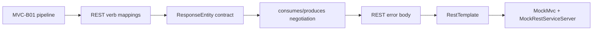

# SPRING-MVC-B02 — REST Verbs, ResponseEntity and RestTemplate Roadmap

> [!summary]
> Route goal: complete Spring MVC REST objective coverage by teaching REST HTTP verbs, `ResponseEntity` response contracts, content negotiation, REST error bodies and `RestTemplate` client calls. This follows [[30_CERTIFICATIONS/Spring/2V0-72.22/SPRING-MVC-B01/SPRING-MVC-B01 Roadmap]], which covered the DispatcherServlet and annotated-controller pipeline.

# Route navigation

- **Registry:** [[00_HOME/Knowledge Route Registry]]
- **Master roadmap:** [[30_CERTIFICATIONS/Spring/2V0-72.22/Spring 99 Percent Master Roadmap]]
- **Domain map:** [[01_MAPS/Spring Map]]
- **Previous:** [[30_CERTIFICATIONS/Spring/2V0-72.22/SPRING-MVC-B01/SPRING-MVC-B01 Roadmap]]
- **Next:** `SPRING-SEC-B01 — Authentication, Authorization and Method Security`
- **Canvas:** [[01_MAPS/Spring MVC REST Map.canvas]]

# Progress

```text
Canonical note       1  PUBLISHED
Visual deep dive     1  PUBLISHED
Mermaid diagrams    25  PUBLISHED
Base cards          25  PUBLISHED
Pre-test            10  PUBLISHED
Post-test           15  PUBLISHED
Production cases    12  PUBLISHED
REST lab tests      15  SOURCE COMPLETE
Canvas               1  PUBLISHED
Source index         1  VERIFIED 2026-07-24
```

# Learning sequence



# Artifacts

| Role | Artifact |
|---|---|
| Canonical | [[10_CONCEPTS/Spring/MVC/REST Endpoints ResponseEntity and RestTemplate]] |
| Visual deep dive | [[10_CONCEPTS/Spring/MVC/Spring MVC REST Visual Deep Dive]] |
| Cards | [[30_CERTIFICATIONS/Spring/2V0-72.22/SPRING-MVC-B02/SPRING-MVC-B02 Cards]] |
| Assessment | [[30_CERTIFICATIONS/Spring/2V0-72.22/SPRING-MVC-B02/SPRING-MVC-B02 Assessment]] |
| Cases | [[40_PRODUCTION_CASES/Spring/Spring MVC REST Production Cases]] |
| Lab | [[50_LABS/Spring/SPRING-MVC-B02/README]] |
| Canvas | [[01_MAPS/Spring MVC REST Map.canvas]] |
| Sources | [[98_SOURCES/Spring MVC REST and RestTemplate Sources]] |

# Objective mapping

| Objective | Status after route | Evidence |
|---|---|---|
| `SPRING-3.2.1` REST endpoints for multiple HTTP verbs | complete after runtime PASS | canonical, cards, cases, MockMvc tests |
| `SPRING-3.2.2` `RestTemplate` client operations | complete after runtime PASS | canonical, cards, cases, MockRestServiceServer tests |

# Coverage

## REST endpoints

```text
@RestController
@RequestMapping shortcuts
GET / POST / PUT / PATCH / DELETE
@PathVariable / @RequestParam / @RequestHeader
@RequestBody
@Valid and validation failure
ResponseEntity status/header/body
201 Created + Location
204 No Content
404 domain not-found
406 Not Acceptable
415 Unsupported Media Type
@RestControllerAdvice
custom error DTO
```

## RestTemplate

```text
getForObject
getForEntity
postForEntity
exchange
HttpEntity
ResponseEntity
message converters
ResponseErrorHandler
RestTemplateBuilder
MockRestServiceServer
```

# Version boundary

| Concern | Spring 5.3 / Boot 2.5 baseline | Current production delta |
|---|---|---|
| Server REST | `@RestController`, mapping annotations, `ResponseEntity` | same core model |
| Client REST | `RestTemplate`, `RestTemplateBuilder` | `RestClient` and `WebClient` as current alternatives |
| Error body | custom DTO/advice/status exception | `ProblemDetail` and `ErrorResponse` available |
| Namespace | `javax.servlet` | `jakarta.servlet` |

# Runtime proof

Command:

```bash
mvn --batch-mode --no-transfer-progress \
  -f 50_LABS/Spring/SPRING-MVC-B02/pom.xml test
```

Expected proof:

```text
10 MockMvc server-side REST tests
5 MockRestServiceServer RestTemplate client tests
```

# Quality checklist

- [x] Official source index.
- [x] Canonical concept note.
- [x] Visual deep dive with 25 diagrams.
- [x] 25 cards with stable IDs and full mandatory sections.
- [x] Pre-test and post-test.
- [x] 12 production cases.
- [x] Maven lab source.
- [x] Canvas route map.
- [ ] Maven runtime gate executed in GitHub Actions.
- [ ] Objective override applied.
- [ ] Readiness manifest updated.
- [ ] Strict-card CI enabled.

# Review questions

1. Which status and header should a creation endpoint normally return?
2. Why can `Content-Type` mismatch produce 415 before validation?
3. Why can `Accept` mismatch produce 406?
4. When is `ResponseEntity` preferable to returning a DTO directly?
5. Which `RestTemplate` method exposes headers and status?
6. Which `RestTemplate` method is most flexible for method/header/body control?
7. Why is `RestClient` a current delta, not a Spring 5.3 exam-baseline answer?

# Next route

```text
SPRING-SEC-B01 — Authentication, Authorization and Method Security
```
