# Spring 2V0-72.22 — 99 Percent Master Roadmap

> [!summary]
> Target: 600 base cards + 150 exam-drill cards + six full timed mocks. Existing Core/AOP/Transactions/Data/Testing routes remain canonical; missing Boot, MVC, Security, Actuator, JDBC, MockMvc and SpEL routes are built using the same visual vertical-slice standard.

# Exam baseline

```text
Exam              2V0-72.22 Spring Professional Develop
Questions         60
Duration          130 minutes
Format            single and multiple choice
Passing score     300 scaled
Primary language  English
```

Official status and current exam logistics must be re-verified before registration.

# Version policy

The repository separates:

```text
EXAM BASELINE
Spring Framework 5.3-era concepts
Spring Boot 2.x-era behavior relevant to 2V0-72.22
javax-era API names where exam wording uses them

CURRENT PRODUCTION DELTA
Spring Framework 6.x
Spring Boot 3.x
jakarta namespace
current auto-configuration and observability APIs
```

Every version-sensitive note must contain an explicit `Exam baseline` and `Current delta` block.

# Card target

```text
Base cards   600
Drill cards  150
----------------
Total        750
```

## Base-card allocation

| Domain | Target | Current mapped | Remaining |
|---|---:|---:|---:|
| Spring Core and SpEL | 130 | 130 | 0 core + SpEL gap |
| AOP and Cache interception | 50 | 44 | 6 |
| Data, Transactions, JPA and JDBC | 90 | 68 | 22 plus JDBC balance |
| Spring MVC and REST | 60 | 0 | 60 |
| Testing and MockMvc | 85 | 36 | 49 |
| Spring Security | 35 | 0 | 35 |
| Spring Boot and Actuator | 150 | 0 | 150 |
| **Total** | **600** | **278 objective-mapped** | **322** |

Existing Spring Core has 140 cards, but the readiness calculation caps Core contribution at its planned exam allocation so excess volume does not hide missing exam domains.

## Drill-card allocation

| Drill type | Cards |
|---|---:|
| Multiple-select traps | 35 |
| Configuration/code-result questions | 30 |
| Cross-domain proxy/transaction/testing questions | 25 |
| Boot condition and property questions | 25 |
| MVC/Security request-path questions | 20 |
| Data/JDBC/exception translation questions | 15 |
| **Total** | **150** |

# Current published foundation

## Spring Core

- [[30_CERTIFICATIONS/Spring/2V0-72.22/Spring Core Card Roadmap]]
- [[10_CONCEPTS/Spring/Core/Spring Core Visual Deep Dive]]
- 140 cards.

## AOP and Cache

- [[30_CERTIFICATIONS/Spring/2V0-72.22/Spring AOP and Cache Roadmap]]
- 44 normalized cards.

## Transaction Management

- [[30_CERTIFICATIONS/Spring/2V0-72.22/Spring Transaction Management Roadmap]]
- 32 cards.

## Spring Data and JPA

- [[30_CERTIFICATIONS/Spring/2V0-72.22/Spring Data JPA Roadmap]]
- 36 cards.

## Spring Testing

- [[30_CERTIFICATIONS/Spring/2V0-72.22/Spring Testing Roadmap]]
- 36 cards.

# Missing P0 routes

## SPRING-BOOT-B01 — Bootstrap and Auto-configuration

Target:

```text
2 canonical notes
30+ visual models
60 base cards
20 drill cards
15 production cases
1 ApplicationContextRunner lab
1 starter/custom-auto-config lab
1 Canvas
1 version-pinned source index
```

Coverage:

- `@SpringBootApplication` composition;
- `SpringApplication` bootstrap phases;
- configuration-class parsing;
- `@EnableAutoConfiguration`;
- auto-configuration candidate discovery;
- `spring.factories` versus `AutoConfiguration.imports` version boundary;
- `AutoConfigurationImportSelector` mental model;
- conditional annotations;
- ordering and exclusions;
- Condition Evaluation Report;
- starters and dependency management;
- custom auto-configuration;
- `ApplicationContextRunner`;
- failure analyzers;
- application events and runners;
- lazy initialization and startup diagnostics.

## SPRING-BOOT-B02 — Configuration Properties and Externalized Configuration

Target: 35 base cards + 10 drills.

Coverage:

- property-source precedence;
- relaxed binding;
- `@ConfigurationProperties`;
- constructor binding/version boundary;
- validation;
- metadata generation;
- profile-specific configuration;
- test overrides;
- environment variables;
- command-line arguments;
- sensitive-value boundaries.

## SPRING-MVC-B01 — DispatcherServlet and Controller Pipeline

Target: 35 base cards + 8 drills.

Coverage:

- `DispatcherServlet`;
- `HandlerMapping`;
- `HandlerAdapter`;
- argument resolvers;
- return-value handlers;
- message converters;
- view resolution;
- content negotiation;
- request mapping conditions;
- validation and binding;
- exception resolvers.

## SPRING-MVC-B02 — REST and HTTP Clients

Target: 25 base cards + 7 drills.

Coverage:

- `@RestController`;
- `@RequestBody`, `@PathVariable`, `@RequestParam`;
- `ResponseEntity`;
- status/header/body semantics;
- `@ControllerAdvice` and `@ExceptionHandler`;
- REST error model;
- `RestTemplate` exam baseline;
- `RestTemplateBuilder`;
- current `RestClient`/`WebClient` delta only as comparison.

## SPRING-SEC-B01 — Authentication and Authorization

Target: 35 base cards + 10 drills.

Coverage:

- authentication versus authorization;
- `SecurityContext`;
- `Authentication`;
- authorities and roles;
- `UserDetailsService`;
- password encoding;
- security filter chain mental model;
- request authorization;
- HTTP Basic/form login;
- CSRF;
- method security;
- `@PreAuthorize`;
- test support.

## SPRING-ACT-B01 — Actuator, Health and Metrics

Target: 30 base cards + 10 drills.

Coverage:

- endpoint discovery and exposure;
- health, info, metrics, env, beans and mappings;
- management port/path;
- endpoint security;
- `HealthIndicator`;
- custom health;
- `MeterRegistry`;
- Counter, Gauge and Timer;
- custom metrics;
- readiness/liveness version boundary.

## SPRING-JDBC-B01 — JdbcTemplate and Exception Translation

Target: 30 base cards + 8 drills.

Coverage:

- `DataSource`;
- `JdbcTemplate` callback model;
- `query`, `queryForObject`, `update`, batch operations;
- `RowMapper`, `ResultSetExtractor`;
- prepared statements;
- `NamedParameterJdbcTemplate`;
- `DataAccessException` hierarchy;
- `SQLExceptionTranslator`;
- transaction participation;
- generated keys.

## SPRING-WEBTEST-B01 — MockMvc and Web Slices

Target: 25 base cards + 8 drills.

Coverage:

- `@WebMvcTest`;
- MockMvc setup;
- request builders;
- result matchers;
- JSON path;
- validation and exception tests;
- controller advice;
- security integration;
- slice mocks/imports;
- `@SpringBootTest + @AutoConfigureMockMvc`.

## SPRING-SPEL-B01 — Spring Expression Language

Target: 10 base cards + 4 drills.

Coverage:

- `#{}` versus `${}`;
- property and method access;
- bean references;
- collection selection/projection;
- Elvis and safe-navigation;
- `@Value` usage;
- security and maintainability boundaries.

# Existing-route normalization

```text
CORE-B01    2 incomplete cards
CORE-B04    2 incomplete cards
TX-B01     28 incomplete cards
DATA-B01   34 incomplete cards
TEST-B01   34 incomplete cards
--------------------------------
TOTAL     100 cards to normalize
```

Normalization order:

1. TX-B01.
2. DATA-B01.
3. TEST-B01.
4. CORE-B01 and CORE-B04.

# Mock system

## Mini-mocks

```text
12 domain mini-mocks
25 questions each
300 question appearances
```

## Full mocks

```text
6 mocks
60 questions each
130 minutes
360 mixed question appearances
```

Each mock records:

```text
selected options
correct options
confidence
time per question
error taxonomy
objective ID
source artifact
```

Error taxonomy:

```text
wrong-concept
wrong-version
wrong-proxy-boundary
wrong-transaction-boundary
wrong-annotation-semantics
wrong-multiple-select-count
wrong-attention
correct-guessed
```

# 99% material gate

```text
[ ] all official Spring objectives mapped
[ ] 600 base cards complete
[ ] 150 drill cards complete
[ ] 100 legacy incomplete cards normalized
[ ] P0 routes contain canonical + visual + cards + cases + lab + Canvas + sources
[ ] six full mocks exist
[ ] version-boundary matrix complete
[ ] no P0/P1 content gap
[ ] structural/cross-link/Mermaid/card/readiness CI passes
```

# Delivery sequence

```mermaid
flowchart LR
    BOOT1["BOOT-B01"] --> BOOT2["BOOT-B02"]
    BOOT2 --> MVC1["MVC-B01"]
    MVC1 --> MVC2["MVC-B02"]
    MVC2 --> SEC["SEC-B01"]
    SEC --> ACT["ACT-B01"]
    ACT --> JDBC["JDBC-B01"]
    JDBC --> WEBTEST["WEBTEST-B01"]
    WEBTEST --> SPEL["SPEL-B01"]
    SPEL --> NORMALIZE["Normalize TX/DATA/TEST/Core"]
    NORMALIZE --> DRILLS["150 drills"]
    DRILLS --> MOCKS["6 timed mocks"]
```



# Adjacent dashboards

- [[00_HOME/Certification 99 Percent Readiness Dashboard]]
- [[00_HOME/Knowledge Route Registry]]
- [[30_CERTIFICATIONS/Certification MOC]]
