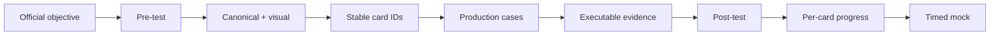

# Spring 2V0-72.22 — 99 Percent Master Roadmap

> [!summary]
> Target: 600 base cards + 150 drills + six timed mocks. Per-card progress, 57-objective traceability and legacy-card normalization are now implemented. `SPRING-BOOT-B01` and `SPRING-BOOT-B02` are published; next content route is MVC.

# Exam baseline

```text
Exam              2V0-72.22 Spring Professional Develop
Questions         60
Duration          130 minutes
Format            single and multiple choice
Passing score     300 scaled
Baseline          Spring Framework 5.3 / Boot 2.5 / Data 2021.0
```

Verify current registration logistics immediately before exam purchase.

# Readiness evidence model

```text
25% official objective traceability
75% vertical-slice artifact/card completeness
```

Machine artifacts:

```text
.github/objectives/spring-2V0-72.22.json
.github/objective-overrides/spring-boot-b02.json
.github/scripts/audit_objective_traceability.py
.github/certification-readiness.json
.github/scripts/audit_certification_readiness.py
```

# Corrected learning model



# Card target

```text
Base cards target     600
Drill cards target    150
-------------------------
Total target          750
```

| Domain | Target | Objective-mapped | Remaining |
|---|---:|---:|---:|
| Spring Core and SpEL | 130 | 130 | SpEL route still required |
| AOP and Cache | 50 | 44 | 6 |
| Data, Transactions, JPA and JDBC | 90 | 68 | 22 + JDBC route |
| Spring MVC and REST | 60 | 0 | 60 |
| Testing and MockMvc | 85 | 36 | 49 |
| Spring Security | 35 | 0 | 35 |
| Spring Boot and Actuator | 150 | 65 | 85 |
| **Total** | **600** | **343** | **257** |

Published Spring cards total: **353**. Core contribution is capped at its objective allocation so extra Core volume cannot hide missing domains.

# Completed infrastructure gates

- [x] Per-card progress registry and scheduler.
- [x] Static due/new review queue without Dataview.
- [x] 57 official Spring objectives in traceability matrix.
- [x] Objective override model for new routes.
- [x] Combined objective/vertical readiness formula.
- [x] CORE-B01 normalized — 20 cards.
- [x] CORE-B04 normalized — 24 cards.
- [x] TX-B01 normalized — 32 cards.
- [x] DATA-B01 normalized — 36 cards.
- [x] TEST-B01 normalized — 36 cards.
- [x] All normalized batches included in strict CI gate.

# Published routes

## Spring Core

- [[30_CERTIFICATIONS/Spring/2V0-72.22/Spring Core Card Roadmap]]
- 140 cards.

## AOP and Cache

- [[30_CERTIFICATIONS/Spring/2V0-72.22/Spring AOP and Cache Roadmap]]
- 44 normalized cards.

## Transaction Management

- [[30_CERTIFICATIONS/Spring/2V0-72.22/Spring Transaction Management Roadmap]]
- 32 normalized cards.

## Spring Data JPA

- [[30_CERTIFICATIONS/Spring/2V0-72.22/Spring Data JPA Roadmap]]
- 36 normalized cards.

## Spring Testing

- [[30_CERTIFICATIONS/Spring/2V0-72.22/Spring Testing Roadmap]]
- 36 normalized cards.

## SPRING-BOOT-B01 — Bootstrap and Auto-configuration

- [[30_CERTIFICATIONS/Spring/2V0-72.22/SPRING-BOOT-B01/SPRING-BOOT-B01 Roadmap]]
- 30 cards;
- 31 diagrams;
- 15 production cases;
- 6 executable tests.

## SPRING-BOOT-B02 — Externalized Configuration

- [[30_CERTIFICATIONS/Spring/2V0-72.22/SPRING-BOOT-B02/SPRING-BOOT-B02 Roadmap]]
- [[10_CONCEPTS/Spring/Boot/Spring Boot Externalized Configuration and Type-safe Binding]]
- [[10_CONCEPTS/Spring/Boot/Spring Boot Configuration Visual Deep Dive]]
- [[30_CERTIFICATIONS/Spring/2V0-72.22/SPRING-BOOT-B02/SPRING-BOOT-B02 Cards|35 cards]]
- [[30_CERTIFICATIONS/Spring/2V0-72.22/SPRING-BOOT-B02/SPRING-BOOT-B02 Assessment|10-question pre-test + 15-question post-test]]
- [[40_PRODUCTION_CASES/Spring/Spring Boot Configuration Production Cases|12 cases]]
- [[50_LABS/Spring/SPRING-BOOT-B02/README|7 executable tests]]
- [[01_MAPS/Spring Boot Configuration Map.canvas]]
- [[98_SOURCES/Spring Boot Externalized Configuration Sources]]

Mapped objectives:

```text
SPRING-1.3.1 external properties
SPRING-1.3.2 profiles
SPRING-6.2.1 defining and loading properties
```

# Remaining P0 routes

## SPRING-MVC-B01 — DispatcherServlet and Controller Pipeline

Target: 35 base cards + 8 drills.

```text
DispatcherServlet
HandlerMapping / HandlerAdapter
argument resolvers
return-value handlers
message converters
view resolution
content negotiation
request mapping conditions
binding, validation and exception resolvers
```

## SPRING-MVC-B02 — REST and HTTP Clients

Target: 25 base cards + 7 drills.

```text
@RestController
request body/path/query parameters
ResponseEntity
status/header/body semantics
@ControllerAdvice
RestTemplate exam baseline
RestTemplateBuilder
current RestClient/WebClient delta
```

## SPRING-SEC-B01 — Authentication and Authorization

Target: 35 base cards + 10 drills.

## SPRING-ACT-B01 — Actuator, Health and Metrics

Target: 30 base cards + 10 drills.

## SPRING-JDBC-B01 — JdbcTemplate and Exception Translation

Target: 30 base cards + 8 drills.

## SPRING-WEBTEST-B01 — MockMvc and Web Slices

Target: 25 base cards + 8 drills.

## SPRING-SPEL-B01 — Spring Expression Language

Target: 10 base cards + 4 drills.

# Drill target

| Drill type | Cards |
|---|---:|
| Multiple-select traps | 35 |
| Configuration/code-result | 30 |
| Cross-domain proxy/transaction/testing | 25 |
| Boot conditions/properties | 25 |
| MVC/Security request path | 20 |
| Data/JDBC translation | 15 |
| **Total** | **150** |

# Mock system

```text
12 domain mini-mocks × 25 questions
6 full mocks × 60 questions / 130 minutes
```

Each result records objective ID, selected/correct options, confidence, elapsed time, outcome taxonomy and source evidence.

# 99% material gate

```text
[ ] all 57 Spring objectives complete or mock-covered
[ ] 600 base cards complete
[ ] 150 drill cards complete
[x] legacy Spring card normalization complete
[ ] every P0 route has pre/post assessment and full evidence roles
[ ] six full timed mocks exist
[ ] version matrix complete
[ ] no P0/P1 objective gap
[ ] all CI gates pass
```

# Delivery sequence


# Related dashboards

- [[00_HOME/Certification 99 Percent Readiness Dashboard]]
- [[00_HOME/Card Review Dashboard]]
- [[00_HOME/Knowledge Route Registry]]
- [[30_CERTIFICATIONS/Certification MOC]]
