# Spring 2V0-72.22 — 99 Percent Master Roadmap

> [!summary]
> Target: 600 base cards + 150 exam-drill cards + six full timed mocks. Existing Core/AOP/Transactions/Data/Testing remain canonical. `SPRING-BOOT-B01` is now published; remaining P0 work is Boot configuration properties, MVC/REST, Security, Actuator, JDBC, MockMvc and SpEL.

# Exam baseline

```text
Exam              2V0-72.22 Spring Professional Develop
Questions         60
Duration          130 minutes
Format            single and multiple choice
Passing score     300 scaled
Primary language  English
```

Official exam status and logistics must be re-verified immediately before registration.

# Version policy

```text
EXAM BASELINE
Spring Framework 5.3-era concepts
Spring Boot 2.x-era behavior relevant to 2V0-72.22
javax-era API names where exam wording uses them

CURRENT PRODUCTION DELTA
Spring Framework 6.x
Spring Boot 3.x/current
jakarta namespace
current auto-configuration and observability APIs
```

Every version-sensitive route must contain explicit `Exam baseline` and `Current delta` sections.

# Card target and current objective mapping

```text
Base cards target     600
Drill cards target    150
-------------------------
Total target          750
```

| Domain | Target | Current mapped | Remaining |
|---|---:|---:|---:|
| Spring Core and SpEL | 130 | 130 | SpEL route still required |
| AOP and Cache interception | 50 | 44 | 6 |
| Data, Transactions, JPA and JDBC | 90 | 68 | 22 + JDBC coverage |
| Spring MVC and REST | 60 | 0 | 60 |
| Testing and MockMvc | 85 | 36 | 49 |
| Spring Security | 35 | 0 | 35 |
| Spring Boot and Actuator | 150 | 30 | 120 |
| **Total** | **600** | **308 objective-mapped** | **292** |

Existing Spring Core has 140 cards, but readiness caps its exam contribution at 130 so excess Core volume cannot hide an uncovered domain.

# Drill-card target

| Drill type | Cards |
|---|---:|
| Multiple-select traps | 35 |
| Configuration/code-result questions | 30 |
| Cross-domain proxy/transaction/testing questions | 25 |
| Boot condition and property questions | 25 |
| MVC/Security request-path questions | 20 |
| Data/JDBC/exception translation questions | 15 |
| **Total** | **150** |

# Published foundation

## Spring Core

- [[30_CERTIFICATIONS/Spring/2V0-72.22/Spring Core Card Roadmap]]
- 140 cards; objective contribution capped at 130.

## AOP and Cache

- [[30_CERTIFICATIONS/Spring/2V0-72.22/Spring AOP and Cache Roadmap]]
- 44 normalized cards.

## Transaction Management

- [[30_CERTIFICATIONS/Spring/2V0-72.22/Spring Transaction Management Roadmap]]
- 32 cards.

## Spring Data and JPA

- [[30_CERTIFICATIONS/Spring/2V0-72.22/Spring Data JPA Roadmap]]
- 36 cards.

## Spring Testing

- [[30_CERTIFICATIONS/Spring/2V0-72.22/Spring Testing Roadmap]]
- 36 cards.

## SPRING-BOOT-B01 — published

- [[30_CERTIFICATIONS/Spring/2V0-72.22/SPRING-BOOT-B01/SPRING-BOOT-B01 Roadmap]]
- [[10_CONCEPTS/Spring/Boot/Spring Boot Bootstrap and Auto-configuration]]
- [[10_CONCEPTS/Spring/Boot/Spring Boot Auto-configuration Visual Deep Dive]]
- [[30_CERTIFICATIONS/Spring/2V0-72.22/SPRING-BOOT-B01/SPRING-BOOT-B01 Cards|30 cards]]
- [[40_PRODUCTION_CASES/Spring/Spring Boot Auto-configuration Production Cases|15 cases]]
- [[50_LABS/Spring/SPRING-BOOT-B01/README|Boot 2.5 ApplicationContextRunner lab]]
- [[01_MAPS/Spring Boot Auto-configuration Map.canvas]]
- [[98_SOURCES/Spring Boot Auto-configuration Sources]]

Published B01 coverage:

```text
@SpringBootApplication composition
SpringApplication phases
Environment and WebApplicationType
@EnableAutoConfiguration
candidate discovery and deferred imports
Boot 2.x spring.factories
current AutoConfiguration.imports delta
conditional annotations and back-off
exclusions and condition report
starters and dependency management
custom auto-configuration
ApplicationContextRunner
failure analyzers, events, runners and lazy initialization
```

# Remaining P0 routes

## SPRING-BOOT-B02 — Configuration Properties and Externalized Configuration

Target: 35 base cards + 10 drills.

Coverage:

- property-source precedence;
- Config Data;
- relaxed binding;
- `@ConfigurationProperties`;
- constructor binding/version boundary;
- validation;
- metadata generation;
- profile-specific configuration;
- test overrides;
- environment variables;
- command-line arguments;
- sensitive-value boundaries.

## SPRING-MVC-B01 — DispatcherServlet and Controller Pipeline

Target: 35 base cards + 8 drills.

Coverage:

- `DispatcherServlet`;
- `HandlerMapping` and `HandlerAdapter`;
- argument resolvers;
- return-value handlers;
- message converters;
- view resolution;
- content negotiation;
- request mapping conditions;
- binding, validation and exception resolvers.

## SPRING-MVC-B02 — REST and HTTP Clients

Target: 25 base cards + 7 drills.

Coverage:

- `@RestController`;
- request body/path/query parameters;
- `ResponseEntity`;
- status/header/body semantics;
- `@ControllerAdvice` and REST errors;
- `RestTemplate` exam baseline;
- `RestTemplateBuilder`;
- current `RestClient`/`WebClient` comparison.

## SPRING-SEC-B01 — Authentication and Authorization

Target: 35 base cards + 10 drills.

Coverage:

- authentication versus authorization;
- `SecurityContext`, `Authentication`, authorities and roles;
- `UserDetailsService` and password encoding;
- filter-chain model;
- request authorization;
- Basic/form login;
- CSRF;
- method security and `@PreAuthorize`;
- test support.

## SPRING-ACT-B01 — Actuator, Health and Metrics

Target: 30 base cards + 10 drills.

Coverage:

- endpoint discovery/exposure/security;
- health, info, metrics, env, beans and mappings;
- management path/port;
- custom `HealthIndicator`;
- `MeterRegistry`, Counter, Gauge and Timer;
- readiness/liveness version boundary.

## SPRING-JDBC-B01 — JdbcTemplate and Exception Translation

Target: 30 base cards + 8 drills.

Coverage:

- `DataSource` and `JdbcTemplate` callback model;
- query/update/batch APIs;
- `RowMapper` and `ResultSetExtractor`;
- prepared statements and generated keys;
- `NamedParameterJdbcTemplate`;
- `DataAccessException` and SQL exception translation;
- transaction participation.

## SPRING-WEBTEST-B01 — MockMvc and Web Slices

Target: 25 base cards + 8 drills.

Coverage:

- `@WebMvcTest`;
- MockMvc request builders/result matchers;
- JSON path;
- validation, advice and error tests;
- security integration;
- slice mocks/imports;
- `@SpringBootTest + @AutoConfigureMockMvc`.

## SPRING-SPEL-B01 — Spring Expression Language

Target: 10 base cards + 4 drills.

Coverage:

- `#{}` versus `${}`;
- property/method/bean access;
- collection selection/projection;
- Elvis and safe navigation;
- `@Value`;
- security and maintainability boundaries.

# Existing-route normalization

```text
CORE-B01    2 incomplete cards
CORE-B04    2 incomplete cards
TX-B01     28 incomplete cards
DATA-B01   34 incomplete cards
TEST-B01   34 incomplete cards
--------------------------------
TOTAL     100 cards
```

Order:

1. TX-B01.
2. DATA-B01.
3. TEST-B01.
4. CORE-B01 and CORE-B04.

# Mock system

## Domain mini-mocks

```text
12 mini-mocks
25 questions each
300 question appearances
```

## Full mocks

```text
6 mocks
60 questions each
130 minutes
360 mixed question appearances
```

Each question records:

```text
objective ID
selected/correct options
correct-answer count
confidence
elapsed time
error taxonomy
source artifact
```

Error taxonomy:

```text
wrong-concept
wrong-version
wrong-proxy-boundary
wrong-transaction-boundary
wrong-annotation-semantics
wrong-multiple-select-count
wrong-attention
correct-guessed
```

# 99% material gate

```text
[ ] all official Spring objectives mapped
[ ] 600 base cards complete
[ ] 150 drill cards complete
[ ] 100 legacy incomplete cards normalized
[ ] every P0 route has canonical + visual + cards + cases + lab + Canvas + sources
[ ] six full timed mocks exist
[ ] version-boundary matrix complete
[ ] no P0/P1 content gap
[ ] structural/cross-link/Mermaid/card/readiness CI passes
```

# Delivery sequence

```mermaid
flowchart LR
    DONE["BOOT-B01 published"] --> BOOT2["BOOT-B02"]
    BOOT2 --> MVC1["MVC-B01"]
    MVC1 --> MVC2["MVC-B02"]
    MVC2 --> SEC["SEC-B01"]
    SEC --> ACT["ACT-B01"]
    ACT --> JDBC["JDBC-B01"]
    JDBC --> WEBTEST["WEBTEST-B01"]
    WEBTEST --> SPEL["SPEL-B01"]
    SPEL --> NORMALIZE["Normalize TX/DATA/TEST/Core"]
    NORMALIZE --> DRILLS["150 drills"]
    DRILLS --> MOCKS["6 timed mocks"]
```



# Adjacent dashboards

- [[00_HOME/Certification 99 Percent Readiness Dashboard]]
- [[00_HOME/Knowledge Route Registry]]
- [[30_CERTIFICATIONS/Certification MOC]]
