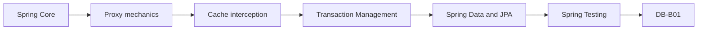

# Spring AOP and Cache Roadmap

> [!summary]
> Маршрут продолжает Spring Core. AOP и Cache объединены через общую runtime boundary: caller должен пересечь Spring proxy, после чего advisor/interceptor решает, вызывать ли target и что сделать до/после invocation.

# Route navigation

- **Registry:** [[00_HOME/Knowledge Route Registry]]
- **Domain map:** [[01_MAPS/Spring Map]]
- **Previous:** [[30_CERTIFICATIONS/Spring/2V0-72.22/Spring Core Card Roadmap]]
- **Next:** [[30_CERTIFICATIONS/Spring/2V0-72.22/Spring Transaction Management Roadmap]]
- **Visual atlas:** [[01_MAPS/Spring AOP and Cache Visual Atlas.canvas]]
- **Shared runtime canvas:** [[01_MAPS/Spring AOP and Caching Map.canvas]]
- **Sources:** [[98_SOURCES/Spring AOP and Cache Sources]]

# Progress

```text
AOP-B01    24 cards  PUBLISHED + NORMALIZED + VISUAL
CACHE-B01  20 cards  PUBLISHED + NORMALIZED + VISUAL
----------------------------------------------------
TOTAL      44 cards
```



# Visual learning

| Route | Deep dive | Diagrams |
|---|---|---:|
| AOP | [[10_CONCEPTS/Spring/AOP/Spring AOP Visual Deep Dive]] | 20 |
| Cache | [[10_CONCEPTS/Spring/Cache/Spring Cache Visual Deep Dive]] | 27 |

Shared bridge:

- [[10_CONCEPTS/Spring/AOP/Spring AOP Proxies and Cache Interception]].

Visual coverage:

```text
bean auto-proxy creation
caller → proxy → interceptor → target
JDK versus CGLIB
self-invocation
advisor ordering
proceed/exception paths
async and security boundaries
cache hit/miss
key identity and tenant isolation
Caffeine per-node topology
Redis shared topology
stampede and sync=true
L1/L2 invalidation
Redis outage cascade
runtime diagnostic trees
```

# AOP-B01

| Role | Artifact |
|---|---|
| Canonical | [[10_CONCEPTS/Spring/AOP/Spring AOP Proxy Mechanics]] |
| Visual | [[10_CONCEPTS/Spring/AOP/Spring AOP Visual Deep Dive]] |
| Cards | [[30_CERTIFICATIONS/Spring/2V0-72.22/AOP-B01/AOP-B01 Cards]] |
| Cases | [[40_PRODUCTION_CASES/Spring/AOP and Cache Production Cases]] |
| Lab | [[50_LABS/Spring/AOP-B01/README]] |
| Sources | [[98_SOURCES/Spring AOP and Cache Sources]] |

Coverage:

- aspect, join point, pointcut, advice and advisor;
- around advice and `ProceedingJoinPoint.proceed()`;
- JDK dynamic proxy and CGLIB;
- final/private boundaries;
- self-invocation and collaborator refactoring;
- advisor ordering and exception propagation;
- runtime proxy/advisor inspection;
- transaction, async and method-security boundaries.

Normalization contract:

```text
24 / 24 cards contain
Question
Russian Translation
Answer
Explanation
Exam Trap
```

# CACHE-B01

| Role | Artifact |
|---|---|
| Canonical | [[10_CONCEPTS/Spring/Cache/Spring Cache with Caffeine and Redis]] |
| Visual | [[10_CONCEPTS/Spring/Cache/Spring Cache Visual Deep Dive]] |
| Cards | [[30_CERTIFICATIONS/Spring/2V0-72.22/CACHE-B01/CACHE-B01 Cards]] |
| Cases | [[40_PRODUCTION_CASES/Spring/AOP and Cache Production Cases]] |
| Lab | [[50_LABS/Spring/CACHE-B01/README]] |
| Redis compose | [[50_LABS/Spring/CACHE-B01/compose.yaml]] |
| Sources | [[98_SOURCES/Spring AOP and Cache Sources]] |

Coverage:

- Spring Cache abstraction and `CacheManager`;
- `@Cacheable`, `@CachePut`, `@CacheEvict`;
- keys, tenant isolation, `condition` and `unless`;
- self-invocation;
- `sync=true` boundary;
- stampede mitigation;
- Caffeine locality, size, weight and expiration;
- Redis TTL, prefixes and serialization;
- transaction-aware timing;
- Redis outage and database overload;
- L1 Caffeine + L2 Redis invalidation;
- cache metrics and diagnostic sequence.

Normalization contract:

```text
20 / 20 cards contain
Question
Russian Translation
Answer
Explanation
Exam Trap
```

# Production transfer

Use [[40_PRODUCTION_CASES/Spring/AOP and Cache Production Cases]] for:

- same-class `REQUIRES_NEW` failure;
- self-invoked `@Async` running synchronously;
- swallowed exception changing rollback behavior;
- method-security internal-call bypass;
- multi-tenant cache-key collision;
- Caffeine stale copies across nodes;
- Redis serialization incompatibility;
- DB commit followed by failed eviction;
- Redis outage causing database overload.

# Quality status

- [x] Central registry and domain MOC links.
- [x] 44 normalized cards.
- [x] 47 Mermaid models.
- [x] Two Canvas entry points.
- [x] Shared production-case collection.
- [x] AOP lab and Cache/Redis lab.
- [x] Primary source index.
- [x] Route manifest and graph audit.
- [ ] Full Maven runtime executed in connected environment.
- [ ] Redis lab executed against Docker Redis.
- [ ] Real recall outcomes collected.

# Review questions

1. Did caller cross the published proxy?
2. JDK or CGLIB proxy?
3. Which advisors are installed and in what order?
4. Is there self-invocation?
5. Can the method be overridden/intercepted?
6. How is cache key composed?
7. Which `CacheManager` and provider are selected?
8. Is state local to one JVM or shared through Redis?
9. What happens under concurrent miss or Redis outage?
10. Which metric, trace or lab proves the behavior?
