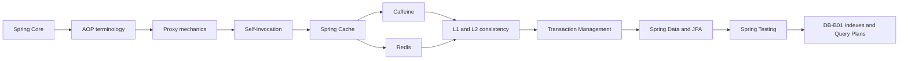

# Spring AOP and Cache Roadmap

> [!summary]
> Маршрут продолжает Spring Core. `@Transactional`, `@Async`, method security и Spring Cache используют proxy/interceptor boundaries, поэтому их типовые failures имеют общий diagnostic model. Все 44 карточки приведены к единому pedagogical contract и дополнены mechanism explanations, exam traps и production examples.

## Progress

```text
AOP-B01    24 cards  PUBLISHED + NORMALIZED
CACHE-B01  20 cards  PUBLISHED + NORMALIZED
-------------------------------------------
TOTAL      44 cards
```

## Learning sequence



# AOP-B01 — published and normalized

Materials:

- [[10_CONCEPTS/Spring/AOP/Spring AOP Proxy Mechanics]];
- [[10_CONCEPTS/Spring/AOP/Spring AOP Proxies and Cache Interception]];
- [[30_CERTIFICATIONS/Spring/2V0-72.22/AOP-B01/AOP-B01 Cards]];
- [[50_LABS/Spring/AOP-B01/README]];
- [[40_PRODUCTION_CASES/Spring/AOP and Cache Production Cases]];
- [[98_SOURCES/Spring AOP and Cache Sources]].

Coverage:

- aspect, join point, pointcut, advice and advisor;
- around advice and `ProceedingJoinPoint.proceed()`;
- JDK dynamic proxy and CGLIB execution paths;
- final/private method limitations;
- self-invocation and collaborator refactoring;
- `AopContext` requirements and trade-offs;
- advisor ordering and nested execution;
- exception propagation and false-success risk;
- runtime proxy and advisor-chain diagnostics;
- `@Transactional(REQUIRES_NEW)` self-invocation;
- `@Async` thread/transaction boundary;
- method-security internal-call bypass.

Normalization result:

```text
24 / 24 cards contain:
Question
Russian Translation
Answer
Explanation
Exam Trap
```

Real examples include:

- security → transaction advisor order;
- final and private method interception failures;
- same-class `REQUIRES_NEW` failure;
- collaborator refactoring;
- swallowed exception changing rollback semantics;
- `AopUtils` and `Advised#getAdvisors()` diagnostics;
- synchronous execution of self-invoked `@Async`;
- method-security bypass through `this`.

# CACHE-B01 — published and normalized

Materials:

- [[10_CONCEPTS/Spring/Cache/Spring Cache with Caffeine and Redis]];
- [[10_CONCEPTS/Spring/AOP/Spring AOP Proxies and Cache Interception]];
- [[30_CERTIFICATIONS/Spring/2V0-72.22/CACHE-B01/CACHE-B01 Cards]];
- [[50_LABS/Spring/CACHE-B01/README]];
- [[50_LABS/Spring/CACHE-B01/compose.yaml]];
- [[40_PRODUCTION_CASES/Spring/AOP and Cache Production Cases]];
- [[98_SOURCES/Spring AOP and Cache Sources]].

Coverage:

- Spring Cache abstraction and provider boundary;
- `CacheManager` selection;
- `@Cacheable`, `@CachePut`, `@CacheEvict`;
- keys, tenant isolation, `condition` and `unless`;
- self-invocation;
- `sync=true` and provider-specific single-flight limits;
- cache stampede mitigation;
- Caffeine locality, size, weight and expiration;
- Redis shared state, TTL, prefixes and serialization;
- transaction-aware timing versus distributed atomicity;
- Redis outage and database overload;
- L1 Caffeine + L2 Redis invalidation;
- runtime metrics and diagnostic sequence.

Normalization result:

```text
20 / 20 cards contain:
Question
Russian Translation
Answer
Explanation
Exam Trap
```

Real examples include:

- multi-tenant cache-key collision;
- `condition` versus `unless`;
- after-invocation and before-invocation eviction;
- same-key concurrent miss and `sync=true` boundary;
- hot-key stampede;
- Caffeine per-JVM stale copies;
- `maximumSize` versus `maximumWeight`;
- Redis DTO/schema-version contract;
- DB commit followed by failed Redis eviction;
- two-level cache cross-node staleness;
- Redis outage causing database overload.

# Vertical-slice quality gate

- [x] 24 AOP cards.
- [x] 20 caching cards.
- [x] English questions and Russian translations.
- [x] 44/44 direct answers.
- [x] 44/44 mechanism explanations.
- [x] 44/44 concrete exam traps.
- [x] Real transaction, async and security proxy examples.
- [x] Real Caffeine, Redis and L1/L2 failure examples.
- [x] Caffeine local cache lab.
- [x] Redis Docker Compose lab.
- [x] 12 production cases.
- [x] Primary source index.
- [x] Visual Canvas.
- [x] Repository structural and Mermaid quality gate.
- [ ] Full Maven runtime executed in connected environment.
- [ ] Redis lab executed against Docker Redis.
- [ ] Real review outcomes collected.

# Review questions

1. Через какой object reference входит caller?
2. JDK или CGLIB proxy?
3. Какие advisors применяются и в каком порядке?
4. Есть ли self-invocation?
5. Может ли method быть переопределён proxy?
6. Кто вычисляет cache key и включает ли он tenant/locale/version?
7. Какой `CacheManager` выбран?
8. Caffeine entry локален какому node?
9. Какой TTL и serialization contract у Redis?
10. Что произойдёт при Redis outage?
11. Как инвалидируется L1 на других nodes?
12. Как доказать behavior через metrics и advisor inspection?

# Published continuations

## Transaction Management

- [[30_CERTIFICATIONS/Spring/2V0-72.22/Spring Transaction Management Roadmap]];
- [[30_CERTIFICATIONS/Spring/2V0-72.22/TX-B01/TX-B01 Cards]];
- [[50_LABS/Spring/TX-B01/README]].

## Spring Data and JPA

- [[30_CERTIFICATIONS/Spring/2V0-72.22/Spring Data JPA Roadmap]];
- [[30_CERTIFICATIONS/Spring/2V0-72.22/DATA-B01/DATA-B01 Cards]];
- [[50_LABS/Spring/DATA-B01/README]].

## Spring Testing

- [[30_CERTIFICATIONS/Spring/2V0-72.22/Spring Testing Roadmap]];
- [[30_CERTIFICATIONS/Spring/2V0-72.22/TEST-B01/TEST-B01 Cards]];
- [[50_LABS/Spring/TEST-B01/README]].

# Next implementation route

```text
DB-B01 — Indexes and Query Plans
```

Planned vertical slice:

1. B-tree mechanics and selectivity.
2. Composite-index ordering and leftmost-prefix reasoning.
3. Covering/index-only scans.
4. Partial and expression indexes.
5. PostgreSQL `EXPLAIN (ANALYZE, BUFFERS)`.
6. Sequential scan versus index scan.
7. Statistics, cardinality estimation and stale statistics.
8. Cases where indexes no longer solve large-data workloads.
9. Production cases and reproducible PostgreSQL lab.
