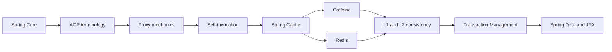

# Spring AOP and Cache Roadmap

> [!summary]
> Маршрут продолжает Spring Core. `@Transactional`, `@Async`, method security и Spring Cache используют proxy/interceptor boundaries, поэтому их типовые failures имеют общий diagnostic model.

## Progress

```text
AOP-B01    24 cards  PUBLISHED
CACHE-B01  20 cards  PUBLISHED
------------------------------
TOTAL      44 cards
```

## Learning sequence



# AOP-B01 — published

Materials:

- [[10_CONCEPTS/Spring/AOP/Spring AOP Proxy Mechanics]];
- [[30_CERTIFICATIONS/Spring/2V0-72.22/AOP-B01/AOP-B01 Cards]];
- [[50_LABS/Spring/AOP-B01/README]];
- [[40_PRODUCTION_CASES/Spring/AOP and Cache Production Cases]];
- [[98_SOURCES/Spring AOP and Cache Sources]].

Coverage:

- aspect, join point, pointcut, advice and advisor;
- around advice and `proceed()`;
- JDK dynamic proxy and CGLIB;
- proxy selection;
- final/private limitations;
- self-invocation and collaborator refactoring;
- `AopContext` trade-off;
- advisor ordering;
- exception propagation;
- runtime diagnostics;
- `@Transactional`, `@Async`, method security and caching boundaries.

# CACHE-B01 — published

Materials:

- [[10_CONCEPTS/Spring/Cache/Spring Cache with Caffeine and Redis]];
- [[30_CERTIFICATIONS/Spring/2V0-72.22/CACHE-B01/CACHE-B01 Cards]];
- [[50_LABS/Spring/CACHE-B01/README]];
- [[50_LABS/Spring/CACHE-B01/compose.yaml]];
- [[40_PRODUCTION_CASES/Spring/AOP and Cache Production Cases]];
- [[98_SOURCES/Spring AOP and Cache Sources]].

Coverage:

- Spring Cache abstraction;
- `CacheManager` and providers;
- `@Cacheable`, `@CachePut`, `@CacheEvict`;
- keys, conditions and `unless`;
- self-invocation;
- `sync=true` and stampede boundaries;
- negative caching;
- Caffeine size, weight, expiration and statistics;
- Redis TTL, prefix and serializers;
- transaction-aware cache timing;
- Redis outage policy;
- L1 Caffeine + L2 Redis invalidation;
- metrics and diagnostics.

# Vertical-slice quality gate

- [x] 24 AOP cards.
- [x] 20 caching cards.
- [x] English questions and Russian translations.
- [x] Mechanism explanations and exam traps.
- [x] Real transaction and async proxy examples.
- [x] Caffeine local cache lab.
- [x] Redis Docker Compose lab.
- [x] 12 production cases.
- [x] Primary source index.
- [x] Visual Canvas.
- [ ] Full Maven runtime executed in connected environment.
- [ ] Redis lab executed against Docker Redis.
- [ ] Real review outcomes collected.

# Review questions

1. Через какой object reference входит caller?
2. JDK или CGLIB proxy?
3. Какие advisors применяются?
4. Есть ли self-invocation?
5. Кто вычисляет cache key?
6. Какой CacheManager выбран?
7. Caffeine entry локален какому node?
8. Какой TTL и serialization contract у Redis?
9. Что произойдёт при Redis outage?
10. Как инвалидируется L1 на других nodes?

# Published continuations

## Transaction Management

- [[30_CERTIFICATIONS/Spring/2V0-72.22/Spring Transaction Management Roadmap]];
- [[30_CERTIFICATIONS/Spring/2V0-72.22/TX-B01/TX-B01 Cards]];
- [[50_LABS/Spring/TX-B01/README]].

## Spring Data and JPA

- [[30_CERTIFICATIONS/Spring/2V0-72.22/Spring Data JPA Roadmap]];
- [[30_CERTIFICATIONS/Spring/2V0-72.22/DATA-B01/DATA-B01 Cards]];
- [[50_LABS/Spring/DATA-B01/README]].

# Next Spring routes

1. Testing.
2. Spring Boot internals and auto-configuration.
3. Spring MVC/WebFlux.
4. Spring Security.
5. Messaging transactions and idempotent consumers.
