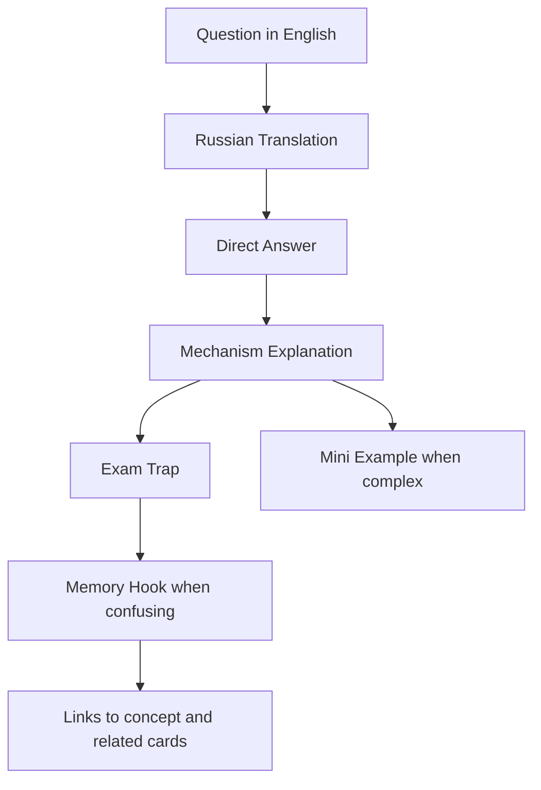
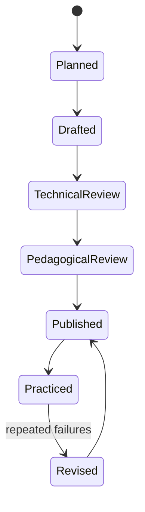

# Spring Certification Card System

> [!summary] Назначение
> Единый стандарт карточек для подготовки по материалам `Spring Certified Professional (2V0-72.22)`: понимать английскую формулировку, давать точный ответ, объяснять механизм и распознавать экзаменационную ловушку.

## Зафиксированные требования

- карточки создаются партиями по **20–30**, а не всем массивом сразу;
- вопрос формулируется на английском;
- рядом даётся русский перевод;
- обязательные секции: `Question`, `Russian Translation`, `Answer`, `Explanation`, `Exam Trap`;
- для сложных тем обязательна секция `Mini Example`;
- для сложных или легко путаемых тем обязательна секция `Memory Hook`;
- целевая модель: **750 base cards + 150 exam drill questions = 900 items**;
- каноническое объяснение хранится в `10_CONCEPTS`, карточка ссылается на него и не дублирует учебник полностью.

## Анатомия хорошей карточки



## Почему карточка не должна быть только вопросом и ответом

Простой Q/A тренирует узнавание. Сертификация и интервью требуют четырёх уровней:

1. **Recall** — вспомнить термин.
2. **Discrimination** — отличить похожие варианты.
3. **Mechanism** — объяснить, почему утверждение верно.
4. **Transfer** — применить правило к новому коду или сценарию.

Секции `Explanation`, `Exam Trap` и `Mini Example` переводят карточку с уровня запоминания на уровень понимания.

## Формат идентификаторов

```text
<DOMAIN>-B<batch>-C<card>
```

Примеры:

```text
CORE-B01-C001
CORE-B01-C002
CORE-B02-C031
AOP-B01-C001
DATA-B01-C001
TX-B01-C001
BOOT-B01-C001
```

## Типы карточек

| kind | Что проверяет | Пример |
|---|---|---|
| definition | точное значение термина | What is a bean? |
| distinction | различие похожих механизмов | @Primary vs @Qualifier |
| mechanism | внутренний процесс | BeanPostProcessor lifecycle |
| code-result | результат конфигурации или кода | Which bean is injected? |
| multi-select | несколько истинных утверждений | Select three repository facts |
| failure-analysis | причина неправильного поведения | Why is advice not invoked? |
| production-transfer | применение вне экзамена | Why does self-invocation break transactions? |

## Уровни сложности

### Foundation

- один термин;
- один прямой факт;
- нет скрытого контекста.

### Intermediate

- сравнение двух механизмов;
- несколько аннотаций;
- lifecycle ordering;
- небольшой code snippet.

### Advanced

- несколько одновременно действующих правил;
- proxy boundaries;
- transaction propagation;
- multiple-choice с близкими утверждениями;
- вопрос, где правильный ответ зависит от точной формулировки.

## Критерии качества

Карточка считается готовой, если:

- вопрос однозначен;
- ответ короткий и самостоятельный;
- explanation объясняет механизм, а не повторяет answer;
- exam trap описывает конкретную ошибку выбора;
- неправильные варианты разобраны, если это multiple-choice;
- mini example компилируем или синтаксически корректен;
- есть ссылка на concept note;
- нет зависимости от текста соседней карточки.

## Review protocol

После ответа фиксируется не только `correct/incorrect`, но и качество воспроизведения:

| outcome | Значение |
|---|---|
| correct-confident | правило понято и воспроизведено |
| correct-guessed | ответ угадан, карточка остаётся слабой |
| wrong-concept | не понят механизм |
| wrong-attention | пропущено `NOT`, `select 3`, scope или qualifier |
| wrong-confusion | перепутаны похожие механизмы |

> [!important]
> Угаданный правильный ответ не повышает `confidence` так же, как уверенно объяснённый.

## Слабые зоны, уже обнаруженные в подготовке

1. [[Bean vs Component]]
2. [[Qualifier vs Primary]]
3. [[BeanPostProcessor vs BeanFactoryPostProcessor]]
4. Multiple-choice attentiveness

Эти темы должны получить:

- comparison note;
- visual decision tree;
- не менее 5 contrast cards;
- code example;
- отдельный exam drill.

## Производственный цикл batch



## Связанные материалы

- [[Spring Core Card Roadmap]]
- [[90_TEMPLATES/Certification Question|Certification Question Template]]
- [[30_CERTIFICATIONS/Certification MOC|Certification MOC]]
