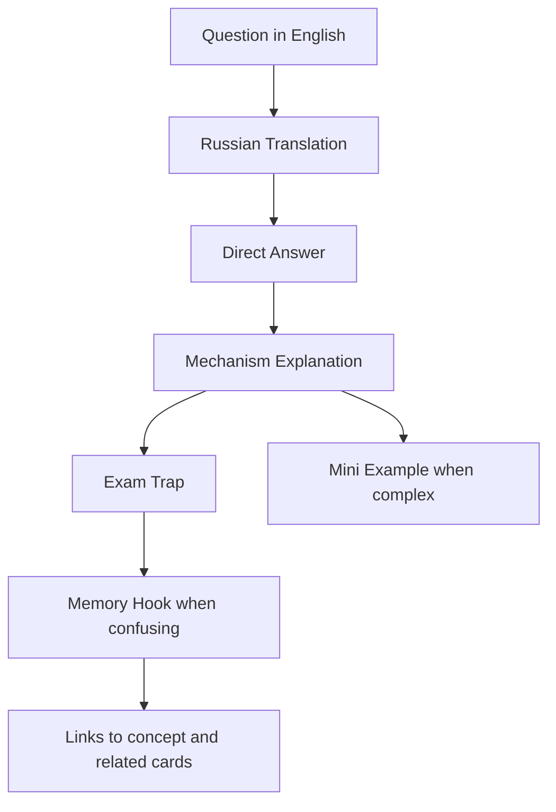
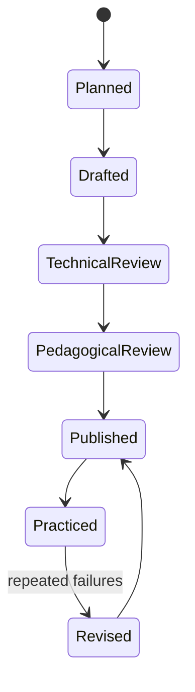

# Spring Certification Card System

> [!summary] Назначение
> Единый стандарт карточек для подготовки по материалам `Spring Certified Professional (2V0-72.22)`: понимать английскую формулировку, давать точный ответ, объяснять механизм и распознавать экзаменационную ловушку.

## Зафиксированные требования

- стандартный batch содержит **20–30 карточек**;
- сложный цельный vertical slice может содержать до **40 карточек**, если деление разрушит общую mental model;
- batch больше 40 необходимо делить по самостоятельным learning objectives;
- вопрос формулируется на английском;
- рядом даётся русский перевод;
- обязательные секции: `Question`, `Russian Translation`, `Answer`, `Explanation`, `Exam Trap`;
- для сложных тем обязательна секция `Mini Example`;
- для легко путаемых тем обязательна секция `Memory Hook`;
- целевая модель: **750 base cards + 150 exam drill questions = 900 items**;
- canonical explanation хранится в `10_CONCEPTS`, карточка ссылается на него и не дублирует учебник полностью.

## Почему размер batch не является самоцелью

```text
слишком маленький batch
    → разрывает единый mechanism

слишком большой batch
    → ухудшает review и diagnosis
```

Примеры допустимых advanced batches:

```text
TX-B01    32 cards
DATA-B01  36 cards
```

Они объединяют тесно связанные механизмы, production cases и lab trace вокруг одной сквозной mental model.

## Анатомия хорошей карточки



## Почему карточка не должна быть только вопросом и ответом

Простой Q/A тренирует узнавание. Сертификация и интервью требуют четырёх уровней:

1. **Recall** — вспомнить термин.
2. **Discrimination** — отличить похожие варианты.
3. **Mechanism** — объяснить, почему утверждение верно.
4. **Transfer** — применить правило к новому коду или сценарию.

Секции `Explanation`, `Exam Trap` и `Mini Example` переводят карточку с уровня запоминания на уровень понимания.

## Формат идентификаторов

```text
<DOMAIN>-B<batch>-C<card>
```

Примеры:

```text
CORE-B01-C001
AOP-B01-C001
CACHE-B01-C001
TX-B01-C001
DATA-B01-C001
BOOT-B01-C001
```

## Типы карточек

| kind | Что проверяет | Пример |
|---|---|---|
| definition | точное значение термина | What is a persistence context? |
| distinction | различие похожих механизмов | flush vs commit |
| mechanism | внутренний процесс | How does dirty checking work? |
| code-result | результат конфигурации или кода | Which entity is managed? |
| multi-select | несколько истинных утверждений | Select three repository facts |
| failure-analysis | причина неправильного поведения | Why does N+1 occur? |
| production-transfer | применение вне экзамена | Why is bulk DML state stale? |

## Уровни сложности

### Foundation

- один термин;
- один прямой факт;
- нет скрытого контекста.

### Intermediate

- сравнение двух механизмов;
- несколько аннотаций;
- lifecycle ordering;
- небольшой code snippet.

### Advanced

- несколько одновременно действующих правил;
- proxy boundaries;
- transaction propagation;
- persistence-context state;
- SQL/fetch-plan prediction;
- multiple-choice с близкими утверждениями;
- ответ зависит от точной формулировки.

## Критерии качества

Карточка считается готовой, если:

- вопрос однозначен;
- ответ короткий и самостоятельный;
- explanation объясняет mechanism, а не повторяет answer;
- exam trap описывает конкретную ошибку выбора;
- неправильные варианты разобраны, если это multiple-choice;
- mini example компилируем или синтаксически корректен;
- есть ссылка на concept note;
- нет зависимости от текста соседней карточки.

## Review protocol

После ответа фиксируется не только `correct/incorrect`, но и качество воспроизведения:

| outcome | Значение |
|---|---|
| correct-confident | правило понято и воспроизведено |
| correct-guessed | ответ угадан, карточка остаётся слабой |
| wrong-concept | не понят mechanism |
| wrong-attention | пропущено `NOT`, `select 3`, scope или qualifier |
| wrong-confusion | перепутаны похожие механизмы |

> [!important]
> Угаданный правильный ответ не повышает `confidence` так же, как уверенно объяснённый.

## Слабые зоны, уже обнаруженные в подготовке

1. [[Bean vs Component]]
2. [[Qualifier vs Primary]]
3. [[BeanPostProcessor vs BeanFactoryPostProcessor]]
4. logical vs physical transaction
5. flush vs commit
6. persist vs merge
7. LAZY vs N+1
8. Multiple-choice attentiveness

Эти темы должны получать:

- comparison note;
- visual decision tree;
- не менее 5 contrast cards;
- code example;
- отдельный exam drill.

## Производственный цикл batch



## Связанные материалы

- [[Spring Core Card Roadmap]]
- [[Spring AOP and Cache Roadmap]]
- [[Spring Transaction Management Roadmap]]
- [[Spring Data JPA Roadmap]]
- [[90_TEMPLATES/Certification Question|Certification Question Template]]
- [[30_CERTIFICATIONS/Certification MOC|Certification MOC]]
