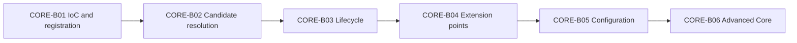

# Spring Core Card Roadmap

> [!summary] Текущее состояние
> Две фактические партии опубликованы: [[CORE-B01/CORE-B01 Cards|CORE-B01]] содержит 20 foundation cards, а [[CORE-B02/CORE-B02 Cards|CORE-B02]] — 24 карточки candidate resolution и optional injection. Обе партии связаны с concept notes, Canvas-картами и практическими материалами.

## Progress

```text
CORE-B01  20 cards  PUBLISHED
CORE-B02  24 cards  PUBLISHED
CORE-B03  planned   bean lifecycle
CORE-B04  planned   extension points
CORE-B05  planned   configuration
CORE-B06  planned   advanced core
```

Всего опубликовано в vault:

```text
44 Spring Core cards
```

## Sequence



## CORE-B01 — published

Материалы:

- [[10_CONCEPTS/Spring/Core/Spring Core Foundations]];
- [[01_MAPS/Spring Core Foundation Map.canvas]];
- [[CORE-B01/CORE-B01 Cards]].

Покрытие:

- IoC vs DI;
- Spring bean;
- BeanDefinition;
- BeanFactory vs ApplicationContext;
- component scanning and stereotypes;
- `@Bean` vs `@Component`;
- `@Configuration`;
- constructor, setter and field injection.

### Quality gate

- [x] 20 cards in one reviewable batch.
- [x] English question.
- [x] Russian translation.
- [x] Direct answer.
- [x] Mechanism explanation.
- [x] Specific exam trap.
- [x] Memory hook.
- [x] Selected mini examples.
- [x] Canonical concept link.
- [ ] Real attempt outcomes collected.

## CORE-B02 — published

Материалы:

- [[10_CONCEPTS/Spring/Core/Dependency Resolution and Optional Injection]];
- [[01_MAPS/Spring Dependency Resolution Map.canvas]];
- [[CORE-B02/CORE-B02 Cards]];
- [[40_PRODUCTION_CASES/Spring/Dependency Resolution Production Cases]];
- [[50_LABS/Spring/Core-B02/README]].

Покрытие:

- multiple candidates;
- `@Primary`;
- `@Qualifier`;
- custom qualifier annotations;
- bean-name fallback;
- `@Autowired` vs `@Resource` semantics;
- collection, array and map injection;
- ordering of injected strategies;
- optional dependencies;
- `Optional<T>`;
- `@Nullable`;
- `ObjectProvider<T>`;
- constructor resolution;
- generics as qualifiers;
- autowire candidate exclusion.

### Quality gate

- [x] 24 cards in one reviewable batch.
- [x] English question and Russian translation.
- [x] Direct answers and mechanism explanations.
- [x] Specific exam traps.
- [x] Memory hooks.
- [x] Mini examples for mechanism-heavy cards.
- [x] Concept module.
- [x] Visual Canvas.
- [x] Three production cases.
- [x] Maven lab structure.
- [ ] Lab executed in a Maven-enabled environment.
- [ ] Real attempt outcomes collected.

## CORE-B03 — next

Bean lifecycle route:

- BeanDefinition to instantiated object;
- constructor invocation;
- dependency population;
- `BeanNameAware`, `BeanFactoryAware`, `ApplicationContextAware`;
- `BeanPostProcessor` before initialization;
- `@PostConstruct`;
- `InitializingBean.afterPropertiesSet()`;
- custom init method;
- `BeanPostProcessor` after initialization;
- destruction callbacks;
- prototype destruction limitation;
- lifecycle ordering traps.

## CORE-B04

- `BeanPostProcessor`;
- `BeanFactoryPostProcessor`;
- `BeanDefinitionRegistryPostProcessor`;
- ordering and lifecycle boundaries.

## CORE-B05

- full vs lite configuration;
- `@Import`;
- profiles;
- properties and Environment.

## CORE-B06

- scopes and scoped proxies;
- `FactoryBean`;
- circular dependencies;
- lazy initialization;
- parent/child contexts.

## Review rule

После batch пользователь должен не только выбрать ответ, но и:

1. объяснить mechanism;
2. назвать confusing alternative;
3. привести minimal example;
4. применить правило к production case;
5. зафиксировать outcome: confident, guessed, concept error, attention error или confusion.

## Review entry point

- [[00_HOME/Review Dashboard]]
