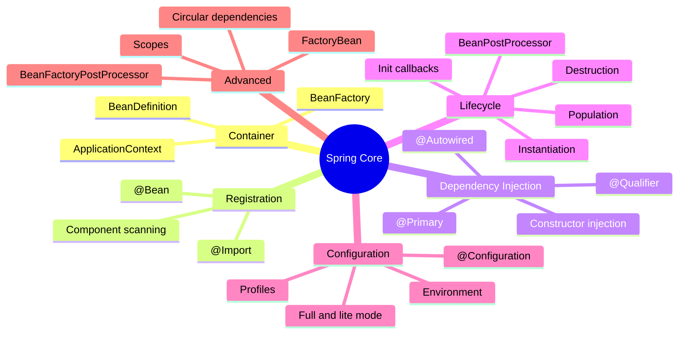
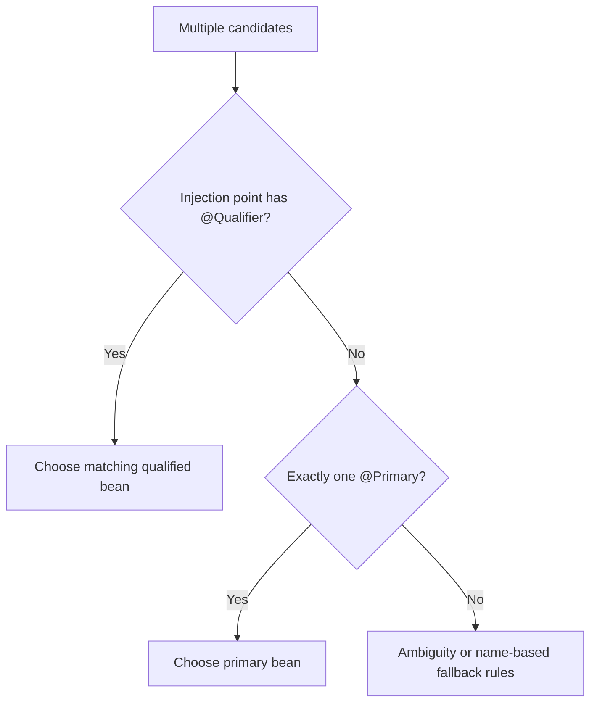

# Spring Core Card Roadmap

> [!summary] Текущее состояние
> В предыдущем плане уже сформирована линия `CORE-B01`–`CORE-B06`, суммарно 174 карточки Spring Core. В Obsidian они должны переноситься партиями, проходить technical/pedagogical review и связываться с каноническими concept notes.

## Карта Spring Core



## Batch strategy

Карточки не следует переносить одной массой. Рабочий порядок:

1. импортировать 20–30 карточек;
2. унифицировать metadata;
3. связать с concept notes;
4. проверить английский question stem;
5. проверить русский перевод;
6. добавить Exam Trap;
7. для сложных тем добавить Mini Example и Memory Hook;
8. выполнить review batch;
9. только затем переходить к следующей партии.

## Batch manifests

### CORE-B01

Фокус первой партии:

- IoC container basics;
- bean definition;
- stereotypes;
- basic dependency injection;
- `@Bean` и component registration.

### CORE-B02

Продолжение:

- constructor/setter/field injection;
- required dependencies;
- candidate selection;
- `@Primary`;
- `@Qualifier`.

### CORE-B03

Lifecycle foundation:

- bean instantiation;
- dependency population;
- aware callbacks;
- initialization callbacks;
- destruction callbacks.

### CORE-B04

Extension points:

- `BeanPostProcessor`;
- `BeanFactoryPostProcessor`;
- `BeanDefinitionRegistryPostProcessor`;
- ordering and lifecycle boundaries.

### CORE-B05

Configuration:

- `@Configuration`;
- full vs lite mode;
- `@Import`;
- profiles;
- properties and Environment.

### CORE-B06

Advanced Core:

- scopes;
- scoped proxies;
- `FactoryBean`;
- circular dependencies;
- lazy initialization;
- parent/child contexts.

> [!note]
> Точная раскладка существующих 174 карточек должна сохранять их исходные IDs и фактическое содержание; этот roadmap задаёт педагогическую группировку для переноса и проверки.

## Приоритетные contrast modules

### `@Bean` vs `@Component`

```mermaid
flowchart TD
    A{Кто создаёт объект?} -->|Component scanning| B[@Component family]
    A -->|Factory method in configuration| C[@Bean]
    B --> D[Class-level registration]
    C --> E[Method-level registration]
    C --> F[Useful for third-party classes]
```

### `@Primary` vs `@Qualifier`



### Processor distinction

| Extension point | Работает с | Когда |
|---|---|---|
| BeanFactoryPostProcessor | BeanDefinition metadata | до создания обычных beans |
| BeanPostProcessor | bean instances | вокруг initialization callbacks |
| BeanDefinitionRegistryPostProcessor | registry of definitions | ранняя регистрация definitions |

## Проверка готовности batch

- [ ] 20–30 карточек имеют IDs.
- [ ] English question проверен.
- [ ] Russian translation точен.
- [ ] Answer краткий.
- [ ] Explanation раскрывает механизм.
- [ ] Exam Trap конкретен.
- [ ] Complex cards имеют Mini Example.
- [ ] Confusing cards имеют Memory Hook.
- [ ] Все concept links разрешаются.
- [ ] Multiple-choice разбирает неправильные варианты.
