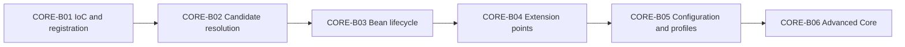

# Spring Core Card Roadmap

> [!summary] Текущее состояние
> Опубликованы пять вертикальных модулей: container foundation, dependency resolution, bean lifecycle, container extension points, configuration and profiles. Каждый модуль связывает concept note, Canvas, certification cards, production cases, sources и executable lab.

## Progress

```text
CORE-B01  20 cards  PUBLISHED
CORE-B02  24 cards  PUBLISHED
CORE-B03  24 cards  PUBLISHED
CORE-B04  24 cards  PUBLISHED
CORE-B05  24 cards  PUBLISHED
CORE-B06  planned   advanced core
```

Всего опубликовано:

```text
116 Spring Core cards
```

## Sequence



## CORE-B01 — published

Материалы:

- [[10_CONCEPTS/Spring/Core/Spring Core Foundations]];
- [[01_MAPS/Spring Core Foundation Map.canvas]];
- [[CORE-B01/CORE-B01 Cards]].

Покрытие:

- IoC vs DI;
- Spring bean и BeanDefinition;
- BeanFactory vs ApplicationContext;
- component scanning и stereotypes;
- `@Bean`, `@Component`, `@Configuration`;
- constructor, setter и field injection.

## CORE-B02 — published

Материалы:

- [[10_CONCEPTS/Spring/Core/Dependency Resolution and Optional Injection]];
- [[01_MAPS/Spring Dependency Resolution Map.canvas]];
- [[CORE-B02/CORE-B02 Cards]];
- [[40_PRODUCTION_CASES/Spring/Dependency Resolution Production Cases]];
- [[50_LABS/Spring/Core-B02/README]].

Покрытие:

- candidate cardinality;
- `@Primary`, `@Qualifier`, custom qualifiers;
- bean-name fallback;
- collection, array и map injection;
- optional dependencies;
- `Optional<T>`, `@Nullable`, `ObjectProvider<T>`;
- constructor resolution;
- generics as qualifiers.

## CORE-B03 — published

Материалы:

- [[10_CONCEPTS/Spring/Core/Bean Lifecycle from Definition to Destruction]];
- [[01_MAPS/Spring Bean Lifecycle Map.canvas]];
- [[CORE-B03/CORE-B03 Cards]];
- [[40_PRODUCTION_CASES/Spring/Bean Lifecycle Production Cases]];
- [[50_LABS/Spring/Core-B03/README]];
- [[98_SOURCES/Spring Bean Lifecycle Sources]].

Покрытие:

- BeanDefinition to raw instance;
- dependency population and aware callbacks;
- init callbacks and BPP phases;
- proxy publication;
- `SmartInitializingSingleton`;
- destruction callbacks;
- prototype destruction boundary.

## CORE-B04 — published

Материалы:

- [[10_CONCEPTS/Spring/Core/Container Extension Points]];
- [[01_MAPS/Spring Container Extension Points Map.canvas]];
- [[CORE-B04/CORE-B04 Cards]];
- [[40_PRODUCTION_CASES/Spring/Container Extension Point Production Cases]];
- [[50_LABS/Spring/Core-B04/README]];
- [[98_SOURCES/Spring Container Extension Point Sources]].

Покрытие:

- metadata plane vs instance plane;
- BDRPP, BFPP and BPP;
- processor ordering and programmatic registration;
- premature creation and proxy eligibility;
- instantiation-aware and smart hooks;
- early references and destruction-aware processing;
- custom annotation/proxy patterns.

## CORE-B05 — published

Материалы:

- [[10_CONCEPTS/Spring/Core/Configuration Profiles and Externalized Properties]];
- [[01_MAPS/Spring Configuration and Profiles Map.canvas]];
- [[CORE-B05/CORE-B05 Cards]];
- [[40_PRODUCTION_CASES/Spring/Configuration and Profiles Production Cases]];
- [[50_LABS/Spring/Core-B05/README]];
- [[98_SOURCES/Spring Configuration and Profiles Sources]].

Покрытие:

- full `@Configuration` vs lite mode;
- `proxyBeanMethods`;
- inter-bean calls vs method-parameter injection;
- `@Import`, selectors and registrars;
- component scanning boundaries;
- profiles and default profiles;
- profile vs feature flag;
- Environment and PropertySource chain;
- `@PropertySource`;
- placeholder resolution and `@Value`;
- Framework configuration vs Boot Config Data;
- type-safe configuration properties;
- property precedence diagnostics;
- test profiles and context-cache impact.

### Quality gate

- [x] 24 cards in one reviewable batch.
- [x] English question and Russian translation.
- [x] Direct answers, mechanism explanations and exam traps.
- [x] Memory hooks and focused code examples.
- [x] Bean-graph vs runtime-value mental model.
- [x] Visual Canvas.
- [x] Six production cases.
- [x] Java 8 / Spring 5.3 Maven lab structure.
- [x] Java source-shape compile with `javac --release 8` against API stubs.
- [x] PropertySource import collision detected and repaired during validation.
- [x] Primary Framework and Boot source index.
- [ ] Full Maven runtime execution.
- [ ] Real attempt outcomes collected.

## CORE-B06 — next

Advanced Spring Core route:

- singleton, prototype, request and session scopes;
- scoped proxies and lookup boundaries;
- `ObjectProvider` for scope/lazy access;
- `FactoryBean` product vs factory identity;
- `&beanName` dereference;
- lazy initialization;
- circular dependencies and early references;
- constructor cycle vs setter/field cycle;
- parent/child ApplicationContext visibility;
- resource loading and message sources;
- lifecycle and scope ownership trade-offs.

## Review rule

После batch пользователь должен:

1. воспроизвести mechanism;
2. назвать confusing alternative;
3. привести minimal example;
4. применить правило к production case;
5. определить lifecycle/configuration phase;
6. отличить bean graph от runtime values;
7. назвать фактический PropertySource winner;
8. зафиксировать outcome.

## Review entry point

- [[00_HOME/Review Dashboard]]
