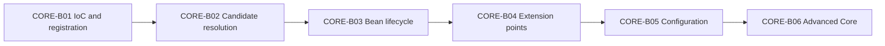

# Spring Core Card Roadmap

> [!summary] Текущее состояние
> Опубликованы три связанные партии: [[CORE-B01/CORE-B01 Cards|CORE-B01]] — container и registration, [[CORE-B02/CORE-B02 Cards|CORE-B02]] — dependency resolution, [[CORE-B03/CORE-B03 Cards|CORE-B03]] — полный bean lifecycle. Каждая партия имеет concept note, Canvas, active recall и практический transfer-layer.

## Progress

```text
CORE-B01  20 cards  PUBLISHED
CORE-B02  24 cards  PUBLISHED
CORE-B03  24 cards  PUBLISHED
CORE-B04  planned   extension points
CORE-B05  planned   configuration
CORE-B06  planned   advanced core
```

Всего опубликовано:

```text
68 Spring Core cards
```

## Sequence



## CORE-B01 — published

Материалы:

- [[10_CONCEPTS/Spring/Core/Spring Core Foundations]];
- [[01_MAPS/Spring Core Foundation Map.canvas]];
- [[CORE-B01/CORE-B01 Cards]].

Покрытие:

- IoC vs DI;
- Spring bean и BeanDefinition;
- BeanFactory vs ApplicationContext;
- component scanning и stereotypes;
- `@Bean`, `@Component`, `@Configuration`;
- constructor, setter и field injection.

## CORE-B02 — published

Материалы:

- [[10_CONCEPTS/Spring/Core/Dependency Resolution and Optional Injection]];
- [[01_MAPS/Spring Dependency Resolution Map.canvas]];
- [[CORE-B02/CORE-B02 Cards]];
- [[40_PRODUCTION_CASES/Spring/Dependency Resolution Production Cases]];
- [[50_LABS/Spring/Core-B02/README]].

Покрытие:

- candidate cardinality;
- `@Primary`, `@Qualifier`, custom qualifiers;
- bean-name fallback;
- collection, array и map injection;
- ordering injected strategies;
- optional dependencies;
- `Optional<T>`, `@Nullable`, `ObjectProvider<T>`;
- constructor resolution;
- generics as qualifiers.

## CORE-B03 — published

Материалы:

- [[10_CONCEPTS/Spring/Core/Bean Lifecycle from Definition to Destruction]];
- [[01_MAPS/Spring Bean Lifecycle Map.canvas]];
- [[CORE-B03/CORE-B03 Cards]];
- [[40_PRODUCTION_CASES/Spring/Bean Lifecycle Production Cases]];
- [[50_LABS/Spring/Core-B03/README]];
- [[98_SOURCES/Spring Bean Lifecycle Sources]].

Покрытие:

- BeanDefinition as metadata recipe;
- instantiation vs initialization;
- dependency population;
- `BeanNameAware`, `BeanFactoryAware`, `ApplicationContextAware`;
- BeanPostProcessor before/after initialization;
- `@PostConstruct` processing;
- `InitializingBean.afterPropertiesSet()`;
- custom init method;
- proxy creation and raw-target boundary;
- `SmartInitializingSingleton`;
- destruction callback order;
- context close;
- prototype destruction limitation;
- `Lifecycle` vs initialization callbacks.

### Quality gate

- [x] 24 cards in one reviewable batch.
- [x] English question and Russian translation.
- [x] Direct answers and mechanism explanations.
- [x] Specific exam traps and memory hooks.
- [x] Stable phase model separated from processor-order details.
- [x] Visual Canvas lifecycle sequence.
- [x] Four production cases.
- [x] Maven lab with full init/proxy/destroy timeline.
- [x] Primary Spring 5.3 source index.
- [ ] Lab executed in Maven-enabled environment.
- [ ] Real attempt outcomes collected.

## CORE-B04 — next

Container extension points:

- `BeanPostProcessor` deep dive;
- `InstantiationAwareBeanPostProcessor`;
- `SmartInstantiationAwareBeanPostProcessor`;
- `DestructionAwareBeanPostProcessor`;
- `BeanFactoryPostProcessor`;
- `BeanDefinitionRegistryPostProcessor`;
- metadata phase vs instance phase;
- `PriorityOrdered`, `Ordered` and registration order;
- static `@Bean` method for processors;
- processor eligibility and early bean creation;
- custom proxy and annotation-processing patterns.

## CORE-B05

- full vs lite configuration;
- `@Import`;
- profiles;
- properties and Environment.

## CORE-B06

- scopes and scoped proxies;
- `FactoryBean`;
- circular dependencies;
- lazy initialization;
- parent/child contexts.

## Review rule

После batch пользователь должен:

1. воспроизвести mechanism;
2. назвать confusing alternative;
3. привести minimal example;
4. применить правило к production case;
5. определить lifecycle phase;
6. различить raw target и published reference;
7. зафиксировать outcome.

## Review entry point

- [[00_HOME/Review Dashboard]]
