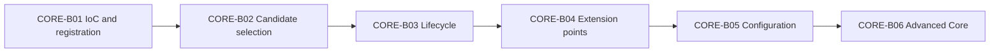

# Spring Core Card Roadmap

> [!summary] Текущее состояние
> Первая фактическая партия [[CORE-B01/CORE-B01 Cards|CORE-B01]] опубликована: 20 карточек связаны с [[10_CONCEPTS/Spring/Core/Spring Core Foundations|Spring Core Foundations]] и визуальной [[01_MAPS/Spring Core Foundation Map.canvas|Canvas-картой]].

## Progress

```text
CORE-B01  20 cards  PUBLISHED
CORE-B02  planned   candidate selection
CORE-B03  planned   lifecycle
CORE-B04  planned   extension points
CORE-B05  planned   configuration
CORE-B06  planned   advanced core
```

## Sequence



## CORE-B01 — published

- IoC vs DI;
- Spring bean;
- BeanDefinition;
- BeanFactory vs ApplicationContext;
- component scanning and stereotypes;
- `@Bean` vs `@Component`;
- `@Configuration`;
- constructor, setter and field injection.

### Quality gate

- [x] 20 cards in one reviewable batch.
- [x] English question.
- [x] Russian translation.
- [x] Direct answer.
- [x] Mechanism explanation.
- [x] Specific exam trap.
- [x] Memory hook.
- [x] Selected mini examples.
- [x] Canonical concept link.
- [ ] Real attempt outcomes collected.

## CORE-B02 — next

- multiple candidates;
- `@Primary`;
- `@Qualifier`;
- bean-name fallback nuances;
- collection and map injection;
- optional dependencies;
- `ObjectProvider` basics;
- contrast drills.

## CORE-B03

- instantiation;
- dependency population;
- aware callbacks;
- init callbacks;
- destruction callbacks.

## CORE-B04

- `BeanPostProcessor`;
- `BeanFactoryPostProcessor`;
- `BeanDefinitionRegistryPostProcessor`;
- ordering and lifecycle boundaries.

## CORE-B05

- full vs lite configuration;
- `@Import`;
- profiles;
- properties and Environment.

## CORE-B06

- scopes and scoped proxies;
- `FactoryBean`;
- circular dependencies;
- lazy initialization;
- parent/child contexts.

## Review rule

После batch пользователь должен не только выбрать ответ, но и:

1. объяснить механизм;
2. назвать confusing alternative;
3. привести minimal example;
4. зафиксировать outcome: confident, guessed, concept error, attention error или confusion.
