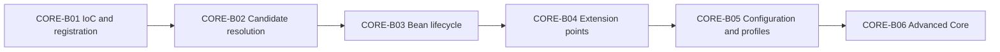

# Spring Core Card Roadmap

> [!summary] Текущее состояние
> Опубликованы четыре вертикальных модуля: container foundation, dependency resolution, bean lifecycle и container extension points. Каждый модуль связывает concept note, Canvas, certification cards, production cases, sources и executable lab.

## Progress

```text
CORE-B01  20 cards  PUBLISHED
CORE-B02  24 cards  PUBLISHED
CORE-B03  24 cards  PUBLISHED
CORE-B04  24 cards  PUBLISHED
CORE-B05  planned   configuration and profiles
CORE-B06  planned   advanced core
```

Всего опубликовано:

```text
92 Spring Core cards
```

## Sequence



## CORE-B01 — published

Материалы:

- [[10_CONCEPTS/Spring/Core/Spring Core Foundations]];
- [[01_MAPS/Spring Core Foundation Map.canvas]];
- [[CORE-B01/CORE-B01 Cards]].

Покрытие:

- IoC vs DI;
- Spring bean и BeanDefinition;
- BeanFactory vs ApplicationContext;
- component scanning и stereotypes;
- `@Bean`, `@Component`, `@Configuration`;
- constructor, setter и field injection.

## CORE-B02 — published

Материалы:

- [[10_CONCEPTS/Spring/Core/Dependency Resolution and Optional Injection]];
- [[01_MAPS/Spring Dependency Resolution Map.canvas]];
- [[CORE-B02/CORE-B02 Cards]];
- [[40_PRODUCTION_CASES/Spring/Dependency Resolution Production Cases]];
- [[50_LABS/Spring/Core-B02/README]].

Покрытие:

- candidate cardinality;
- `@Primary`, `@Qualifier`, custom qualifiers;
- bean-name fallback;
- collection, array и map injection;
- ordering injected strategies;
- optional dependencies;
- `Optional<T>`, `@Nullable`, `ObjectProvider<T>`;
- constructor resolution;
- generics as qualifiers.

## CORE-B03 — published

Материалы:

- [[10_CONCEPTS/Spring/Core/Bean Lifecycle from Definition to Destruction]];
- [[01_MAPS/Spring Bean Lifecycle Map.canvas]];
- [[CORE-B03/CORE-B03 Cards]];
- [[40_PRODUCTION_CASES/Spring/Bean Lifecycle Production Cases]];
- [[50_LABS/Spring/Core-B03/README]];
- [[98_SOURCES/Spring Bean Lifecycle Sources]].

Покрытие:

- BeanDefinition to raw instance;
- instantiation vs initialization;
- dependency population;
- aware callbacks;
- BPP before/after initialization;
- `@PostConstruct`, `afterPropertiesSet()`, custom init;
- proxy publication;
- `SmartInitializingSingleton`;
- destruction callbacks;
- context close;
- prototype destruction boundary.

## CORE-B04 — published

Материалы:

- [[10_CONCEPTS/Spring/Core/Container Extension Points]];
- [[01_MAPS/Spring Container Extension Points Map.canvas]];
- [[CORE-B04/CORE-B04 Cards]];
- [[40_PRODUCTION_CASES/Spring/Container Extension Point Production Cases]];
- [[50_LABS/Spring/Core-B04/README]];
- [[98_SOURCES/Spring Container Extension Point Sources]].

Покрытие:

- metadata plane vs instance plane;
- `BeanDefinitionRegistryPostProcessor`;
- `BeanFactoryPostProcessor`;
- `BeanPostProcessor` deep dive;
- processor auto-detection and declared return type;
- `PriorityOrdered`, `Ordered`, registration order;
- programmatic BPP registration;
- premature bean creation and auto-proxy eligibility;
- `InstantiationAwareBeanPostProcessor`;
- `SmartInstantiationAwareBeanPostProcessor`;
- `DestructionAwareBeanPostProcessor`;
- type prediction, constructor candidates and early references;
- custom annotation and proxy pattern;
- dynamic definition registration.

### Quality gate

- [x] 24 cards in one reviewable batch.
- [x] English question and Russian translation.
- [x] Direct answers, mechanism explanations and exam traps.
- [x] Memory hooks and focused code examples.
- [x] Metadata/instance mental model.
- [x] Visual Canvas.
- [x] Four production cases.
- [x] Java 8 Maven lab structure.
- [x] Java source-shape compile with `javac --release 8` against API stubs.
- [x] Primary Spring 5.3 source index.
- [ ] Full Maven runtime execution.
- [ ] Real attempt outcomes collected.

## CORE-B05 — next

Configuration and environment route:

- `@Configuration` full mode vs lite mode;
- inter-bean method calls;
- `proxyBeanMethods`;
- `@Import` variants;
- component scanning boundaries;
- `@Profile`;
- Environment and active/default profiles;
- property sources;
- `@Value` vs type-safe configuration properties;
- placeholder resolution;
- ordering and precedence of configuration sources;
- testing profile/configuration behavior.

## CORE-B06

- scopes and scoped proxies;
- `FactoryBean`;
- circular dependencies;
- lazy initialization;
- parent/child contexts.

## Review rule

После batch пользователь должен:

1. воспроизвести mechanism;
2. назвать confusing alternative;
3. привести minimal example;
4. применить правило к production case;
5. определить lifecycle phase;
6. отличить metadata от instance;
7. объяснить ordering contract;
8. зафиксировать outcome.

## Review entry point

- [[00_HOME/Review Dashboard]]
