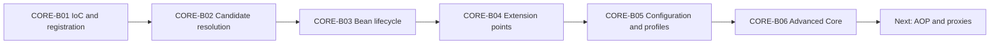

# Spring Core Card Roadmap

> [!summary] Текущее состояние
> Завершены шесть вертикальных Spring Core modules: container foundation, dependency resolution, bean lifecycle, extension points, configuration/profiles и advanced core. Каждый batch связан с concept note, Canvas, cards, production cases, sources и executable lab.

## Progress

```text
CORE-B01  20 cards  PUBLISHED
CORE-B02  24 cards  PUBLISHED
CORE-B03  24 cards  PUBLISHED
CORE-B04  24 cards  PUBLISHED
CORE-B05  24 cards  PUBLISHED
CORE-B06  24 cards  PUBLISHED
```

Всего опубликовано:

```text
140 Spring Core cards
```

## Sequence



## CORE-B01 — published

- [[10_CONCEPTS/Spring/Core/Spring Core Foundations]]
- [[01_MAPS/Spring Core Foundation Map.canvas]]
- [[CORE-B01/CORE-B01 Cards]]

Покрытие: IoC, bean definitions, registration, stereotypes, Java configuration и injection styles.

## CORE-B02 — published

- [[10_CONCEPTS/Spring/Core/Dependency Resolution and Optional Injection]]
- [[01_MAPS/Spring Dependency Resolution Map.canvas]]
- [[CORE-B02/CORE-B02 Cards]]
- [[40_PRODUCTION_CASES/Spring/Dependency Resolution Production Cases]]
- [[50_LABS/Spring/Core-B02/README]]

Покрытие: candidate resolution, qualifiers, primary, collections, ordering, optionality, providers и generics.

## CORE-B03 — published

- [[10_CONCEPTS/Spring/Core/Bean Lifecycle from Definition to Destruction]]
- [[01_MAPS/Spring Bean Lifecycle Map.canvas]]
- [[CORE-B03/CORE-B03 Cards]]
- [[40_PRODUCTION_CASES/Spring/Bean Lifecycle Production Cases]]
- [[50_LABS/Spring/Core-B03/README]]
- [[98_SOURCES/Spring Bean Lifecycle Sources]]

Покрытие: instantiation, population, aware callbacks, initialization, proxy publication и destruction.

## CORE-B04 — published

- [[10_CONCEPTS/Spring/Core/Container Extension Points]]
- [[01_MAPS/Spring Container Extension Points Map.canvas]]
- [[CORE-B04/CORE-B04 Cards]]
- [[40_PRODUCTION_CASES/Spring/Container Extension Point Production Cases]]
- [[50_LABS/Spring/Core-B04/README]]
- [[98_SOURCES/Spring Container Extension Point Sources]]

Покрытие: BDRPP, BFPP, BPP, ordering, instantiation-aware hooks, early references и proxy infrastructure.

## CORE-B05 — published

- [[10_CONCEPTS/Spring/Core/Configuration Profiles and Externalized Properties]]
- [[01_MAPS/Spring Configuration and Profiles Map.canvas]]
- [[CORE-B05/CORE-B05 Cards]]
- [[40_PRODUCTION_CASES/Spring/Configuration and Profiles Production Cases]]
- [[50_LABS/Spring/Core-B05/README]]
- [[98_SOURCES/Spring Configuration and Profiles Sources]]

Покрытие: full/lite configuration, imports, profiles, Environment, property precedence, placeholders и type-safe configuration.

## CORE-B06 — published

- [[10_CONCEPTS/Spring/Core/Advanced Core Scopes FactoryBean and Context Hierarchy]]
- [[01_MAPS/Spring Advanced Core Map.canvas]]
- [[CORE-B06/CORE-B06 Cards]]
- [[40_PRODUCTION_CASES/Spring/Advanced Core Production Cases]]
- [[50_LABS/Spring/Core-B06/README]]
- [[98_SOURCES/Spring Advanced Core Sources]]

Покрытие:

- singleton и prototype identity;
- prototype destruction ownership;
- request/session/custom scopes;
- scoped proxies;
- `ObjectProvider` lookup boundaries;
- `FactoryBean` product vs factory identity;
- `&beanName` dereference;
- lazy initialization;
- constructor and setter circular dependencies;
- early references;
- parent/child context visibility and shadowing;
- `Resource` abstraction;
- `MessageSource`;
- lifecycle ownership.

### CORE-B06 quality gate

- [x] 24 cards in one reviewable batch.
- [x] English questions and Russian translations.
- [x] Direct answers, mechanism explanations and exam traps.
- [x] Identity/resolution/lifetime/ownership mental model.
- [x] Visual Canvas.
- [x] Eight production cases.
- [x] Java 8 / Spring 5.3 Maven lab structure.
- [x] Java source-shape compile with `javac --release 8` against API stubs.
- [x] Primary Spring source index.
- [ ] Full Maven runtime execution.
- [ ] Real attempt outcomes collected.

## Spring Core completion definition

Spring Core route is content-complete when the learner can:

1. explain container creation and dependency resolution;
2. trace a bean from definition through destruction;
3. select the correct extension phase;
4. distinguish graph configuration from runtime values;
5. reason about identity, lookup timing and ownership;
6. solve a new production failure without guessing annotations;
7. reproduce at least one lab trace per batch.

## Next route — AOP and Proxies

- join point, pointcut, advice and advisor;
- JDK dynamic proxy vs CGLIB;
- proxy selection rules;
- self-invocation;
- final/private methods and proxy boundaries;
- introduction/interceptor chain;
- aspect precedence and ordering;
- custom pointcuts;
- proxy diagnostics;
- relationship to `@Transactional`, `@Async`, caching and security.

## Review entry point

- [[00_HOME/Review Dashboard]]
