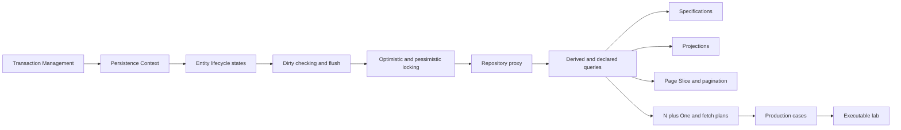

# Spring Data JPA Roadmap

> [!summary]
> Маршрут продолжает Transaction Management. Главная идея: service transaction определяет unit of work; persistence context управляет entity identity и dirty state; repository proxy выбирает persist/merge/query strategy; fetch plan и result shape должны проектироваться под конкретный use case.

## Progress

```text
DATA-B01  36 cards  PUBLISHED
```

Общее число опубликованных Spring cards после этого batch:

```text
Spring Core               140
AOP and Cache               44
Transaction Management      32
Spring Data and JPA          36
-------------------------------
TOTAL                       252
```

---

# Learning sequence



---

# DATA-B01 — published

## Canonical concept modules

1. [[10_CONCEPTS/Spring/Data/Spring Data JPA Persistence Context and Entity Lifecycle]]
2. [[10_CONCEPTS/Spring/Data/Spring Data Repositories Queries and Fetching]]

## Recall

- [[30_CERTIFICATIONS/Spring/2V0-72.22/DATA-B01/DATA-B01 Cards]]

## Production transfer

- [[40_PRODUCTION_CASES/Spring/Spring Data JPA Production Cases]]

## Executable experiments

- [[50_LABS/Spring/DATA-B01/README]]

## Visual map

- [[01_MAPS/Spring Data JPA Map.canvas]]

## Official sources

- [[98_SOURCES/Spring Data JPA Sources]]

---

# Coverage

## Persistence context

- identity map;
- first-level cache;
- one managed instance per persistent identity;
- transaction-scoped context;
- entity state inspection;
- memory growth in long contexts.

## Entity lifecycle

- transient;
- managed;
- detached;
- removed;
- `persist()`;
- `find()`;
- `getReference()`;
- `detach()`;
- `clear()`;
- `merge()`;
- `remove()`;
- cascades;
- orphan removal.

## Dirty checking and flush

- snapshots;
- automatic dirty checking;
- write-behind action queue;
- flush vs commit;
- AUTO flush before overlapping queries;
- constraint failures at flush/commit;
- `save()` not required for already managed entity;
- `saveAndFlush()` boundaries;
- batch flush/clear.

## Concurrency

- `@Version`;
- optimistic locking;
- lost-update detection;
- pessimistic read/write locks;
- lock timeout;
- deadlock risk;
- atomic conditional update;
- database-specific verification.

## Repository infrastructure

- repository proxy;
- `SimpleJpaRepository`;
- inherited transactional metadata;
- persist vs merge new-state detection;
- `Persistable.isNew()`;
- repository fragments/custom implementation;
- service transaction as unit-of-work boundary.

## Query methods

- derived query parsing;
- nested property traversal;
- reserved method names;
- declared JPQL with `@Query`;
- native query trade-offs;
- named parameters;
- `@Modifying`;
- `clearAutomatically` and stale context;
- streams and resource ownership.

## Dynamic query

- `Specification<T>`;
- composable predicates;
- optional filters;
- Criteria API;
- join duplication;
- custom repository for complex reporting queries.

## Result shape

- entities;
- interface projections;
- DTO/class projections;
- dynamic projections;
- nested projections;
- projection vs managed aggregate.

## Pagination

- `Page`;
- `Slice`;
- additional count query;
- offset cost;
- stable ordering;
- keyset pagination concept;
- collection fetch join limitation.

## Fetch planning

- lazy/eager mapping defaults;
- N+1;
- fetch join;
- `@EntityGraph`;
- batch fetching;
- projection;
- over-fetching;
- SQL statement metrics.

---

# Vertical-slice quality gate

- [x] Two deep canonical notes.
- [x] 36 certification cards.
- [x] English questions and Russian translations.
- [x] Mechanism explanations and exam traps.
- [x] 16 production incidents.
- [x] H2/Hibernate executable project structure.
- [x] Identity-map experiment.
- [x] Dirty-checking experiment without `save()`.
- [x] Detach/merge and repository-save experiment.
- [x] Flush-time failure experiment.
- [x] N+1 statement-count experiment.
- [x] Fetch join and entity graph experiments.
- [x] Specification and projection experiments.
- [x] Page/Slice comparison.
- [x] Bulk-DML stale-context experiment.
- [x] Optimistic and pessimistic locking experiments.
- [x] Official primary-source index.
- [x] Visual Canvas.
- [ ] Full Maven runtime executed in connected environment.
- [ ] PostgreSQL Testcontainers verification.
- [ ] Real review outcomes collected.

---

# Review questions

1. Какое состояние entity сейчас: transient, managed, detached или removed?
2. Какая Java instance является canonical для этого ID?
3. Когда Hibernate выполнит SQL?
4. Может ли query вызвать AUTO flush?
5. Нужен ли `save()` для managed object?
6. Что возвращает `merge()`?
7. Где находится service transaction boundary?
8. Repository method использует persist или merge?
9. Query возвращает entity, projection или DTO?
10. Сколько SQL statements выполняется?
11. Есть ли N+1?
12. Нужны `Page` totals или достаточно `Slice`?
13. Может ли bulk DML оставить managed state stale?
14. Как предотвращается lost update?
15. Проверялось ли поведение на production database?

---

# Confusion pairs

| Pair | Ключевое различие |
|---|---|
| persistence context vs database | managed object state против committed rows |
| first-level cache vs Redis | identity/unit-of-work против distributed cache |
| flush vs commit | SQL synchronization против transaction durability |
| managed vs detached | tracked state против ordinary Java object |
| persist vs merge | manage new instance против copy state to managed instance |
| merge argument vs merge result | detached original против managed copy |
| `save()` vs dirty checking | repository abstraction против JPA managed-state tracking |
| `save()` vs `saveAndFlush()` | schedule/persist-merge против immediate flush request |
| `LAZY` vs N+1 | loading timing policy против repeated-query symptom |
| fetch join vs entity graph | JPQL fetch clause против external fetch plan |
| entity vs projection | managed aggregate против read shape |
| `Page` vs `Slice` | total count metadata против next-page knowledge |
| derived query vs Specification | fixed method grammar против composable runtime predicates |
| bulk DML vs entity update | direct database mutation против dirty checking |
| optimistic vs pessimistic lock | conflict detection против database lock acquisition |

---

# Next Spring routes

1. Testing:
   - unit vs slice vs integration;
   - `@DataJpaTest`;
   - transaction rollback tests;
   - Testcontainers;
   - SQL-count assertions;
   - commit-time failure tests.
2. Spring Boot internals and auto-configuration.
3. Spring MVC/WebFlux.
4. Spring Security.
