# Spring Data JPA Roadmap

> [!summary]
> Service transaction определяет unit of work; persistence context управляет identity и dirty state; repository proxy выбирает persist/merge/query strategy; fetch plan и result shape проектируются под use case.

# Route navigation

- **Registry:** [[00_HOME/Knowledge Route Registry]]
- **Domain map:** [[01_MAPS/Spring Map]]
- **Previous:** [[30_CERTIFICATIONS/Spring/2V0-72.22/Spring Transaction Management Roadmap]]
- **Next:** [[30_CERTIFICATIONS/Spring/2V0-72.22/Spring Testing Roadmap]]
- **Visual deep dive:** [[10_CONCEPTS/Spring/Data/Spring Data JPA Visual Deep Dive]]
- **Canvas:** [[01_MAPS/Spring Data JPA Map.canvas]]
- **Sources:** [[98_SOURCES/Spring Data JPA Sources]]

# Progress

```text
DATA-B01  36 cards  PUBLISHED
```

```mermaid
flowchart LR
    TX["Transaction Management"] --> PC["Persistence Context"]
    PC --> STATE["Entity states"]
    STATE --> DIRTY["Dirty checking and flush"]
    DIRTY --> LOCK["Locking"]
    LOCK --> REPO["Repository proxy"]
    REPO --> QUERY["Queries and Specifications"]
    QUERY --> SHAPE["Projections and pagination"]
    SHAPE --> FETCH["Fetch plans and N+1"]
    FETCH --> CASES["Production cases"]
    CASES --> LAB["Executable lab"]
    LAB --> TEST["Spring Testing"]
```



# DATA-B01 artifacts

| Role | Artifact |
|---|---|
| Persistence canonical | [[10_CONCEPTS/Spring/Data/Spring Data JPA Persistence Context and Entity Lifecycle]] |
| Repository/query canonical | [[10_CONCEPTS/Spring/Data/Spring Data Repositories Queries and Fetching]] |
| Visual deep dive | [[10_CONCEPTS/Spring/Data/Spring Data JPA Visual Deep Dive]] |
| Cards | [[30_CERTIFICATIONS/Spring/2V0-72.22/DATA-B01/DATA-B01 Cards]] |
| Cases | [[40_PRODUCTION_CASES/Spring/Spring Data JPA Production Cases]] |
| Lab | [[50_LABS/Spring/DATA-B01/README]] |
| Canvas | [[01_MAPS/Spring Data JPA Map.canvas]] |
| Sources | [[98_SOURCES/Spring Data JPA Sources]] |

# Coverage

## Persistence context and lifecycle

- identity map and first-level cache;
- transient, managed, detached and removed states;
- `persist`, `find`, `getReference`, `detach`, `clear`, `merge`, `remove`;
- cascades and orphan removal;
- transaction-scoped context;
- memory growth in long contexts.

## Dirty checking and flush

- snapshots and automatic dirty checking;
- write-behind action queue;
- flush versus commit;
- AUTO flush before overlapping queries;
- constraint failures at flush/commit;
- `save()` not required for managed entity;
- `saveAndFlush()`;
- batch flush/clear.

## Repository infrastructure

- repository proxy and `SimpleJpaRepository`;
- inherited transactional metadata;
- persist-versus-merge new-state detection;
- `Persistable.isNew()`;
- repository fragments;
- service transaction as unit-of-work boundary.

## Queries and dynamic query

- derived method parsing;
- reserved method names;
- JPQL and native `@Query`;
- named parameters;
- `@Modifying` and stale context;
- `Specification<T>`;
- Criteria API;
- optional filters and join duplication.

## Result shape and pagination

- entities, interface projections and DTO projections;
- dynamic projections;
- `Page` versus `Slice`;
- count query cost;
- stable ordering;
- offset and keyset pagination;
- collection fetch join limitation.

## Fetch planning

- LAZY/EAGER mapping defaults;
- N+1;
- fetch join;
- `@EntityGraph`;
- batch fetching;
- projection and over-fetching;
- SQL statement metrics.

## Concurrency

- `@Version` and optimistic locking;
- pessimistic read/write locks;
- lock timeout and deadlock risk;
- atomic conditional update;
- database-specific verification.

# Production transfer

Use [[40_PRODUCTION_CASES/Spring/Spring Data JPA Production Cases]] for:

- detached entity passed to persist;
- merge result ignored;
- dirty checking outside transaction;
- constraint failure delayed until flush;
- bulk DML leaving persistence context stale;
- N+1 in production list endpoint;
- pagination with collection fetch join;
- locking behavior that differs from H2.

# Quality status

- [x] Central registry and domain MOC links.
- [x] Two canonical notes.
- [x] Visual deep dive and Canvas.
- [x] 36 cards.
- [x] 16 production incidents.
- [x] H2/Hibernate lab.
- [x] Source index.
- [x] Route manifest and graph audit.
- [ ] DATA-B01 card normalization complete.
- [ ] Full Maven runtime executed in connected environment.
- [ ] PostgreSQL locking exercise executed.
- [ ] Real recall outcomes collected.

# Review questions

1. What is the current entity state?
2. Which Java instance is canonical for the database identity?
3. When will SQL be emitted?
4. Can a query trigger AUTO flush?
5. Is `save()` needed for this managed entity?
6. What does `merge()` return?
7. Where is the service transaction boundary?
8. Does repository new-state detection choose persist or merge?
9. Is the result an entity, projection or DTO?
10. How many SQL statements execute?
11. Is there N+1?
12. Are totals required or is `Slice` sufficient?
13. Can bulk DML leave managed state stale?
14. How is lost update prevented?
15. Was behavior verified on the production database dialect?
