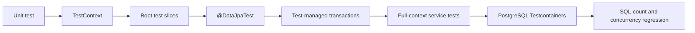

# Spring Testing Roadmap

> [!summary]
> Маршрут продолжает Spring Data/JPA и Transaction Management. Центральная модель: каждый test должен иметь минимальный scope, который способен доказать конкретный риск; transaction rollback, embedded database и cached context полезны, но каждый из них может создать false confidence, если test проверяет не тот execution boundary.

## Progress

```text
TEST-B01  36 cards  PUBLISHED
```

## Learning sequence



## TEST-B01 — published

Materials:

- [[10_CONCEPTS/Spring/Testing/Spring TestContext and Test Slices]];
- [[10_CONCEPTS/Spring/Testing/Spring Data JPA Testing with Testcontainers]];
- [[30_CERTIFICATIONS/Spring/2V0-72.22/TEST-B01/TEST-B01 Cards]];
- [[01_MAPS/Spring Testing Map.canvas]];
- [[40_PRODUCTION_CASES/Spring/Spring Testing Production Cases]];
- [[50_LABS/Spring/TEST-B01/README]];
- [[98_SOURCES/Spring Testing Sources]].

## Coverage

### TestContext infrastructure

- `SpringExtension`;
- `TestContextManager`;
- `TestContext`;
- `TestExecutionListener`;
- dependency injection;
- context loaders;
- context cache;
- `@DirtiesContext`;
- active profiles and test properties.

### Test selection

- unit test;
- `@SpringJUnitConfig`;
- `@SpringBootTest`;
- test slices;
- `@DataJpaTest`;
- `@Import` in slices;
- `@MockBean` trade-offs.

### Transactional testing

- `TransactionalTestExecutionListener`;
- rollback by default;
- `@Commit`;
- `@Rollback`;
- `TestTransaction`;
- `@BeforeTransaction`;
- `@AfterTransaction`;
- application vs test transaction topology;
- preemptive timeout trap;
- `REQUIRES_NEW` and worker-thread escape.

### JPA proof techniques

- `TestEntityManager`;
- `flush()`;
- `clear()`;
- round-trip assertions;
- constraint failures;
- dirty checking;
- first-level-cache false positives;
- statement counts;
- N+1 regression;
- Page/count-query behavior.

### Testcontainers

- PostgreSQL container;
- `@Testcontainers`;
- `@Container`;
- static vs instance lifecycle;
- `@DynamicPropertySource`;
- `@AutoConfigureTestDatabase(replace = NONE)`;
- random ports;
- cleanup and parallel execution;
- container/context-cache lifecycle;
- migration tests;
- native queries;
- locking and MVCC proof.

## Vertical-slice quality gate

- [x] Two canonical concept modules.
- [x] 36 certification cards.
- [x] English questions and Russian translations.
- [x] TestContext lifecycle model.
- [x] Unit/slice/full/container decision model.
- [x] Detailed transactional-test semantics.
- [x] Flush/clear false-positive examples.
- [x] Context-cache diagnostics.
- [x] 16 production incidents.
- [x] H2 `@DataJpaTest` lab.
- [x] Full-context service transaction lab.
- [x] `TestTransaction` commit/rollback lab.
- [x] PostgreSQL Testcontainers lab.
- [x] N+1 statement-count regression test.
- [x] Visual Canvas.
- [x] Primary official source index.
- [ ] Full `mvn clean test` executed in connected environment.
- [ ] Docker/Testcontainers suite executed.
- [ ] PostgreSQL locking exercise executed.
- [ ] Flyway/Liquibase migration exercise implemented.
- [ ] Real review outcomes collected.

## Review questions

1. What exact risk must this test prove?
2. Can a plain object test prove it?
3. Which Spring context is actually loaded?
4. Is the test using a slice or the full application graph?
5. Is the test method inside a test-managed transaction?
6. Does application code join that transaction?
7. Can any work escape through `REQUIRES_NEW` or another thread?
8. Has SQL been forced with flush?
9. Has the persistence context been cleared before reload?
10. Is the datasource H2 or the real database engine?
11. Can Boot replace the Testcontainers datasource?
12. Does the assertion prove commit or only pre-commit state?
13. Is N+1 protected by an automated count?
14. Is context caching reused or fragmented?
15. Who owns the container lifecycle?

## Confusion matrix

| Pair | Distinction |
|---|---|
| unit vs integration | isolated Java logic vs infrastructure collaboration |
| slice vs full context | one layer vs application graph |
| `@DataJpaTest` vs `@SpringBootTest` | repository/mapping vs service/wiring |
| test transaction vs service transaction | listener-owned scope vs application proxy scope |
| rollback test vs commit test | isolation vs real commit behavior |
| flush vs commit | SQL synchronization vs transaction completion |
| flush vs clear | execute SQL vs discard managed identity map |
| H2 vs PostgreSQL | JPA mechanics vs engine semantics |
| `@DirtiesContext` vs DB cleanup | context cache invalidation vs data isolation |
| static vs instance container | class lifecycle vs per-test lifecycle |
| event published vs message delivered | in-process observation vs durable external effect |
| functional correctness vs SQL regression | correct values vs bounded query behavior |

## Five-minute trace drill

For any Spring integration test, answer:

```text
1. Which test annotation bootstraps the context?
2. Which beans are included?
3. Is a test transaction active?
4. Which thread executes the operation?
5. Which transaction manager owns the resource?
6. Has SQL flushed?
7. Is the entity still managed?
8. Which database engine is connected?
9. Does the test commit?
10. What external effect can survive rollback?
```

## Recommended lab order

1. Slice boundary.
2. Flush/clear round trip.
3. Constraint failure.
4. Dirty checking.
5. N+1 count.
6. Page count query.
7. Service rollback without test transaction.
8. Explicit test commit/rollback.
9. PostgreSQL native query.
10. PostgreSQL constraint.
11. Optimistic conflict.
12. Pessimistic lock.
13. Migration test.

## Next Spring route

Spring Boot Internals and Auto-configuration:

- `@SpringBootApplication` composition;
- auto-configuration import pipeline;
- conditions and condition report;
- starters and dependency management;
- configuration metadata;
- custom starter;
- `ApplicationContextRunner`;
- startup diagnostics;
- actuator and observability.
