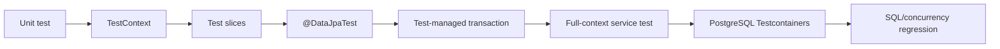

# Spring Testing Roadmap

> [!summary]
> Каждый test должен иметь минимальный scope, который способен доказать конкретный риск. Rollback, embedded database и cached context полезны, но могут создать false confidence, если test проверяет не тот execution boundary.

# Route navigation

- **Registry:** [[00_HOME/Knowledge Route Registry]]
- **Domain map:** [[01_MAPS/Spring Map]]
- **Previous:** [[30_CERTIFICATIONS/Spring/2V0-72.22/Spring Data JPA Roadmap]]
- **Next Spring route:** Spring Boot Internals and Auto-configuration — planned.
- **Visual deep dive:** [[10_CONCEPTS/Spring/Testing/Spring Testing Visual Deep Dive]]
- **Canvas:** [[01_MAPS/Spring Testing Map.canvas]]
- **Sources:** [[98_SOURCES/Spring Testing Sources]]

# Progress

```text
TEST-B01  36 cards  PUBLISHED
```



# TEST-B01 artifacts

| Role | Artifact |
|---|---|
| TestContext canonical | [[10_CONCEPTS/Spring/Testing/Spring TestContext and Test Slices]] |
| JPA/Testcontainers canonical | [[10_CONCEPTS/Spring/Testing/Spring Data JPA Testing with Testcontainers]] |
| Visual deep dive | [[10_CONCEPTS/Spring/Testing/Spring Testing Visual Deep Dive]] |
| Cards | [[30_CERTIFICATIONS/Spring/2V0-72.22/TEST-B01/TEST-B01 Cards]] |
| Cases | [[40_PRODUCTION_CASES/Spring/Spring Testing Production Cases]] |
| Lab | [[50_LABS/Spring/TEST-B01/README]] |
| Canvas | [[01_MAPS/Spring Testing Map.canvas]] |
| Sources | [[98_SOURCES/Spring Testing Sources]] |

# Coverage

## TestContext infrastructure

- `SpringExtension`;
- `TestContextManager` and listeners;
- dependency injection and context loaders;
- context cache and `@DirtiesContext`;
- active profiles and test properties.

## Test selection

- plain unit test;
- `@SpringJUnitConfig`;
- `@SpringBootTest`;
- slices and `@DataJpaTest`;
- `@Import` and mocks in slices;
- minimal scope versus full graph.

## Transactional testing

- `TransactionalTestExecutionListener`;
- rollback by default;
- `@Commit`, `@Rollback`, `TestTransaction`;
- `@BeforeTransaction`, `@AfterTransaction`;
- application versus test transaction topology;
- preemptive timeout thread boundary;
- `REQUIRES_NEW` and worker-thread escape.

## JPA proof techniques

- `TestEntityManager`;
- `flush()` and `clear()`;
- database round-trip assertions;
- constraint failures;
- dirty checking;
- first-level-cache false positives;
- statement counts and N+1 regression;
- Page/count-query behavior.

## Testcontainers

- PostgreSQL container lifecycle;
- `@Testcontainers`, `@Container`;
- static versus instance containers;
- `@DynamicPropertySource`;
- disabling embedded-database replacement;
- cleanup and parallel execution;
- context-cache/container compatibility;
- native queries, migrations, locks and MVCC proof.

# Production transfer

Use [[40_PRODUCTION_CASES/Spring/Spring Testing Production Cases]] for:

- test passed because managed entity was never reloaded;
- constraint failure hidden until commit;
- test rollback hiding application commit behavior;
- `REQUIRES_NEW` work surviving test rollback;
- preemptive timeout running outside test transaction;
- H2 accepting behavior PostgreSQL rejects;
- N+1 not covered by correctness assertion;
- `@DirtiesContext` masking configuration fragmentation.

# Recommended lab order

1. Slice boundary.
2. Flush/clear round trip.
3. Constraint failure.
4. Dirty checking.
5. N+1 statement count.
6. Page count query.
7. Service rollback without test transaction.
8. Explicit test commit/rollback.
9. PostgreSQL native query.
10. PostgreSQL constraint.
11. Optimistic conflict.
12. Pessimistic lock.
13. Migration test.

Lab: [[50_LABS/Spring/TEST-B01/README]].

# Quality status

- [x] Central registry and domain MOC links.
- [x] Two canonical notes.
- [x] Visual deep dive and Canvas.
- [x] 36 cards.
- [x] 16 production incidents.
- [x] H2 slice/full-context tests.
- [x] `TestTransaction` examples.
- [x] PostgreSQL Testcontainers structure.
- [x] N+1 regression example.
- [x] Source index.
- [x] Route manifest and graph audit.
- [ ] TEST-B01 card normalization complete.
- [ ] Full `mvn clean test` executed in connected environment.
- [ ] Docker/Testcontainers suite executed.
- [ ] Migration exercise completed.

# Review questions

1. What exact risk must this test prove?
2. Can a plain object test prove it?
3. Which Spring context is loaded?
4. Is this slice or full application graph?
5. Is a test-managed transaction active?
6. Does application code join it?
7. Can work escape through another transaction or thread?
8. Has SQL been flushed?
9. Has persistence context been cleared?
10. Which database engine is connected?
11. Does the assertion prove commit or only pre-commit state?
12. Is N+1 bounded by an automated assertion?
13. Is context caching reused or fragmented?
14. Who owns container lifecycle?
15. Which evidence would fail if production behavior regressed?
