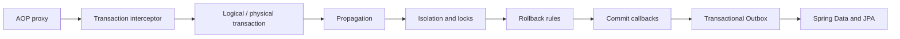

# Spring Transaction Management Roadmap

> [!summary]
> External call crosses proxy, interceptor selects transaction manager, propagation maps logical scopes to physical resource transactions, rollback rules interpret outcome, and commit-phase actions require an explicit durability policy.

# Route navigation

- **Registry:** [[00_HOME/Knowledge Route Registry]]
- **Domain map:** [[01_MAPS/Spring Map]]
- **Previous:** [[30_CERTIFICATIONS/Spring/2V0-72.22/Spring AOP and Cache Roadmap]]
- **Next:** [[30_CERTIFICATIONS/Spring/2V0-72.22/Spring Data JPA Roadmap]]
- **Visual deep dive:** [[10_CONCEPTS/Spring/Transactions/Spring Transaction Management Visual Deep Dive]]
- **Canvas:** [[01_MAPS/Spring Transaction Management Map.canvas]]
- **Sources:** [[98_SOURCES/Spring Transaction Management Sources]]

# Progress

```text
TX-B01  32 cards  PUBLISHED
```



# TX-B01 artifacts

| Role | Artifact |
|---|---|
| Canonical | [[10_CONCEPTS/Spring/Transactions/Spring Transaction Management Deep Dive]] |
| Visual deep dive | [[10_CONCEPTS/Spring/Transactions/Spring Transaction Management Visual Deep Dive]] |
| Outbox canonical | [[10_CONCEPTS/Spring/Transactions/Transactional Outbox and Commit Boundaries]] |
| Cards | [[30_CERTIFICATIONS/Spring/2V0-72.22/TX-B01/TX-B01 Cards]] |
| Cases | [[40_PRODUCTION_CASES/Spring/Transaction Management Production Cases]] |
| Lab | [[50_LABS/Spring/TX-B01/README]] |
| Canvas | [[01_MAPS/Spring Transaction Management Map.canvas]] |
| Sources | [[98_SOURCES/Spring Transaction Management Sources]] |

# Coverage

## Infrastructure

- `@Transactional` metadata;
- proxy/interceptor path;
- `PlatformTransactionManager`;
- transaction definition/status;
- thread-bound imperative transaction;
- self-invocation.

## Logical and physical transactions

- method-level logical scopes;
- physical JDBC/JPA transaction;
- rollback-only marker;
- `UnexpectedRollbackException`;
- begin/commit/rollback evidence.

## Propagation

- `REQUIRED`;
- `REQUIRES_NEW`;
- `NESTED`;
- `SUPPORTS`;
- `MANDATORY`;
- `NOT_SUPPORTED`;
- `NEVER`;
- connection-pool pressure;
- savepoint support.

## Isolation and concurrency

- dirty/non-repeatable/phantom reads;
- lost update;
- database-specific MVCC;
- lock ordering;
- optimistic and pessimistic locking;
- atomic conditional update.

## Rollback semantics

- runtime versus checked exceptions;
- `rollbackFor` and `noRollbackFor`;
- swallowed exceptions;
- explicit rollback-only;
- commit-time failures;
- read-only and timeout boundaries.

## Advanced control

- `TransactionTemplate`;
- multiple transaction managers;
- synchronization callbacks;
- `@TransactionalEventListener` phases;
- cache invalidation timing;
- async/thread boundary;
- remote I/O inside a transaction.

## Cross-resource consistency

- dual-write problem;
- Transactional Outbox;
- relay and at-least-once delivery;
- consumer idempotency;
- ordering, retry and cleanup.

# Production transfer

Use [[40_PRODUCTION_CASES/Spring/Transaction Management Production Cases]] for:

- caught exception followed by `UnexpectedRollbackException`;
- `REQUIRES_NEW` pool exhaustion;
- unsupported nested/savepoint behavior;
- checked exception committing partial state;
- inner isolation metadata joining weaker outer transaction;
- cache value published before DB commit;
- after-commit listener losing external message;
- outbox duplicate delivery;
- remote HTTP call holding DB resources;
- deadlock from inconsistent lock order.

# Quality status

- [x] Central registry and domain MOC links.
- [x] Canonical, visual and Outbox notes.
- [x] 32 cards.
- [x] 15 production incidents.
- [x] H2 lab structure.
- [x] Canvas and source index.
- [x] Route manifest and graph audit.
- [ ] TX-B01 card normalization complete.
- [ ] Full Maven runtime executed.
- [ ] PostgreSQL concurrency experiments executed.

# Review questions

1. Did caller cross a proxy?
2. Which transaction manager was selected?
3. How many logical scopes exist?
4. How many physical transactions exist?
5. Was a transaction joined, suspended or rejected?
6. Which rollback rule matched?
7. Was rollback-only set?
8. Did isolation metadata start a new physical transaction?
9. Is remote I/O holding DB resources?
10. Does async work have its own transaction?
11. Is cache invalidation before or after commit?
12. Is publication durable after process crash?
13. Can outbox delivery duplicate?
14. Is consumer idempotent?
15. What evidence proves commit/rollback behavior?
