# Spring Transaction Management Roadmap

> [!summary]
> Маршрут продолжает AOP и Cache. Центральная модель: external call crosses proxy, interceptor chooses transaction manager, propagation maps logical scopes to physical resource transactions, rollback rules interpret method outcome, and commit-phase actions require an explicit durability policy.

## Progress

```text
TX-B01  32 cards  PUBLISHED
```

## Learning sequence

```mermaid
flowchart LR
    A[AOP proxy mechanics] --> B[Transaction interceptor]
    B --> C[Logical vs physical transaction]
    C --> D[Propagation]
    D --> E[Isolation and locking]
    E --> F[Rollback rules]
    F --> G[Programmatic transactions]
    G --> H[Commit callbacks]
    H --> I[Cache and async boundaries]
    I --> J[Transactional Outbox]
    J --> K[Production diagnostics]
```



## TX-B01 — published

Materials:

- [[10_CONCEPTS/Spring/Transactions/Spring Transaction Management Deep Dive]];
- [[10_CONCEPTS/Spring/Transactions/Transactional Outbox and Commit Boundaries]];
- [[30_CERTIFICATIONS/Spring/2V0-72.22/TX-B01/TX-B01 Cards]];
- [[01_MAPS/Spring Transaction Management Map.canvas]];
- [[40_PRODUCTION_CASES/Spring/Transaction Management Production Cases]];
- [[50_LABS/Spring/TX-B01/README]];
- [[98_SOURCES/Spring Transaction Management Sources]].

## Coverage

### Transaction infrastructure

- `@Transactional` as metadata;
- proxy/interceptor execution path;
- `PlatformTransactionManager`;
- transaction definition and status;
- thread-bound imperative transaction;
- self-invocation.

### Logical and physical transactions

- logical method scopes;
- physical JDBC/JPA transaction;
- rollback-only marker;
- `UnexpectedRollbackException`;
- physical begin/commit/rollback counters.

### Propagation

- `REQUIRED`;
- `REQUIRES_NEW`;
- `NESTED`;
- `SUPPORTS`;
- `MANDATORY`;
- `NOT_SUPPORTED`;
- `NEVER`;
- connection-pool pressure;
- savepoint support.

### Isolation and concurrency

- dirty read;
- non-repeatable read;
- phantom read;
- lost update;
- database-specific MVCC semantics;
- stable lock ordering;
- optimistic locking;
- pessimistic locking;
- atomic conditional updates.

### Rollback semantics

- runtime vs checked exceptions;
- `rollbackFor` and `noRollbackFor`;
- swallowed exceptions;
- explicit rollback-only;
- commit-time failures;
- read-only and timeout boundaries.

### Advanced transaction control

- `TransactionTemplate`;
- multiple transaction managers;
- local vs distributed atomicity;
- transaction synchronization;
- `@TransactionalEventListener` phases;
- test-managed transactions.

### Cross-resource consistency

- database/cache ordering;
- after-commit invalidation;
- async/thread boundary;
- remote I/O inside transaction;
- dual-write problem;
- Transactional Outbox;
- outbox relay;
- at-least-once delivery;
- consumer idempotency;
- ordering, retry and cleanup.

## Vertical-slice quality gate

- [x] 32 certification cards.
- [x] English questions and Russian translations.
- [x] Logical vs physical transaction mental model.
- [x] All seven propagation modes.
- [x] Detailed `UnexpectedRollbackException` explanation.
- [x] Isolation phenomena and database boundary.
- [x] Checked/runtime rollback examples.
- [x] TransactionTemplate examples.
- [x] Synchronization and transaction-bound event examples.
- [x] Cache and async boundary examples.
- [x] Separate Transactional Outbox concept.
- [x] 15 production incidents.
- [x] H2 executable lab structure.
- [x] Visual Canvas.
- [x] Primary source index.
- [ ] Full Maven runtime executed in a connected environment.
- [ ] PostgreSQL concurrency experiments executed.
- [ ] Real review outcomes collected.

## Review questions

1. Did the caller cross a proxy?
2. Which `PlatformTransactionManager` was selected?
3. How many logical transaction scopes exist?
4. How many physical transactions exist?
5. Was an existing transaction joined, suspended or rejected?
6. Which rollback rule matched?
7. Was rollback-only set?
8. Did the isolation declaration start a new physical transaction?
9. Is a remote call holding DB locks/connections?
10. Does an async worker have its own transaction?
11. Is cache invalidation before or after commit?
12. Is external message publication durable after process crash?
13. Can outbox delivery duplicate?
14. Is the consumer idempotent?
15. What evidence proves actual commit/rollback behavior?

## Confusion matrix

| Pair | Distinction |
|---|---|
| logical vs physical | method scope vs resource commit |
| `REQUIRED` vs `REQUIRES_NEW` | join/create vs independent transaction |
| `REQUIRES_NEW` vs `NESTED` | second physical transaction vs savepoint |
| caught exception vs committable transaction | catch does not clear rollback-only |
| checked vs runtime exception | checked commits by default |
| read-only vs write prohibition | hint/contract vs hard enforcement |
| after-commit vs durable publish | callback phase vs persisted intent |
| cache transaction-aware vs XA | deferred timing vs atomic resources |
| async invocation vs transaction continuation | new thread does not inherit imperative transaction |
| outbox vs exactly once | durable intent + at-least-once delivery |

## Next Spring routes

1. Spring Data and JPA:
   - persistence context;
   - entity states;
   - dirty checking;
   - flush and commit;
   - locking;
   - query derivation;
   - specifications;
   - projections;
   - pagination;
   - N+1 and fetch plans.
2. Spring testing.
3. Spring Boot internals and auto-configuration.
4. Messaging transactions and idempotent consumers.
