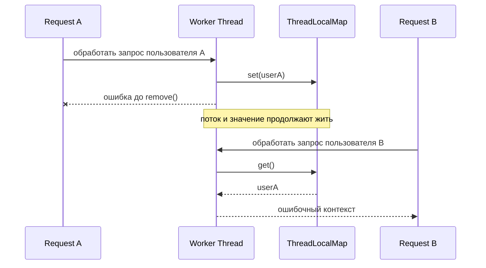
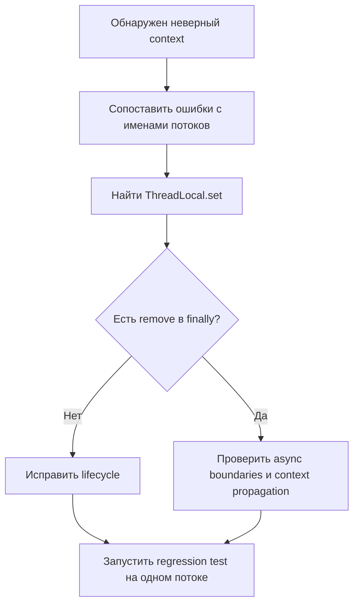

# ThreadLocal context leaked between requests

## Ситуация

Приложение сохраняет идентификатор пользователя в `ThreadLocal` в начале обработки HTTP-запроса. После ошибки очистка не выполняется. Контейнер переиспользует тот же рабочий поток для следующего запроса.

## Как возникает ошибка



## Наблюдаемые симптомы

- в логах следующего запроса появляется предыдущий correlation ID;
- аудит иногда связывает операцию не с тем пользователем;
- heap dump показывает объекты, удерживаемые рабочими потоками;
- проблема воспроизводится нестабильно и зависит от планирования задач.

## Корневая причина

Жизненный цикл значения был ошибочно связан с завершением метода, хотя фактически он связан с жизненным циклом потока и записью в `ThreadLocalMap`.

## Диагностика



1. Проверить все вызовы `ThreadLocal.set()`.
2. Найти пути выполнения без `remove()`.
3. Проверить обработку исключений.
4. Сопоставить ошибочный контекст с именем рабочего потока.
5. Проанализировать heap dump и цепочки удержания от `Thread`.

## Неправильные решения

- увеличить heap;
- периодически перезапускать приложение;
- полагаться на сборщик мусора;
- присваивать `null` только локальной переменной;
- создавать ещё один `ThreadLocal`.

## Рабочее решение

```java
try {
    USER_CONTEXT.set(context);
    chain.doFilter(request, response);
} finally {
    USER_CONTEXT.remove();
}
```

Дополнительно:

- инкапсулировать установку и очистку в фильтре или interceptor;
- не хранить тяжёлые объекты;
- добавить тест на последовательную обработку двух задач одним потоком;
- рассмотреть явную передачу контекста.

## Trade-offs

`ThreadLocal` уменьшает количество параметров, но скрывает зависимость и требует строгого контроля жизненного цикла.

## Проверка решения

Запустить две последовательные задачи на single-thread executor. Первая устанавливает контекст и завершается исключением, вторая проверяет отсутствие старого значения.

## Вопросы интервьюера

- Почему проблема проявляется не на каждом запросе?
- Может ли очистка ключа сборщиком мусора решить проблему?
- Как передавать context между asynchronous stages?
- Что меняется при virtual threads?

## Связанные концепции

- [[10_CONCEPTS/Java/Concurrency/ThreadLocal]]
- [[ExecutorService]]
- [[Memory Leaks]]
