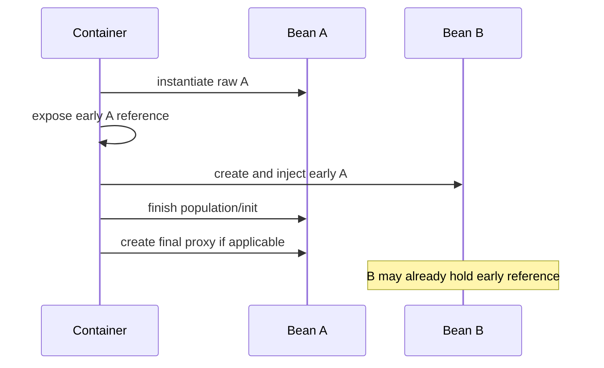

# Advanced Core Production Cases

## Case 1. Prototype helper сохраняет данные предыдущего запроса

### Symptoms

- первый export работает;
- второй export содержит данные первого;
- bean помечен `prototype`, но instance identity не меняется;
- ошибка исчезает после restart.

### Problematic design

```java
@Component
class ExportService {
    private final ReportBuilder builder;

    ExportService(ReportBuilder builder) {
        this.builder = builder;
    }

    Report export(Input input) {
        builder.add(input);
        return builder.build();
    }
}

@Component
@Scope(ConfigurableBeanFactory.SCOPE_PROTOTYPE)
class ReportBuilder {
    // mutable state
}
```

### Root cause

```text
ExportService singleton created once
    ↓
prototype dependency resolved once
    ↓
one ReportBuilder stored in field
    ↓
mutable state reused across operations
```

Prototype scope applies to lookup events, not business method calls.

### Repair options

#### Provider lookup

```java
@Component
class ExportService {
    private final ObjectProvider<ReportBuilder> builders;

    Report export(Input input) {
        ReportBuilder builder = builders.getObject();
        try {
            builder.add(input);
            return builder.build();
        } finally {
            builder.close();
        }
    }
}
```

#### Explicit factory

```java
ReportBuilder builder = reportBuilderFactory.create();
```

#### Eliminate bean scope

For a simple helper, plain construction can be clearer:

```java
ReportBuilder builder = new ReportBuilder();
```

### Senior lesson

Do not use Spring prototype merely to avoid writing `new`. Use it only when container injection or initialization is genuinely needed, and define cleanup ownership.

---

## Case 2. Scoped proxy throws “scope not active” in background task

### Symptoms

- request processing succeeds;
- async/background job fails;
- exception says request/session scope is not active;
- singleton service contains request-scoped proxy.

### Shape

```java
@Service
class AuditService {
    private final RequestIdentity identity;

    @Async
    void writeLater() {
        identity.userId();
    }
}
```

### Root cause

Scoped proxy is only a stable handle. It still needs an active scope when target resolution happens.

```text
HTTP thread
→ request scope active
→ proxy resolves target

background thread
→ no request scope
→ proxy cannot resolve target
```

### Wrong fix

Propagating entire HTTP request/session scope into arbitrary worker threads.

This couples background lifecycle to web infrastructure and can retain large request state.

### Correct design

Capture explicit immutable data at boundary:

```java
AuditCommand command = new AuditCommand(
        requestIdentity.userId(),
        correlationId,
        action
);

executor.execute(() -> auditWriter.write(command));
```

### Senior lesson

Use scoped bean for scope-bound behavior. Cross an asynchronous boundary with explicit values, not a proxy to a vanished context.

---

## Case 3. FactoryBean product leaks connections

### Symptoms

- custom client created by `FactoryBean` works;
- context closes cleanly;
- network threads remain alive;
- reconnect count grows after context refresh in tests.

### Problematic factory

```java
@Component("remoteClient")
class RemoteClientFactoryBean implements FactoryBean<RemoteClient> {
    private RemoteClient cached;

    public RemoteClient getObject() {
        if (cached == null) {
            cached = RemoteClient.connect();
        }
        return cached;
    }

    public boolean isSingleton() {
        return true;
    }
}
```

### Root cause

Product identity was defined, but product destruction ownership was not.

```text
FactoryBean lifecycle managed
≠
external product automatically closed by arbitrary factory implementation
```

### Repair

```java
class RemoteClientFactoryBean
        implements FactoryBean<RemoteClient>, DisposableBean {

    private RemoteClient cached;

    @Override
    public void destroy() {
        if (cached != null) {
            cached.close();
        }
    }
}
```

Or expose product through a simple `@Bean(destroyMethod = "close")` if FactoryBean transparency is not needed.

### Diagnostic questions

- Is the product cached?
- Who owns it?
- Can `getObject()` fail after partial allocation?
- Is close idempotent?
- What happens if factory scope is prototype?

### Senior lesson

Factory abstraction does not erase resource ownership. Product and factory lifecycles must be designed separately.

---

## Case 4. Application is READY, but first request fails

### Symptoms

- startup and readiness pass;
- first request to rare endpoint blocks for seconds then fails;
- exception reveals invalid TLS file or missing remote endpoint;
- bean is `@Lazy`.

### Root cause

Lazy initialization moved validation from startup to runtime.

```text
startup
→ lazy bean not created
→ readiness reports success

first request
→ bean creation
→ configuration/resource/network failure
```

### Wrong conclusion

“Lazy makes startup faster, so it is always better.”

### Repair choices

1. Keep bean eager if integration is required for readiness.
2. Use explicit warmup before declaring READY.
3. Model optional integration as DEGRADED capability.
4. Validate configuration separately from opening expensive connections.
5. Export initialization state through health indicators.

### Senior lesson

Lazy changes the failure phase. Readiness semantics must state whether the delayed capability is mandatory.

---

## Case 5. Circular dependency produces inconsistent proxy behavior

### Symptoms

- `A` calls `B`, `B` calls `A`;
- some calls are transactional, others are not;
- logs show raw class in one collaborator and proxy class in another;
- upgrading framework/Boot changes startup outcome.

### Root cause

A setter/field cycle may require early reference exposure before final initialization and proxy publication.



Spring infrastructure tries to preserve proxy consistency for supported scenarios, but custom processors and complex cycles make the graph fragile.

### Correct repair

Extract orchestration:

```text
Before:
A ↔ B

After:
Coordinator → A
Coordinator → B
```

Or use domain events for one-way notification.

### Senior lesson

A cycle is not merely a container inconvenience. It is usually a responsibility graph that lacks direction.

---

## Case 6. Child context silently shadows parent service

### Symptoms

- shared parent defines `auditService`;
- module child also defines `auditService`;
- module behavior differs from background jobs;
- parent metrics show no calls from module;
- both contexts start successfully.

### Resolution model

```text
child lookup auditService
    ↓
local child definition exists
    ↓
child bean returned

parent lookup auditService
    ↓
parent bean returned
```

Child definition shadows parent only for child resolution.

### Diagnostic plan

1. Log context ID and parent ID.
2. Log bean names and runtime class locally.
3. Check `containsLocalBean()` versus hierarchical `containsBean()`.
4. Inspect where consumer bean itself is defined.
5. Verify shutdown order.

### Repair options

- use explicit module-specific bean names;
- use qualifiers rather than accidental shadowing;
- keep shared service only in parent;
- use explicit composition/registry for module overrides;
- document context ownership.

### Senior lesson

Context hierarchy is a directed namespace and lifecycle boundary, not an automatic modularity solution.

---

## Case 7. Classpath Resource works in IDE but fails in packaged JAR

### Symptoms

- local development reads template successfully;
- packaged application throws `FileNotFoundException` from `resource.getFile()`;
- resource exists inside JAR.

### Root cause

A classpath resource inside an archive is not necessarily a file-system file.

### Repair

```java
try (InputStream input = resource.getInputStream()) {
    return parser.parse(input);
}
```

If a third-party library requires a `File`, copy resource to a controlled temporary file and define cleanup ownership.

### Senior lesson

Program against `Resource` capabilities, not an assumed storage implementation.

---

## Case 8. Localized text becomes unstable API contract

### Symptoms

- clients parse error message text;
- changing locale breaks frontend logic;
- monitoring groups the same error into several message strings;
- fallback messages differ between parent and child context.

### Root cause

Localized presentation message was used as machine-readable identity.

### Repair contract

```json
{
  "code": "PAYMENT_LIMIT_EXCEEDED",
  "message": "Payment exceeds the allowed limit",
  "details": {
    "limit": 100000
  }
}
```

- `code` remains stable;
- `message` comes from MessageSource;
- structured details remain locale-independent;
- logs/metrics use stable code.

### Senior lesson

MessageSource localizes human text. It does not define domain identity.

---

## Production review checklist

- [ ] Scope matches state lifetime.
- [ ] Long-lived bean does not capture short-lived target accidentally.
- [ ] Async boundaries carry values, not vanished scoped contexts.
- [ ] Prototype cleanup has an explicit owner.
- [ ] FactoryBean product ownership is documented.
- [ ] Lazy capability participates correctly in readiness.
- [ ] Circular dependency is removed or justified explicitly.
- [ ] Parent/child visibility and shutdown order are documented.
- [ ] Resource code does not assume `File`.
- [ ] Localized text is separated from stable error codes.

## Sources

- [[98_SOURCES/Spring Advanced Core Sources]]
