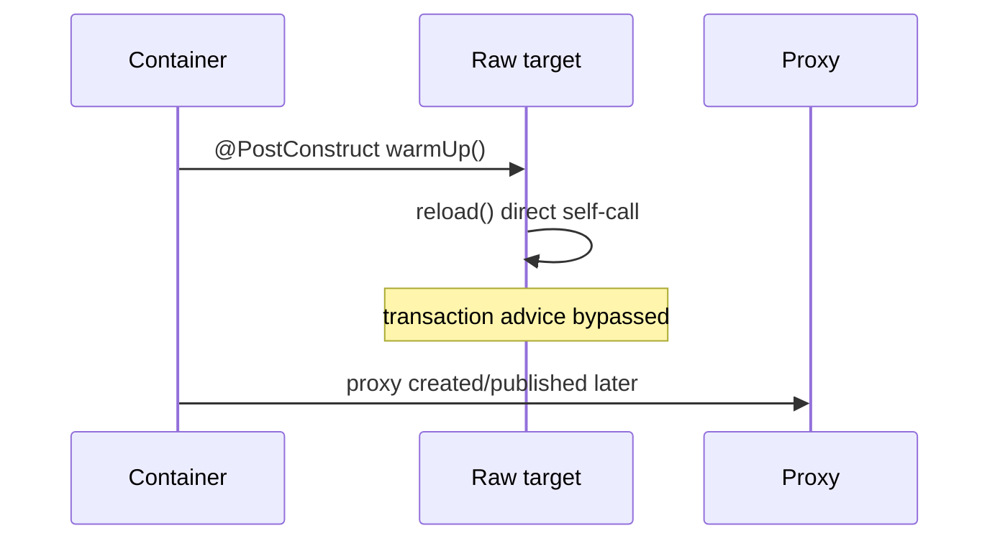
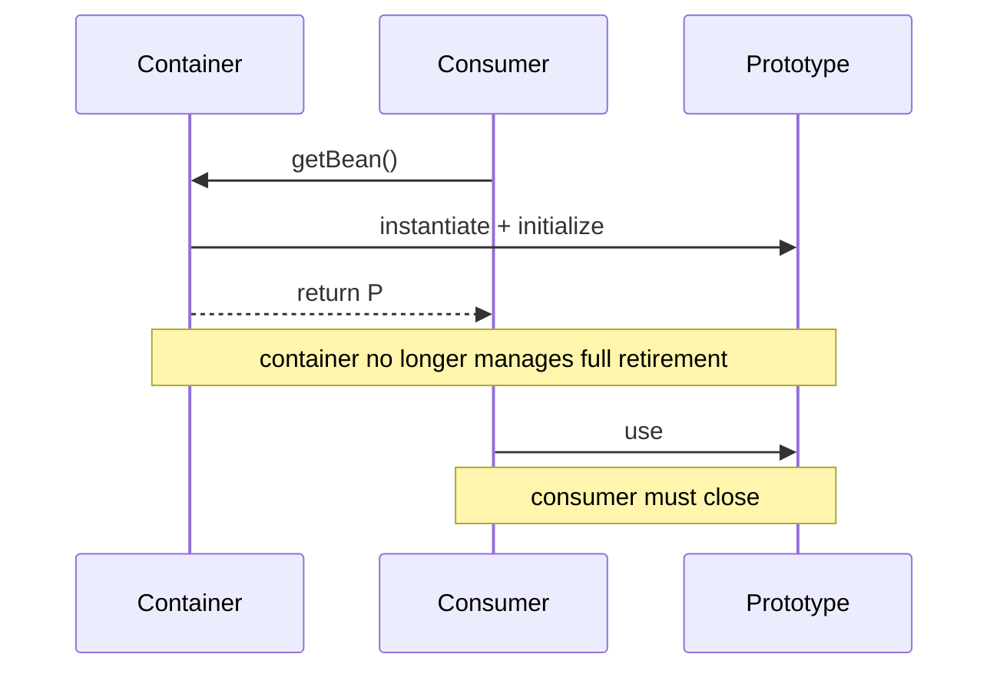

# Bean Lifecycle Production Cases

> [!summary]
> Эти кейсы проверяют перенос lifecycle knowledge в диагностику: proxy boundary, startup coordination, resource ownership и processor ordering.

# Case 1. @Transactional не работает в @PostConstruct

## Situation

```java
@Service
class ReferenceDataService {

    @PostConstruct
    void warmUp() {
        reload();
    }

    @Transactional
    public void reload() {
        repository.deleteAll();
        repository.saveAll(loadReferenceData());
    }
}
```

Разработчик ожидает одну transaction. При ошибке часть операций уже зафиксирована или transaction отсутствует.

## Observable symptoms

- transaction synchronization is not active;
- rollback не происходит ожидаемым образом;
- transaction logging/advice не появляется;
- тот же method работает transactional при вызове из controller.

## Root cause

`warmUp()` выполняется на target в initialization phase. Вызов `reload()` — self-invocation через `this`, а не external call через Spring AOP proxy.



## Weak fixes

- добавить `@Transactional` на `warmUp()`;
- получить `this` proxy из context внутри bean;
- включить circular self-injection;
- сделать method public и надеяться, что этого достаточно.

Public visibility нужна proxy-based advice, но не заставляет self-call пересечь proxy boundary.

## Better designs

### Separate transactional bean

```java
@Service
class ReferenceDataWriter {
    @Transactional
    public void reload() {
        // transaction boundary
    }
}

@Component
class ReferenceDataWarmup {
    private final ReferenceDataWriter writer;

    ReferenceDataWarmup(ReferenceDataWriter writer) {
        this.writer = writer;
    }

    @EventListener(ContextRefreshedEvent.class)
    public void warmUp() {
        writer.reload();
    }
}
```

### Explicit startup orchestration

- `SmartInitializingSingleton`;
- `ContextRefreshedEvent`;
- application runner in Boot;
- dedicated migration/job mechanism.

## Senior follow-up

- Может ли event прийти более одного раза в parent/child context?
- Должна ли warmup failure блокировать readiness?
- Как сделать operation idempotent?
- Нужна ли distributed coordination при нескольких replicas?

## Memory Hook

> Lifecycle call on target is not a business call through proxy.

---

# Case 2. Application hangs during startup

## Situation

```java
@Component
class CatalogCache {

    @PostConstruct
    void initialize() {
        remoteCatalogClient.downloadAll();
        anotherBean.awaitReady();
    }
}
```

После deployment pod не становится ready. Thread dump показывает несколько bean creation paths, ожидающих друг друга или remote I/O.

## Why lifecycle matters

Singleton initialization происходит до publication bean как fully ready. Spring 5.3 lifecycle documentation предупреждает, что initialization callbacks singleton выполняются в creation-lock context; external bean access и долгие операции увеличивают риск initialization deadlock.

```mermaid
flowchart TD
    A[Create bean A] --> B[@PostConstruct A]
    B --> C[Wait for bean B]
    D[Create bean B] --> E[@PostConstruct B]
    E --> F[Wait for bean A]
    C --> G[Startup deadlock]
    F --> G
```

## Diagnostic sequence

1. Снять thread dump до restart.
2. Найти threads внутри bean creation / init callback.
3. Определить remote waits, locks и cross-bean lookups.
4. Проверить circular dependencies и readiness chain.
5. Измерить duration каждого init callback.

## Better phase separation

### In initialization

- validate local configuration;
- allocate small local data structures;
- fail fast on invalid mandatory values.

### After context construction

- expensive cache warmup;
- remote synchronization;
- asynchronous preparation;
- retryable external operations.

## Design choices

| Requirement | Mechanism |
|---|---|
| All regular singletons must exist | `SmartInitializingSingleton` |
| Act after refresh | `ContextRefreshedEvent` |
| Runtime start/stop with phases | `SmartLifecycle` |
| Boot startup task | `ApplicationRunner` / `CommandLineRunner` |
| Database schema migration | Flyway/Liquibase/deployment job |

## Trade-off

Перенос после refresh требует явной readiness model. Application context может быть refreshed, но service ещё не готов обслуживать requests.

Нужно определить states:

```text
STARTING → WARMING → READY
               ↘ DEGRADED / FAILED
```

## Memory Hook

> Keep bean birth local; move distributed coordination to an explicit startup phase.

---

# Case 3. Prototype client leaks connections

## Situation

```java
@Bean
@Scope("prototype")
TemporaryClient temporaryClient() {
    return new TemporaryClient();
}
```

`TemporaryClient` имеет `@PreDestroy close()`, но connections продолжают расти.

## Root cause

Spring создаёт и инициализирует prototype bean, затем передаёт consumer. Container не хранит ownership каждой созданной instance и не вызывает ordinary destruction callbacks автоматически.



## Incorrect assumption

> «При shutdown context Spring найдёт все prototype instances и вызовет @PreDestroy».

Это неверный ownership model.

## Better designs

### Caller-owned resource

```java
try (TemporaryClient client = clientFactory.create()) {
    client.call();
}
```

### Execute-with-resource abstraction

```java
clientOperations.execute(client -> client.call());
```

Factory создаёт, callback использует, factory гарантированно закрывает.

### Appropriate scope

Если object должен жить request/session lifecycle, использовать web scope и соответствующий scope manager вместо generic prototype.

## Senior follow-up

- Почему `ObjectProvider<TemporaryClient>` не решает cleanup автоматически?
- Как тестировать отсутствие resource leak?
- Где хранить ownership contract?
- Нужен ли pool вместо prototype clients?

## Memory Hook

> Creation scope is not destruction ownership.

---

# Case 4. BeanPostProcessor wraps a bean, but one consumer receives the raw target

## Situation

Часть вызовов проходит через metrics/security proxy, часть — нет.

## Possible causes

- raw `this` опубликован из constructor/init callback;
- manual object creation bypassed container;
- early reference leaked during circular dependency;
- consumer stored target before final post-processing;
- custom processor returned inconsistent wrappers.

## Diagnostic questions

1. Кто создал object — Spring или `new`?
2. Какой runtime class injected reference?
3. Когда reference была сохранена?
4. Есть ли circular dependency?
5. Возвращает ли BPP один stable proxy?
6. Не вызывает ли target method сам себя?

## Minimal diagnostic

```java
System.out.println(bean.getClass());
System.out.println(AopUtils.isAopProxy(bean));
System.out.println(AopProxyUtils.ultimateTargetClass(bean));
```

## Design principles

- не публиковать `this` из constructor;
- избегать service locator в init;
- не создавать managed component вручную;
- устранять circular dependency архитектурно;
- использовать стандартные auto-proxy creators вместо ad-hoc wrappers.

## Memory Hook

> The container publishes the processed reference; leaked raw targets bypass the contract.

---

# Review Matrix

| Symptom | Lifecycle question |
|---|---|
| Advice missing | Was the call made through the final proxy? |
| Startup hangs | What runs inside initialization and what does it wait for? |
| Resource leak | Who owns destruction for this scope? |
| Different behavior across consumers | Did someone receive a raw/early/manual instance? |
| Callback not executed | Is the object Spring-managed and is the context closed? |
