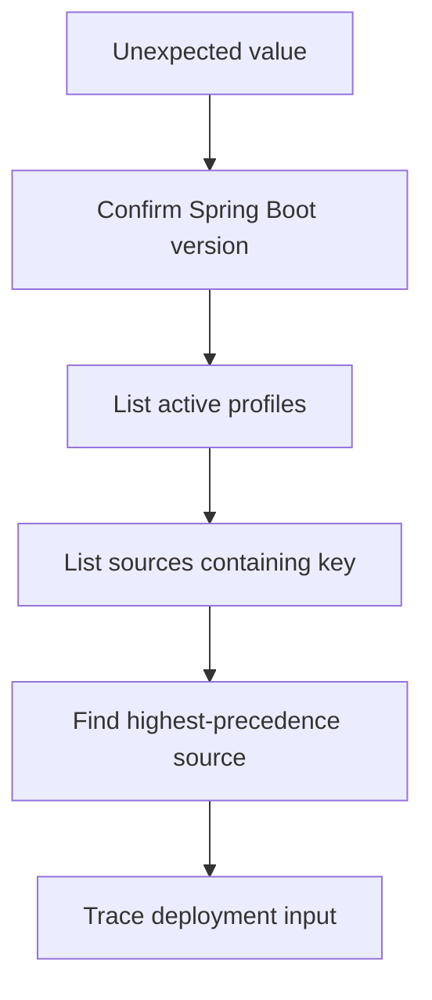

# Configuration and Profiles Production Cases

## Case 1. Два экземпляра клиента при singleton definition

### Симптом

В context зарегистрирован один `PaymentClient`, но `OrderService` использует другой объект. Метрики, connection pools и proxy behavior расходятся.

### Причина

```java
@Configuration(proxyBeanMethods = false)
class PaymentConfig {
    @Bean PaymentClient paymentClient() {
        return new PaymentClient();
    }

    @Bean OrderService orderService() {
        return new OrderService(paymentClient());
    }
}
```

При отключённом proxy direct call `paymentClient()` является обычным Java-вызовом:

```text
managed PaymentClient in context
        +
second object created by direct method call
```

### Исправление

```java
@Bean
OrderService orderService(PaymentClient paymentClient) {
    return new OrderService(paymentClient);
}
```

### Диагностика

- сравнить identity references;
- проверить `proxyBeanMethods`;
- найти direct calls между `@Bean` methods;
- проверить manual factory calls;
- сравнить runtime proxy classes.

> [!important]
> Method-parameter injection не зависит от full/lite interception semantics.

---

## Case 2. Production использует fake adapter

### Симптом

Application успешно стартует, но вместо внешней интеграции пишет данные в log.

```java
@Bean
@Profile("dev")
EmailSender loggingSender() {
    return new LoggingEmailSender();
}

@Bean
@Profile("prod")
EmailSender smtpSender() {
    return new SmtpEmailSender();
}
```

### Возможные причины

- неверный active profile;
- default profile зарегистрировал fallback bean;
- deployment input унаследовал `dev`;
- command-line или environment override;
- несколько profile activation sources.

### Почему startup успешен

Graph валиден: container нашёл ровно один `EmailSender`. Ошибка находится не в dependency resolution, а в выборе definition.

### Предотвращение

- логировать active profiles;
- публиковать безопасную информацию о selected adapter;
- проверять production invariants до readiness;
- стандартизировать activation source;
- не использовать silent fake fallback для production profile.

> [!important]
> Profile selection является частью deployment contract.

---

## Case 3. Значение из application file проигнорировано

### Симптом

В configuration file timeout равен `500`, но runtime использует `5000`.

### Ошибочная гипотеза

> Spring не прочитал файл.

### Возможные источники override

- environment variable;
- JVM system property;
- command-line argument;
- profile-specific document;
- external config location;
- imported config data;
- test property source;
- programmatically added PropertySource.

### Правильный вопрос

> Какой конкретный PropertySource победил для этого key?

### Diagnostic pattern

```java
ConfigurableEnvironment env = context.getEnvironment();
for (PropertySource<?> source : env.getPropertySources()) {
    Object value = source.getProperty("payment.timeout-ms");
    if (value != null) {
        log.info("source={} value={}", source.getName(), value);
    }
}
```

Не выводить чувствительные значения.



> [!important]
> Configuration incident расследуют по фактической PropertySource chain, а не только по repository file.

---

## Case 4. Startup успешен, первый request падает

### Симптом

- service сообщает ready;
- первый вызов downstream падает;
- URL пустой или malformed;
- timeout равен zero;
- retry settings противоречат друг другу.

### Weak design

```java
class ClientService {
    ClientService(Environment env) {
        this.url = env.getProperty("client.url");
        this.timeout = Integer.parseInt(
                env.getProperty("client.timeout")
        );
    }
}
```

### Проблемы

- string keys размазаны по business code;
- missing values обнаруживаются поздно;
- нет cross-field validation;
- parsing повторяется;
- configuration contract не виден.

### Better model

```text
ClientSettings
  baseUrl: URI        required
  timeout: Duration   positive
  retry.enabled: boolean
  retry.maxAttempts: positive when enabled
```

Binding и validation должны завершить startup понятной ошибкой до приёма traffic.

> [!important]
> Configuration — это входные данные приложения, поэтому ей нужен контракт и fail-fast validation.

---

## Case 5. Profile используется как feature flag

### Требование

Нужно включить новый pricing algorithm для части клиентов и иметь мгновенный rollback.

### Ошибочное решение

```java
@Profile("new-pricing")
PricingService newPricingService() {
    return new NewPricingService();
}
```

### Почему не подходит

Profile выбирается при создании ApplicationContext и действует на весь graph. Он не даёт:

- percentage rollout;
- выбор по tenant/user;
- изменение без restart;
- experiment metrics;
- runtime audit trail.

### Correct shape

```text
OldPricingStrategy
NewPricingStrategy
        ↓
PricingRouter
        ↓
FeatureFlagDecision(request context)
```

Profile может выбрать implementation feature-flag provider, но не должен заменять runtime decision.

---

## Case 6. Integration tests стали медленными

### Симптом

После добавления множества `@ActiveProfiles` и inline properties test suite создаёт много почти одинаковых contexts.

### Причина

TestContext cache учитывает configuration inputs. Уникальные combinations profiles, properties и config classes уменьшают cache reuse.

### Исправление

- стандартизировать небольшое число test profiles;
- группировать common properties;
- использовать unit tests без context, где container не нужен;
- применять focused test slices;
- не создавать profile для каждого test class;
- избегать случайных dynamic property values без необходимости.

---

# Decision matrix

| Требование | Подходящий механизм |
|---|---|
| Разная implementation при startup | profile, conditional import, module composition |
| Та же implementation, другие values | externalized properties |
| Runtime rollout | feature flag and router |
| Reusable optional module | import, selector, registrar |
| Неожиданное значение | inspect PropertySource chain |
| Invalid configuration | typed binding and validation |
| Duplicate unmanaged object | remove direct lite-mode bean calls |
| Slow tests | reduce unique context configurations |

# Senior Interview Drill

1. Почему `proxyBeanMethods=false` не меняет scope definitions?
2. Как найти object, созданный direct bean-method call?
3. Почему wrong profile может дать успешный startup?
4. Как доказать источник runtime property value?
5. Почему версия Boot важна для precedence?
6. Чем profile отличается от feature flag?
7. Как сделать configuration failure ранним?
8. Почему множество test profiles ухудшает cache reuse?

# Sources

- [[98_SOURCES/Spring Configuration and Profiles Sources]]
