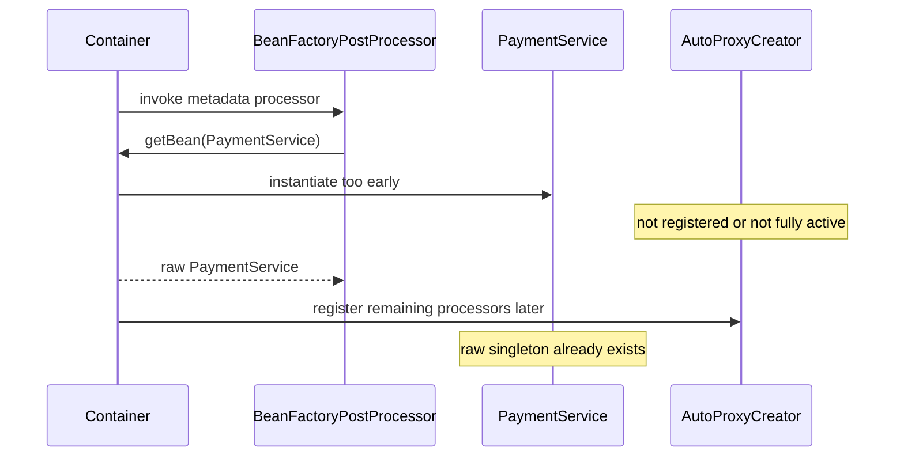

# Container Extension Point Production Cases

> [!summary]
> Эти кейсы проверяют не знание названий interfaces, а способность восстановить container phase по production symptom.

---

# Case 1. `@Transactional` исчез после добавления metadata processor

## Ситуация

Команда добавила custom `BeanFactoryPostProcessor`, который должен прочитать configuration и настроить timeout клиентов.

```java
class ClientConfigurationProcessor
        implements BeanFactoryPostProcessor {

    @Override
    public void postProcessBeanFactory(
            ConfigurableListableBeanFactory beanFactory
    ) {
        PaymentService paymentService =
                beanFactory.getBean(PaymentService.class);

        paymentService.prepare();
    }
}
```

После изменения:

- `PaymentService` присутствует в context;
- method с `@Transactional` вызывается;
- transaction interceptor не срабатывает;
- runtime class — обычный `PaymentService`, не proxy;
- в startup logs есть сообщения об early creation.

## Ошибочная гипотеза

> «Spring случайно не просканировал `@Transactional`».

Annotation была найдена. Проблема появилась раньше — bean instance создан в metadata phase.

## Причинная цепочка



## Корневая причина

`BeanFactoryPostProcessor` нарушил phase boundary:

```text
metadata phase
    ↓ incorrect getBean()
instance creation before processor chain is ready
```

Bean попал в singleton cache как raw/insufficiently processed instance.

## Исправление

Изменять definition:

```java
@Override
public void postProcessBeanFactory(
        ConfigurableListableBeanFactory beanFactory
) {
    BeanDefinition definition =
            beanFactory.getBeanDefinition("remoteClient");

    definition.getPropertyValues()
            .add("timeoutMs", 2_000);
}
```

Если требуется business initialization после startup:

- отдельный bean;
- `ApplicationRunner` в Spring Boot;
- event listener после context refresh;
- `SmartInitializingSingleton`, если нужен callback после singleton creation;
- explicit orchestration service.

## Диагностика

1. Найти все `getBean()` внутри BFPP/BDRPP.
2. Проверить startup order logs.
3. Сравнить runtime class ожидаемого proxied bean.
4. Проверить `AopUtils.isAopProxy(bean)`.
5. Найти `not eligible for getting processed by all BeanPostProcessor interfaces`.

## Senior interview answer

> BFPP должен работать с BeanDefinition metadata. Вызов getBean() создаёт application bean до полного набора BeanPostProcessor и auto-proxy infrastructure. Поэтому bean может остаться raw и потерять transaction advice. Исправление — изменять definition или перенести instance-level работу в позднюю lifecycle phase.

---

# Case 2. Bean не eligible for auto-proxying из-за зависимости custom BPP

## Ситуация

Создан processor для custom audit annotation:

```java
class AuditBeanPostProcessor implements BeanPostProcessor {

    private final AuditService auditService;

    AuditBeanPostProcessor(AuditService auditService) {
        this.auditService = auditService;
    }
}
```

`AuditService` содержит:

```java
@Async
@Transactional
public void save(AuditRecord record) {
    // ...
}
```

Но:

- метод выполняется синхронно;
- transaction отсутствует;
- runtime class не proxy;
- Spring пишет, что bean не eligible for processing by all BPPs.

## Причинная цепочка

```text
container must create AuditBeanPostProcessor early
    ↓
constructor requires AuditService
    ↓
AuditService is instantiated during processor-registration phase
    ↓
auto-proxy creators are not all registered
    ↓
AuditService remains insufficiently processed
```

## Почему это системная проблема

BeanPostProcessor — infrastructure bean. Его dependency graph тоже втягивается в раннюю фазу.

Чем больше business dependencies у processor, тем выше риск:

- premature application graph creation;
- missing `@Transactional`;
- missing `@Async`;
- missing validation proxy;
- circular infrastructure dependencies;
- startup fragility.

## Исправления

### Вариант 1. Processor зависит только от metadata

```java
class AuditBeanPostProcessor implements BeanPostProcessor {
    // no business service dependency
}
```

Processor создаёт proxy, а runtime interceptor получает service через поздний provider.

### Вариант 2. Отложенный lookup

```java
class AuditInterceptor {
    private final ObjectProvider<AuditService> provider;
}
```

Lookup выполняется при business invocation, не при processor registration.

### Вариант 3. Event-based separation

Processor публикует lightweight event/record в infrastructure channel, а business consumer обрабатывает после startup.

## Неправильное исправление

> «Добавим `@Lazy` на AuditService».

Это может изменить timing, но не исправляет архитектурную зависимость infrastructure → business. Необходимо проверить, когда provider реально dereference-ится.

## Диагностика

- построить dependency graph каждого BPP;
- найти application beans в constructors/processors;
- проверить order регистрации auto-proxy creators;
- искать early-instantiation log;
- проверить runtime proxy status.

## Memory Hook

> Processor dependencies become early dependencies.

---

# Case 3. Custom proxy processor создаёт double proxy и ломает type checks

## Ситуация

Приложение уже использует:

- `@Transactional`;
- method security;
- custom `@Audited` annotation.

Custom BPP:

```java
@Override
public Object postProcessAfterInitialization(
        Object bean,
        String beanName
) {
    if (bean.getClass().isAnnotationPresent(Audited.class)) {
        return createJdkProxy(bean);
    }
    return bean;
}
```

Симптомы:

- часть beans имеет proxy вокруг proxy;
- `bean.getClass().isAnnotationPresent(Audited.class)` иногда false;
- injection по concrete class падает;
- `equals()` ведёт себя неожиданно;
- один interceptor выполняется дважды;
- order advice непредсказуем для команды.

## Возможная sequence

```text
raw target
    ↓ transaction auto-proxy creator
transaction proxy
    ↓ custom audit BPP
second JDK proxy
```

Или наоборот — зависит от processor order.

## Корневая причина

Custom BPP:

- проверяет annotation на runtime proxy class вместо target class;
- не распознаёт existing Spring AOP proxy;
- создаёт независимый proxy mechanism;
- не имеет явного ordering contract;
- не объединяет advisor с existing proxy.

## Более устойчивые решения

### Решение 1. Spring Advisor infrastructure

Вместо ручного JDK proxy:

- создать `Pointcut`;
- создать `MethodInterceptor`;
- создать `Advisor`;
- использовать advising post-processor или auto-proxy infrastructure.

### Решение 2. Проверять target class

```java
Class<?> targetClass = AopUtils.getTargetClass(bean);
```

Но это не решает автоматически double-proxy architecture.

### Решение 3. Добавлять advisor в существующий proxy

Если bean реализует `Advised`, infrastructure может расширить advisor chain, а не строить второй wrapper.

## Диагностическая матрица

| Проверка | Что показывает |
|---|---|
| `AopUtils.isAopProxy(bean)` | bean уже Spring proxy |
| `AopUtils.getTargetClass(bean)` | исходный target type |
| `bean instanceof Advised` | можно исследовать advisors |
| `((Advised) bean).getAdvisors()` | фактическая chain |
| processor order | какой wrapper создан первым |

## Senior principle

> Для production AOP extension предпочтительно участвовать в advisor/auto-proxy ecosystem Spring, а не независимо оборачивать каждый bean через `Proxy.newProxyInstance()`.

---

# Case 4. Dynamic bean registration выполнена слишком поздно

## Ситуация

Plugin manager после полного startup читает manifest и пытается добавить BeanDefinition:

```java
@Component
class PluginManager {

    @PostConstruct
    void registerPlugins() {
        registry.registerBeanDefinition(
                "newPaymentPlugin",
                definition
        );
    }
}
```

Симптомы:

- bean definition появляется в registry;
- существующий `List<PaymentPlugin>` не обновляется;
- singleton consumers уже созданы;
- lifecycle callbacks plugin выполняются не в ожидаемом startup order;
- monitoring считает plugin отсутствующим;
- иногда lookup по имени работает, но system topology inconsistent.

## Почему definition registration недостаточна

BeanDefinition registry и уже созданный object graph — разные уровни.

После singleton creation:

```text
definition added
≠
existing consumers re-injected
≠
strategy lists rebuilt
≠
startup callbacks replayed
```

## Правильный выбор зависит от requirement

### Статический набор plugins на startup

Использовать:

- `BeanDefinitionRegistryPostProcessor`;
- `ImportBeanDefinitionRegistrar`;
- configuration import mechanism.

### Динамический runtime plugin system

Не маскировать его под обычный static Spring container.

Нужны:

- explicit plugin registry;
- lifecycle contract `load/start/stop/unload`;
- dynamic routing;
- version/isolation policy;
- classloader ownership;
- thread/resource cleanup;
- refresh strategy.

### Отдельный child context

Для plugin isolation можно создавать отдельный `ApplicationContext` и явно управлять его lifecycle.

## Production question

> Требуется ли bean быть частью immutable startup graph или dynamic runtime registry?

От ответа зависит архитектура.

## Memory Hook

> Adding a definition late does not rewind the container.

---

# Cross-case diagnostic checklist

## Если proxy отсутствует

- [ ] bean создан через Spring, а не `new`;
- [ ] bean не создан внутри BFPP через `getBean()`;
- [ ] bean не является ранней dependency BPP;
- [ ] processor declared return type доступен для early detection;
- [ ] processor зарегистрирован до target creation;
- [ ] custom BPP не заменил proxy raw target;
- [ ] context hierarchy проверена.

## Если processor не срабатывает

- [ ] он является bean нужного context;
- [ ] factory method возвращает BPP-compatible type;
- [ ] bean eligible и создан после registration;
- [ ] annotation имеет runtime retention;
- [ ] target class определяется корректно;
- [ ] order не скрывает marker/proxy;
- [ ] programmatic registration order проверен.

## Если startup создаёт beans слишком рано

- [ ] BFPP не вызывает `getBean()`;
- [ ] BPP не внедряет business services;
- [ ] BFPP factory method `static`;
- [ ] processor constructor лёгкий;
- [ ] нет eager type lookup большого candidate set;
- [ ] provider не dereference-ится в constructor.

# Related

- [[10_CONCEPTS/Spring/Core/Container Extension Points]]
- [[30_CERTIFICATIONS/Spring/2V0-72.22/CORE-B04/CORE-B04 Cards]]
- [[50_LABS/Spring/Core-B04/README]]
