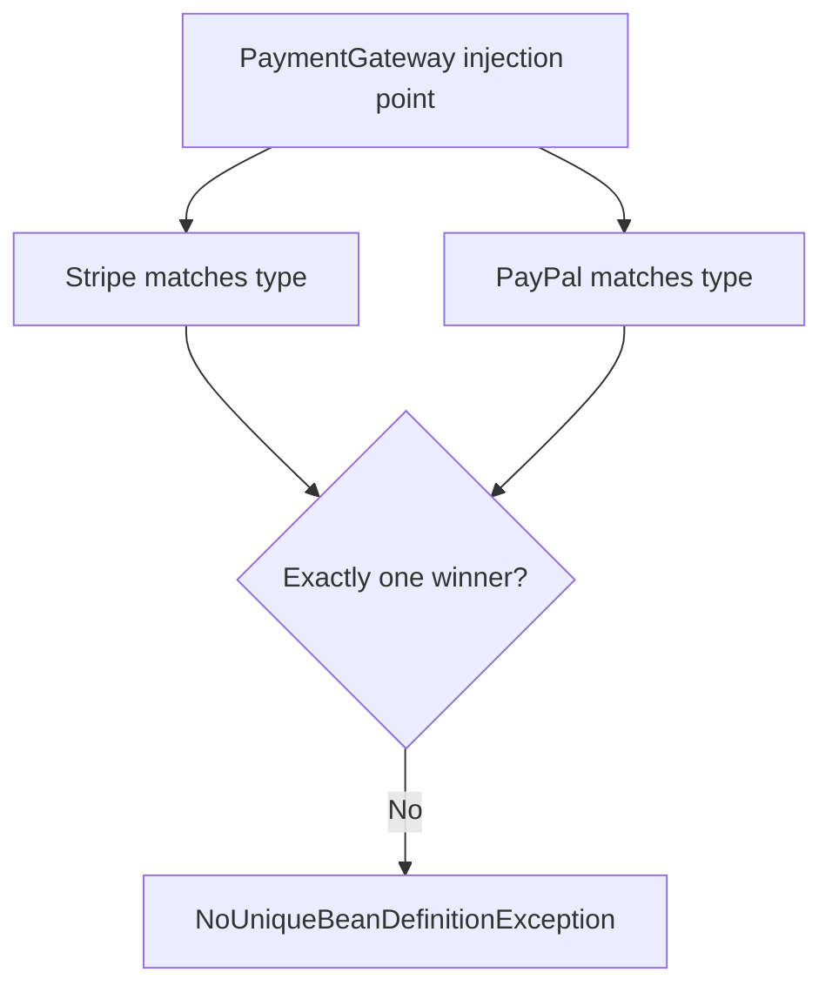
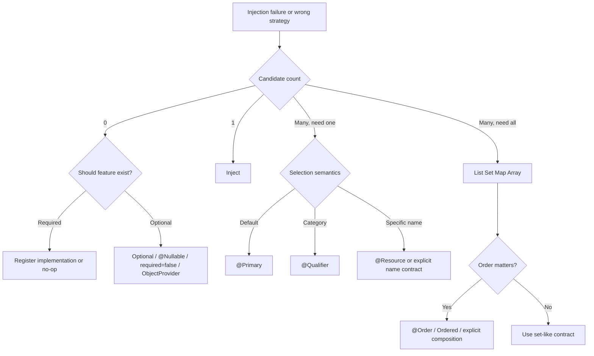

# Dependency Resolution Production Cases

> [!summary]
> Эти кейсы проверяют не знание аннотаций, а способность восстановить алгоритм candidate resolution по симптомам startup failure или неверного runtime behavior.

# Case 1. Новый gateway сломал запуск приложения

## Ситуация

В приложении существовал один bean:

```java
@Bean
PaymentGateway stripeGateway() {
    return new StripeGateway();
}
```

Service:

```java
@Service
class CheckoutService {
    private final PaymentGateway gateway;

    CheckoutService(PaymentGateway gateway) {
        this.gateway = gateway;
    }
}
```

После добавления PayPal:

```java
@Bean
PaymentGateway paypalGateway() {
    return new PaypalGateway();
}
```

context перестал запускаться с ошибкой неоднозначности.

## Диагноз

Тип `PaymentGateway` теперь имеет два candidates, а injection point требует один bean. Spring не знает, какой gateway выражает business default.



## Плохие исправления

### 1. Удалить второй bean

Это скрывает необходимую вариативность вместо моделирования policy.

### 2. Переименовать parameter и надеяться на name fallback

```java
CheckoutService(PaymentGateway stripeGateway) { ... }
```

Может работать как convention, но business intent остаётся хрупким и зависит от имени.

### 3. Пометить случайный bean `@Primary`

Технически запускает приложение, но может скрыть отсутствие согласованного default behavior.

## Рабочие варианты

### Default gateway существует

```java
@Bean
@Primary
PaymentGateway stripeGateway() { ... }
```

Подходит, если Stripe действительно является системным default.

### Checkout требует конкретную категорию

```java
CheckoutService(
        @Qualifier("online") PaymentGateway gateway
) { ... }
```

Beans получают semantic qualifiers.

### Checkout должен маршрутизировать динамически

```java
CheckoutService(Map<String, PaymentGateway> gateways) {
    this.gateways = gateways;
}
```

Но routing key и bean name не всегда должны быть одним понятием. Часто лучше построить registry по явному domain key.

## Senior-level answer

> Добавление второго implementation изменило cardinality candidate set с one на many. Я сначала выясню contract injection point: нужен default implementation, semantic category или runtime routing. `@Primary` моделирует default, `@Qualifier` — semantic filter, collection/map — multi-strategy contract. Я не буду полагаться на случайный registration order.

## Follow-up

- Что произойдёт, если оба beans `@Primary`?
- Почему `Optional<PaymentGateway>` не поможет?
- Стоит ли использовать bean name как payment method code?
- Как протестировать wiring отдельно от business logic?

# Case 2. Optional audit integration неожиданно стала обязательной

## Ситуация

Audit integration устанавливается только в некоторых environments.

```java
@Service
class CheckoutService {
    private final AuditSink auditSink;

    CheckoutService(AuditSink auditSink) {
        this.auditSink = auditSink;
    }
}
```

В lightweight environment bean `AuditSink` отсутствует, и приложение не запускается.

## Корневая причина

Constructor parameter выражает required dependency. Конфигурация deployment считает integration optional, а кодовый contract — required. Это архитектурное противоречие.

## Вариант A. Null Object — feature логически обязательна

```java
@Bean
@ConditionalOnMissingBean(AuditSink.class)
AuditSink noopAuditSink() {
    return event -> { };
}
```

Преимущества:

- service всегда получает non-null collaborator;
- нет branching в каждой операции;
- contract остаётся простым.

Ограничение: framework-specific Boot annotation не относится к чистому Spring Core exam objective; концептуально можно зарегистрировать no-op bean обычной configuration logic.

## Вариант B. `Optional<AuditSink>` — отсутствие является частью contract

```java
CheckoutService(Optional<AuditSink> auditSink) {
    this.auditSink = auditSink;
}
```

```java
auditSink.ifPresent(sink -> sink.write(event));
```

Подходит, если решение принимается один раз и отсутствие явно допустимо.

## Вариант C. `ObjectProvider<AuditSink>` — lazy/dynamic lookup

```java
CheckoutService(ObjectProvider<AuditSink> auditSinks) {
    this.auditSinks = auditSinks;
}
```

```java
auditSinks.ifAvailable(sink -> sink.write(event));
```

Подходит, если нужен lazy access, provider API или repeated lookup.

## Вариант D. `@Autowired(required=false)` field

Работает, но ухудшает явность dependency и тестируемость. Это знание для экзамена, а не автоматическая production-рекомендация.

## Плохое исправление

```java
@Autowired(required = false)
private AuditSink auditSink;

void checkout() {
    auditSink.write(event); // NPE
}
```

Container startup теперь успешен, но failure отложен до runtime.

## Senior-level answer

> Сначала определю business semantics: audit обязателен, допускает no-op или действительно отсутствует. Если collaborator логически обязателен — зарегистрирую explicit no-op implementation. Если отсутствие является частью domain contract — использую Optional. ObjectProvider выберу только при реальной потребности в lazy или repeated lookup. `required=false` не освобождает consumer от корректной обработки absence.

# Case 3. Strategy chain выполняется в неожиданном порядке

## Ситуация

```java
@Service
class ValidationPipeline {
    private final List<Validator> validators;

    ValidationPipeline(List<Validator> validators) {
        this.validators = validators;
    }
}
}
```

После добавления нового validator production result изменился. Команда считала, что beans выполняются в порядке объявления configuration methods.

## Ошибка модели

Registration order не должен быть неявным business contract. Если pipeline order влияет на результат, порядок нужно моделировать явно.

## Исправление через `@Order`

```java
@Component
@Order(10)
class AuthenticationValidator implements Validator { ... }

@Component
@Order(20)
class LimitValidator implements Validator { ... }

@Component
@Order(30)
class FraudValidator implements Validator { ... }
```

## Альтернатива: явная композиция

```java
@Bean
ValidationPipeline validationPipeline(
        AuthenticationValidator authentication,
        LimitValidator limit,
        FraudValidator fraud
) {
    return new ValidationPipeline(
            List.of(authentication, limit, fraud)
    );
}
```

Явная composition сильнее, если порядок является критическим domain workflow, а не расширяемой plugin chain.

## Ловушка

`@Order` влияет на ordering injected collection, но не является механизмом гарантирования bean initialization order.

## Диагностический checklist

1. Порядок является business invariant или только optimization?
2. Должен ли новый implementation автоматически входить в chain?
3. Нужен qualifier-filtered subset?
4. Кто владеет ordering policy: individual strategy или pipeline configuration?
5. Есть ли тест на полный ordered list?

## Тест wiring contract

```java
@Test
void validatorsHaveExpectedOrder() {
    assertThat(pipeline.validatorNames())
            .containsExactly(
                    "authentication",
                    "limit",
                    "fraud"
            );
}
```

# Consolidated Decision Tree



# Interview Drill

> [!question] Приложение не запускается после добавления второго implementation. Каков порядок анализа?

> [!answer]- Ответ
> Сначала определить injection point и candidate set по типу, затем qualifiers/primary/name rules, после чего проверить, нужен ли one-of, all-of или runtime routing contract. Ошибка не исправляется случайным выбором bean; нужно выразить business selection semantics.

> [!question] Почему startup failure лучше случайного выбора первого зарегистрированного bean?

> [!answer]- Ответ
> Failure делает неоднозначность наблюдаемой до обработки production request. Случайный выбор создаёт конфигурационно-зависимое поведение и может тихо направить операции через неверную реализацию.

## Related

- [[10_CONCEPTS/Spring/Core/Dependency Resolution and Optional Injection]]
- [[30_CERTIFICATIONS/Spring/2V0-72.22/CORE-B02/CORE-B02 Cards]]
- [[50_LABS/Spring/Core-B02/README]]
