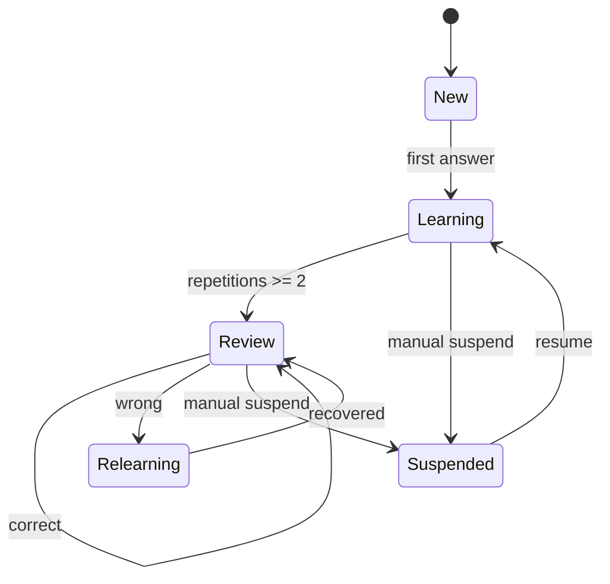

# Per-Card Progress Model

> [!summary]
> Карточки могут оставаться в batch-файлах, но учебное состояние хранится отдельно по стабильному `card_id`. Это позволяет независимо отслеживать `SPRING-BOOT-B01-C001`, даже если тридцать карточек находятся в одном Markdown-файле.

# Files

```text
70_PROGRESS/
├── README.md
├── card-progress.schema.json
└── card-progress.json

.github/scripts/
├── card_progress.py
└── test_card_progress.py
```

`card-progress.json` содержит только пользовательское состояние. Каталог карточек формируется из Markdown headings при запуске команды.

# Card identity

Стабильный ID является primary key:

```text
SPRING-BOOT-B01-C001
TX-B01-C014
JAVA-B05-C032
CONC-B02-C011
```

Переименование заголовка разрешено. Изменение опубликованного `card_id` считается migration и требует переноса progress history.

# State model



# Outcomes

| Outcome | Meaning | Scheduling effect |
|---|---|---|
| `correct-confident` | Correct and mechanism was explained | Normal interval growth |
| `correct-guessed` | Correct, but confidence/evidence was weak | Short interval; not mastery |
| `wrong-attention` | Rule was known but wording/detail was missed | Short relearning interval |
| `wrong-confusion` | Confused with a neighboring concept | Reset and create contrast review |
| `wrong-concept` | Underlying model is incorrect | Reset and return to canonical concept |

# Progress record

```json
{
  "state": "review",
  "attempts": 4,
  "correct_attempts": 3,
  "repetitions": 2,
  "lapses": 1,
  "ease_factor": 2.36,
  "interval_days": 6,
  "confidence": 4,
  "last_outcome": "correct-confident",
  "last_answered": "2026-07-22",
  "next_review": "2026-07-28",
  "history": []
}
```

# Commands

## Audit catalog and progress integrity

```bash
python .github/scripts/card_progress.py audit \
  --root . \
  --progress 70_PROGRESS/card-progress.json \
  --catalog-output .audit/card-catalog.json \
  --queue-output .audit/card-review-queue.md
```

The audit:

- extracts every card heading;
- rejects duplicate IDs;
- verifies progress IDs exist in the catalog;
- creates a static due/new review queue;
- reports batch and domain statistics.

## Initialize all current cards

```bash
python .github/scripts/card_progress.py sync \
  --root . \
  --progress 70_PROGRESS/card-progress.json
```

`sync` adds missing cards with `state = new` and preserves existing history.

## Record an answer

```bash
python .github/scripts/card_progress.py record \
  --root . \
  --progress 70_PROGRESS/card-progress.json \
  --card-id SPRING-BOOT-B01-C001 \
  --outcome correct-confident \
  --confidence 4 \
  --elapsed-seconds 54
```

Optional note:

```bash
--note "Explained scan vs auto-configuration without opening notes"
```

## Show due cards

```bash
python .github/scripts/card_progress.py due \
  --root . \
  --progress 70_PROGRESS/card-progress.json \
  --limit 30
```

# Scheduling policy

The scheduler is SM-2-inspired but uses the project's outcome taxonomy.

```text
correct-confident → quality 5
correct-guessed   → quality 3
wrong-attention   → quality 2
wrong-confusion   → quality 1
wrong-concept     → quality 0
```

Rules:

1. Quality below 3 resets repetitions and schedules the next day.
2. First successful repetition uses 1 day.
3. Second successful repetition uses 6 days.
4. Later intervals multiply by the ease factor.
5. `correct-guessed` never counts as confident mastery and is capped to a short interval during learning.
6. History is append-only unless an explicit data migration is performed.

# Privacy and Git policy

`card-progress.json` is learner-specific. The repository currently contains an empty baseline so the system is reproducible. A learner may:

- commit personal progress to a private branch;
- keep the file local and add it to a personal exclude file;
- copy the schema and maintain a separate progress repository.

Do not merge another learner's history into a shared public branch.

# Dashboard integration

- [[00_HOME/Card Review Dashboard]]
- [[00_HOME/Review Dashboard]]
- [[00_HOME/Certification 99 Percent Readiness Dashboard]]

The static queue generated in `.audit/card-review-queue.md` works without community plugins. Dataview can be added as an optional UI, not as the source of truth.
