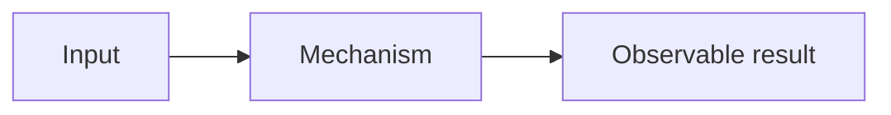

# <Atomic Concept>

> [!summary]
> **30-second model:** одно причинное объяснение без перечисления деталей.

## Why this matters

```text
Exam:
Production:
Prerequisite:
Next concept:
```

## Before reading

> [!recall]
> 1. Что уже известно?
> 2. Какой результат ожидается?
> 3. С чем этот механизм чаще всего путают?

## Main mental model

Одна схема, объясняющая ownership, order, type flow или runtime boundary.



После схемы обязательно объяснить:

- что показывает;
- почему boundary важна;
- какую ошибочную интуицию исправляет;
- как доказать кодом.

## Mechanism in steps

1.
2.
3.

## Worked example

```java
// minimal example
```

```text
Prediction:
Compile status:
Exact output/exception:
Mechanism:
```

## Plausible wrong model

> [!repair]
> **Ошибочная интуиция:**  
> **Почему она кажется логичной:**  
> **Где ломается:**  
> **Правильная модель:**

## Contrast table

| A | B | Deciding signal |
|---|---|---|
| | | |

## Retrieval ladder

### Level 1 — definition

1.

### Level 2 — mechanism

1.

### Level 3 — transfer

1.

## Decision/check algorithm

```text
1.
2.
3.
```

## Evidence

- **Cards:** <CARDS_WIKILINK>
- **Drills:** <DRILLS_WIKILINK>
- **Lab:** <LAB_WIKILINK>
- **Sources:** <SOURCES_WIKILINK>

## Navigation

- **Route:** <ROUTE_WIKILINK>
- **Previous:** <PREVIOUS_WIKILINK>
- **Next:** <NEXT_WIKILINK>
- **Repair center:** [[00_HOME/Java Weakness Repair Center]]
