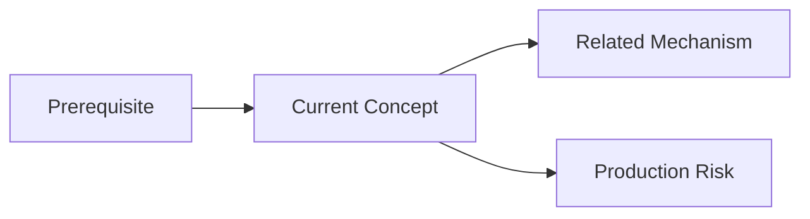
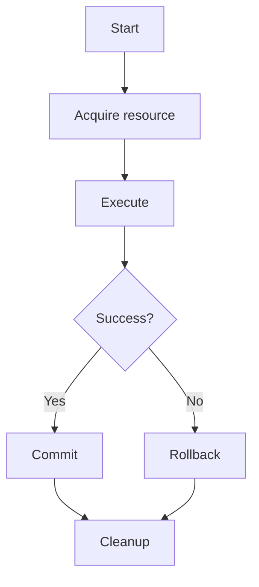
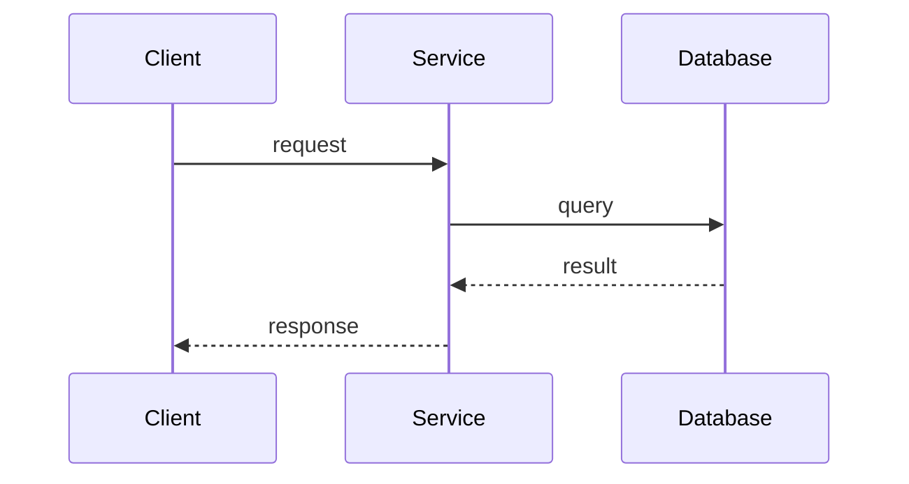
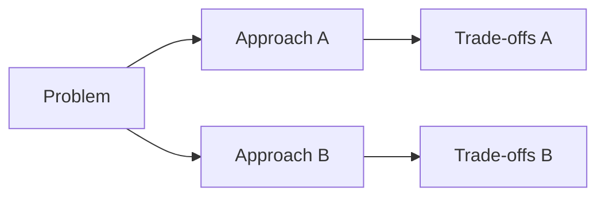

# Diagram Patterns

Схемы должны объяснять механизм, последовательность, зависимости или решение. Не добавляйте диаграмму только ради оформления.

## Concept dependencies

## Execution lifecycle

## Request sequence

## Comparison

## Visual rules

- одна диаграмма — одна мысль;
- до 7–9 узлов на одной схеме, если это не mind map;
- длинное объяснение остаётся в Markdown под диаграммой;
- Canvas используется для навигации между заметками;
- Mermaid используется для алгоритмов, lifecycle, sequence и причинно-следственных связей;
- внешние PNG/SVG добавляются только когда Mermaid недостаточен.
