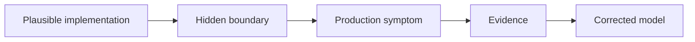

# Pedagogical Visual Standard

> [!summary]
> Большой объём текста не является достаточным признаком качества. Канонический учебный модуль должен помогать построить mental model, проследить runtime path, увидеть failure boundary и перенести правило в production diagnosis.

# 1. Обязательная структура advanced concept

```text
1. 30-second summary
2. Main mental model
3. Terminology grounded in one domain example
4. Runtime or data-flow walkthrough
5. At least one failure path
6. Decision or diagnostic tree
7. Worked production example
8. Interview explanation
9. Exercises
10. Links to cards, cases and lab
```

# 2. Минимальный визуальный набор

Для advanced notes рекомендуется не менее четырёх **разных по функции** визуализаций:

1. **Architecture or topology diagram** — какие компоненты существуют.
2. **Sequence diagram** — в каком порядке происходит runtime interaction.
3. **Decision tree** — как выбирать решение или диагностировать failure.
4. **State/data-flow diagram** — как меняется состояние или данные.

Нельзя считать достаточным четыре почти одинаковых flowchart.

# 3. Выбор типа диаграммы

| Задача | Предпочтительная диаграмма |
|---|---|
| Порядок вызовов | `sequenceDiagram` |
| Компоненты и связи | `flowchart` или Canvas |
| Состояния lifecycle | `stateDiagram-v2` |
| Типы и inheritance | `classDiagram` |
| Выбор/диагностика | decision `flowchart TD` |
| Архитектурная карта обучения | Obsidian Canvas |

# 4. Правило «diagram + explanation»

После каждой важной диаграммы должно быть объяснение:

```text
Что показывает схема?
Почему порядок или граница важны?
Какую ошибочную интуицию она исправляет?
Как это доказать кодом, SQL, log или metric?
```

Диаграмма без интерпретации превращается в декоративный элемент.

# 5. Worked example contract

Полный пример должен включать:

```text
Requirement
Initial code or architecture
Observed runtime path
Failure symptom
Root cause
Corrected path
How to prove the fix
Production trade-off
```

# 6. Failure-first learning

Для сложных Spring/DB/Messaging тем обязательно показать как минимум один неправильный путь:



# 7. Visual density — не механическая квота

Количество diagrams не должно увеличиваться искусственно. Однако warning оправдан, когда:

- advanced note длиннее 400 lines и содержит только одну diagram;
- runtime-heavy topic не содержит sequence diagram;
- lifecycle topic не содержит state model;
- distributed topic не содержит topology;
- troubleshooting section не содержит decision tree;
- diagram повторяет текст, но не раскрывает mechanism.

# 8. Точность Mermaid

- labels с annotations, `/`, `:` и сложными expressions заключать в кавычки;
- избегать недоказанных implementation internals;
- version-sensitive details маркировать явно;
- не изображать logical scope как physical resource;
- не изображать approximate relationship как ownership;
- каждый diagram должен проходить `mermaid-cli` renderer.

# 9. Canvas standard

Canvas должен иметь:

```text
root mental model
canonical concepts
visual deep dives
cards
production cases
labs
sources or diagnostics
```

Проверяются:

- JSON validity;
- unique IDs;
- existing file targets;
- no dangling edges;
- no isolated learning nodes;
- readable geometry;
- absence of substantial overlaps.

# 10. Quality gate для нового vertical slice

```text
[ ] Canonical explanation is mechanism-oriented
[ ] Main mental model exists
[ ] Architecture/topology diagram exists
[ ] Runtime sequence exists
[ ] Failure path exists
[ ] Diagnostic decision tree exists
[ ] Worked production example exists
[ ] Cards use full pedagogical contract
[ ] Production cases include evidence and repair
[ ] Lab proves at least one key mechanism
[ ] Mermaid renders successfully
[ ] Canvas links the whole route
```

# 11. Review questions for authors

1. Может ли читатель пересказать mechanism без memorized wording?
2. Видно ли, где находится runtime boundary?
3. Показан ли неверный, но правдоподобный вариант?
4. Есть ли evidence path для диагностики?
5. Понимает ли читатель trade-off, а не только «правильную annotation»?
6. Соответствуют ли diagrams фактической версии framework/provider?
7. Можно ли перейти от concept к card, case и lab одним-двумя кликами?

# 12. Current application

Стандарт полностью применён к:

- [[10_CONCEPTS/Spring/AOP/Spring AOP Visual Deep Dive]];
- [[10_CONCEPTS/Spring/Cache/Spring Cache Visual Deep Dive]];
- [[10_CONCEPTS/Spring/Transactions/Spring Transaction Management Visual Deep Dive]];
- [[10_CONCEPTS/Spring/Data/Spring Data JPA Visual Deep Dive]];
- [[10_CONCEPTS/Spring/Testing/Spring Testing Visual Deep Dive]];
- [[01_MAPS/Spring AOP and Cache Visual Atlas.canvas]];
- [[01_MAPS/Spring Visual Learning Atlas.canvas]].

Текущий объём применения:

```text
Deep-dive Mermaid diagrams  122
Standard example diagram      1
Connected Canvas atlases       2
--------------------------------
Total visual elements        125
```

Следующие кандидаты на enrichment:

```text
Java Concurrency visual consolidation
DB-B01 — Indexes and Query Plans
Messaging
Distributed Systems
```
